# 6장 기본 컴퓨터 프로그래밍

- 기계어(컴퓨터가 알아들을 수 있는 유일한 언어 오로지 기계어 뿐)
- 어셈블리 언어
- 어셈블러
- 프로그램 루프
- 산술 및 논리 연산의 프로그래밍
- 서브루틴
- 입출력 프로그래밍

# 1. 기본 컴퓨터 명령어

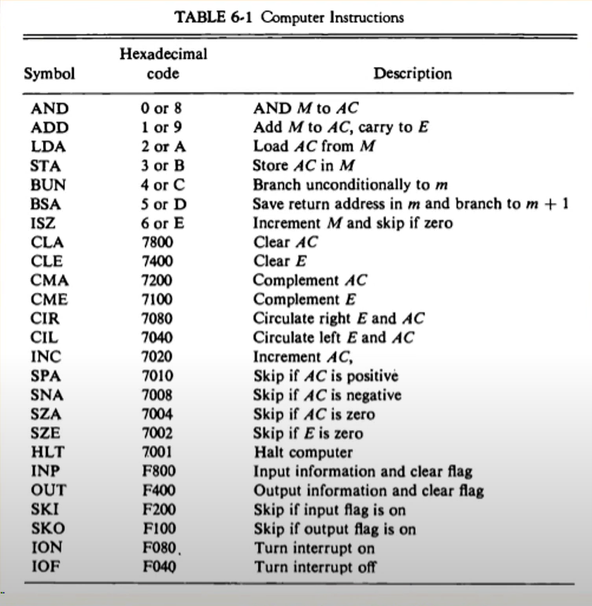

- ### 명령어 Symbol <-----> Hexa code 관계

### MRI 명령어

| Symbol | Hexadecimal code |                        Description                        |
| :----: | :--------------: | :-------------------------------------------------------: |
|  AND   |      0 or 8      | 직접주소일때는 0 0 0 간접주소일때는 1 0 0 0 이므로 8 |
|  ADD   |      1 or 9      |                                                           |
|  LDA   |      2 or A      |                                                           |
|  STA   |      3 or B      |                                                           |
|  BUN   |      4 or C      |                                                           |
|  BSA   |      5 or D      |                                                           |
|  ISZ   |      6 or E      |                                                           |

### RRI 명령어

- 앞에 직간접비트가 0이여서 맨앞에 7 즉 0 1 1 1 이다.

| Symbol | Hexadecimal code | Description |
| :----: | :--------------: | :---------: |
|  CLA   |       7800       |             |
|  CLE   |       7400       |             |
|  CMA   |       7200       |             |
|  CME   |       7100       |             |
|  CIR   |       7080       |             |
|  CIL   |       7040       |             |
|  INC   |       7020       |             |
|  SPA   |       7010       |             |
|  SNA   |       7008       |             |
|  SZA   |       7004       |             |
|  SZE   |       7002       |             |
|  HLT   |       7001       |             |

### IO 명령어

- 맨 앞에 4 비트가 1 1 1 1 이기 때문에 F가 된다.

| Symbol | Hexadecimal code | Description |
| :----: | :--------------: | :---------: |
|  INP   |       F800       |             |
|  OUT   |       F400       |             |
|  SKI   |       F200       |             |
|  SKO   |       F100       |             |
|  ION   |       F080       |             |
|  IOF   |       F040       |             |

16진수, 10진수, 2진수를 자유자재로 왔다갔다해야한다.

## 2. 기계어

기계어도 컴퓨터 프로그래밍 언어중의 하나이다.

- 프로그램의 종류
  - 이진 코드(Binary code)
    - 기계어 프로그램(코드)
    - 메모리상에 실제 나타나는 형태의 명령어 집합
    - 이진 명령어와 피연산자의 시퀀스로 구성
  - 8진/16진 코드(Octal/Hexa code)
    - 이진 기계어 코드를 8진수, 16진수로 표현
  - 기호 코드(Symbolic code)
    - 이진 기계어 코드에 대하여 문자로 도니 심볼로 표현
    - 어셈블리어에 해당
  - 고급 프로그래밍 언어
    - 하드웨어 구조와 관계 없이 문제 해결 논리가 고려된 언어
    - 문제 위주의 기호와 형식 사용
    - 인터프리터, 컴파일러 사용( 실제로 컴퓨터가 사용가능한 기계어로 만들기 위해서 사용한다.)
    - FORTRAN, PASCAL, C, C++, BASIC, Java, COBOL,

- 이진코드와 8진 16진 코드는 모두 기계어라고 보고 기호 코드는 어셈블리 코드라고 보면된다. 근데 어셈블리 코드랑 기계어랑 같다고 보면된다.
- 아래 그림에서 위에 기계어 부분과 아래 어셈블리 언어로 적힌 코드는 같은거다. 
- 

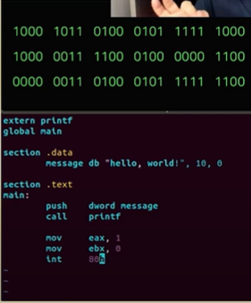

- 기계어는 기본적으로 2진수로 표현된 언어이다.
- 그러나 2진수로 된 기계어를 보는거는 전문가도 어렵다. 그래서 우리는 16진수를 사용하고 그거를 기호로 바꾸고 그거를 어셈블리 코드로 바꾼다.
- 여기서 Location : 메인 메모리의 주소(위에서부터 0,1,2,3,4,5,6번지)

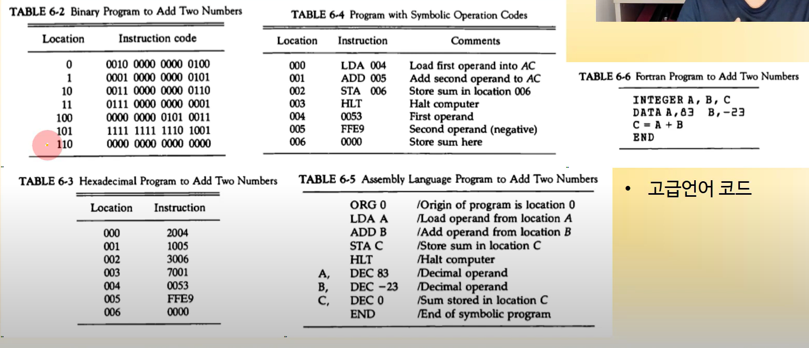

- 일단 Location 0에 코드를 보자 `0010 0000 0000 0100`  요거는 16비트이고 이거를 명령어라고 가정한다면
- 앞이 0 즉 직간접비트가 0 그리고 op코드가 010 
- 그럼 op코드가 010인거는 무엇이냐 2이므로 즉 LDA 로드 어큐레이터이고 이건 MRI 명령이고 나머지 뒤에 12개는 주소일것이다. 0100 4번지 그래서 이거를 바꾸면 0번지는 2004 요래 바뀐다. 즉 6-2가 6-3 처럼 바뀐다.

- 2004를 보면 요거는 앞에 2 는 LDA이고 뒤에는 004 즉 4번지 이므로 4번지의 데이터를 로드하라 이말이다 ~~~
- 4번지는 0053인데 요거는 데이터이다. 즉 hexadecimal 53 데이터
- 이런식으로 해석하면된다.
- 4번지에 있는 데이터를 로드하고 5번지에 있는 데이터를 더하고 더한 결과를 6번지에 저장해라
- 요거를 어셈블리화하면 예를 들어 4번지를 A 5번지를 B 6번지를 C라고 하면 TABLE 6-5처럼 표현 가능

## 3. 어셈블리 언어

- ### 언어 규칙

  - 어셈블리 언어로 표현된 프로그램은 아래의 3개의 필드로 구성되어 있음 
  - 라벨 필드(Label)        : 기호 주소, 또는 공란
  - 명령어 필드 : 기계 명령어, 수도 명령어, (요거는 5장에서 배운 op코드들)
  - 코멘트 필드 : 명령어에 대한 주석

- ### 명령어 필드 항목

  - 메모리 참조 명령어(MRI 명령어) 요거는 직접 명령어인지 간접명령어인지에 따라서 표현이 또 다름
  - 레지스터 참조 명령어(RRI 명령어), 입출력 명령어(IO명령어)
  - 수도 명령어
  - 아래 그림에서 처음은 RRI명령어 그 밑으로 MRI 명령어, MRI 간접 명령어

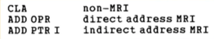

- ### 수도 명령어(Pseudo Instruction)

  - 요거는 실제로 컴퓨터를 동적시키는데 사용되는 명령어는 아님
  - 어셈블리언어를 편하게 보여주기 위한거라고 보면 된다.
  - ORG : 어셈블리 프로그램이 시작하는 번지가 어딘지 알려주는거
  - END : 여기가 어셈블리 프로그램이 끝이다를 어셈블러한테 알려준다.
  - DEC :  decimal 요거는 10진수
  - HEX : hexadecimal 요거는 16진수

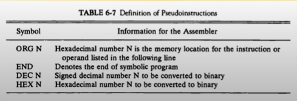

- ### 어셈블리 프로그램 예

  ### 83 - (-23) = 106

  ### hexa로 나타내면 0x0053 - 0xFFE9 = 0x006A 로 나타남

  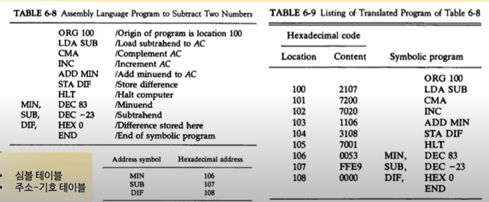

1. 들어갈 주소 정함 ----> ORG 100 
2. 뺄수를 로드함 (SUB, -23)
3. COMPLEMENT함 1의 보수화
4. 2의 보수화
5. 83에다가 더한다
6. DIF에 저장
7. HALT한다.

- 여기서 주소를 주목하자 시작이 100번지이다 그럼 LDA SUB부터 100번지 시작이므로 MIN은 106번지 SUB는 107번지 DIF는 108번지임을 알 수 있다. 우리는 이런 주소값을 알아야한다. 이런 테이블을 심볼 테이블이라고 부른다 혹은 주소-기호 테이블이라 부른다.
- 요런 어셈블리 코드를 다시 이진수로 바꾸면 TABLE 6-9이다

## 4. 어셈블러

- ### 어셈블러란?

  - 기호-언어 프로그램을 이진 프로그램으로 번역하는 프로그램
    - MS Macro Assembler, Tubo Assembler 등
  - Two pass 어셈블러
    - First pass, Second pass

- ### 메모리 내에서 기호 프로그램의 표현

  - 프로그램 예
    - PL3, LDA SUB I

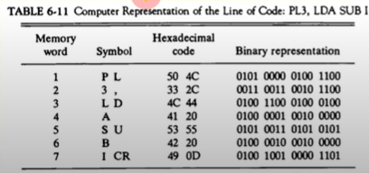

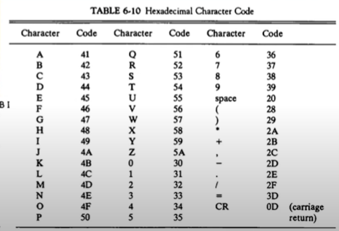

 TABLE 6-11 요거는 8비트씩 P L 총 16비트 3 , 16비트 이런식으로 표현 

요 Symbol들을 6-10 테이블을 보고 hexadecimal code로 바꾼다

- ### First Pass

  - 주소 기호-이진수값의 관계표 작성
  - Symbol Table을 출력(Address-Symbol Table)
  - Location Counter(LC)를 사용하여 프로그램 주소 카운트

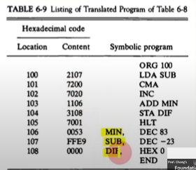

- - 여기서보면 처음에 100번지의 프로그램을 읽으면 SUB가 몇번지인지 아직 모른다.
  - 그래서 이거를 아직 기계어로 바꿀 수 없다. 그래서 필요한게 SUB, MIN, DIF  이런 SYMBOL 이 뭐가 있는지 그런 심볼의 주소가 몇번지인지 알 수 있는 Symbol Table이 먼저 필요하다.
  - 즉 First Pass에서 symbol table 만들어야한다. 이것이 목적
  - 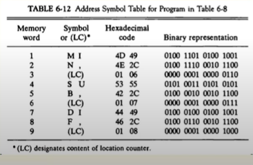
  - 위에서부터 SYMBOL M I N 나오고 그밑에 (LC) 주소가 나온다.
  - 요러한 심볼 테이블을 만들면 그대로 

- ### Second Pass

  - 이진수로의 번역 수행
  - 4개 테이블 참조
    - MRI 명령어 Table
    - Non-MIR 명령어 Table (RRI or IO)
    - 슈도 명령어 Table
    - Symbol Table
  - 출력
    - 기계어 코드

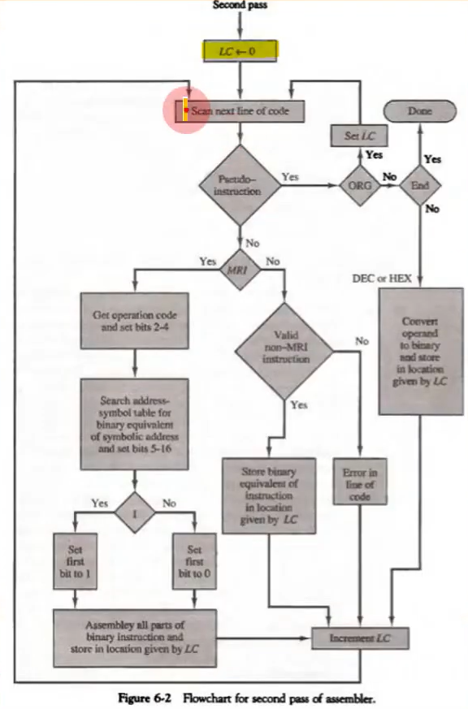