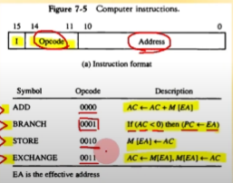
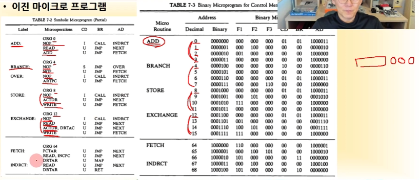
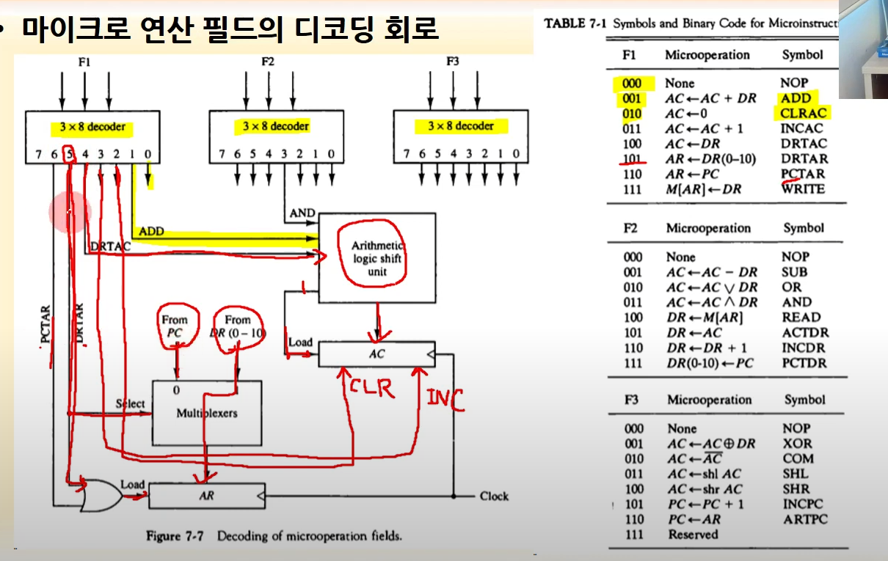
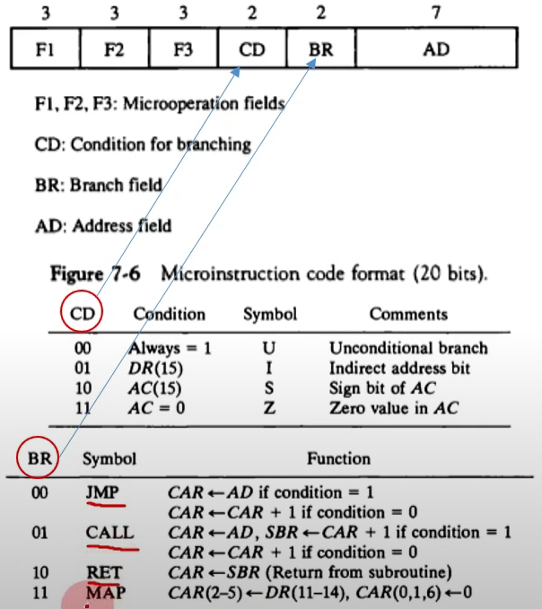
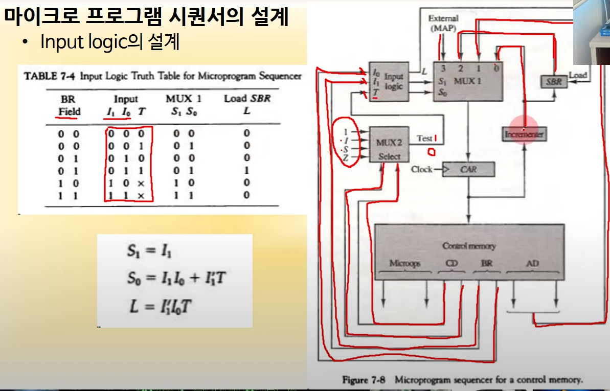
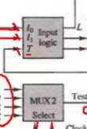
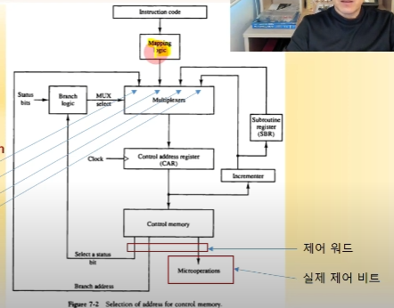

# 7-2 마이크로 프로그램

### 이진 마이크로 프로그램 예시

### 

이전시간에 배웠던 각 명령어들이 어떻게 마이크로 프로그램에 저장되는지 확인 할 수 있다.

맵핑될 당시 opcode 뒤에 2비트(00)이 붙으면서 해당 크기 만큼 주소를 차지하는 걸 알 수 있는데,
2비트, 즉 4개의 주소를 넘어서는 단계를 가질 경우, 다음 2의 배수인 3비트(000)을 붙여줌으로써 확장 시킬 수 있다.

### F1, F2, F3 디코딩 회로

### CD, BR 회로 ( Branch logic )

#### CD

브랜치를 위한 조건의 결과가 어떤지 파악하고 결과값을 Input Logic으로 보내줌 

#### BR

Input Logic에 I1, I0 값으로 대입되어서 MUX 값을 정하는데 사용됌

	

이 부분이 아래 설계에서 Branch logic을 맡음

	