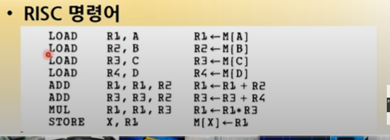
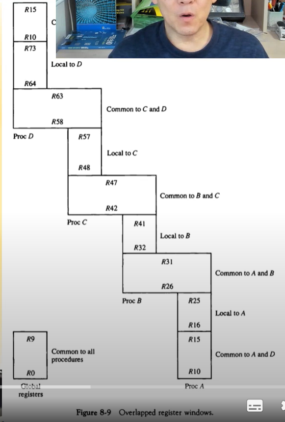
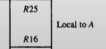

# 7. 프로그램 제어

- ### 프로그램 인터럽트

  - 서브루틴과의 차이점
    - 시스템 내, 외부적 신호에 의하여 프로그램 진행 변경, 서브루틴은 프로그램에서 제어에 의해서 다른 주소로 PC값이 바뀌는거 요게 큰 차이점이다
    - 인터럽트 처리 루틴의 주소는 하드웨어적으로 결정되어 있음 요거는 IVT에 저장되어있다
    - PC값 만이 아니라 CPU의 다른 상태를 나타내는 정보도 대피(메모리에 저장)
  - PSW(Program Status Word)
    - 인터럽트가 발생될 때 저장하는 CPU 정보
    - PSW로 저장되는 데이터
      1. 프로그램 카운터(PC)의 값
      2. PC를 포함한 나머지 모든 레지스터의 값
      3. 상태 조건 비트(C, S, V, Z)
  - 인터럽트가 발생하면 그냥 인터럽트 서비스로 점프해가는게 아니라 먼저 스택에다가 PSW를 저장하고 복귀주소도 스택에 저장하고(복귀조소는 PC값이다) 인터럽트 서비스로 점프해간다

- ### 인터럽트의 형태 (어떤 이유로 발생하는지에 따라서)

  - 외부 인터럽트 (말그대로 외부장치에 의해서 생기는 인터럽트)
    - 입출력 장치, 타이밍 장치, 전원 등 외부 요소에 의하여 발생
  - 내부 인터럽트
    - 불법적인 명령이나 데이터를 사용할 때 발생
    - 오버플로우, divided by 0, segment fault 등
  - 소프트웨어 인터럽트 (프로그램을 작성할 때 프로그램 내에서 발생하는거, OS도 소프트웨어이므로 OS가 발생시키는 거도 소프트웨어 인터럽트 Supervisor나 system call 이런거 )
    - 명령어의 수행에 의하여 발생
    - Supervisor call 명령, system call

# 8.간소화된 명령어 집합 컴퓨터

- ### RISC(Reduced Instruction Set Computer) 개요

  - 간소화된 명령어 집합 컴퓨터, 명령어가 기존의 CPU에 비해서 명령어가 굉장히 줄었음
  - CPU의 기본 개념이였던 CISC(Complex Instruction Set Computer)에 비하여 새로운 설계 개념 제시
  - 기존의 CPU는 사실 명령어의 개수가 많다. 명령어가 많다? -> 제어장치가 많아진다 -> 에러 가능성 높아짐 -> 설계자는 지옥이다
  - 새로운 마이크로 아키텍쳐와 명령어 구조 제시
  - MIPS, ALPHA, PowerPC, SPARC, PA-RISC

- ### CISC vs RISC

|                          CISC                           |                             RISC                             |
| :-----------------------------------------------------: | :----------------------------------------------------------: |
|                    많은 수의 명령어                     |                 상대적으로 적은 수의 명령어                  |
| 특별한 명령을 수행하는 일부 명령어는 자주 사용되지 않음 |              상대적으로 적은수의 어드레싱 모드               |
|                다양한 어드레싱 모드 사용                |           메모리 참조는 load/store 명령으로만 제한           |
|                  가변 길이 명령어 형식                  |             모든 동작은 CPU내 레지스터에서 수행              |
|                메모리에서 피연산자 처리                 | 고정된 길이의 명령어 형식 사용(고정되어 있으므로 어ㅓㅉㄹ때는 16비트 32비트 이래 다르지 않고 똑같다) |
|                                                         |   단일 사이클의 명령어 실행(간단함 == 빠름, 9장에서 배움)    |
|                                                         |                   하드와이어 제어방식 사용                   |

- 아래 사진에서 보듯이 LOAD와 STORE에만 A,B,C,D,X 로 메모리로 접근함 
- ADD 혹은 MUL는 레지스터로 접근함
- 그러므로 연산 속도가 빠르다
- 여기서 RISC에서는 한꺼번에 4개(메모리들)를 병렬로 가져옴 그래서 CISC보다 훨씬 빠름

- RISC는 제어장치가 간단해져서 CPU에 자리가 많다 남은 자리로 레지스터를 만든다.

- ### RISC 프로세서의 특징

  - 적은 수의 명령어로 인한 장점
    - 제어장치의 간소화로 여유 공간 확보
    - 많은 수의 레지스터(128개 이상) 요새는 더 많음
    - 제어장치를 하드와이어 방식으로 구현, 마이크로프로그램 방식 사용X 기사시험에 잘나옴 ㄷ ㄷ
  - 효과적인 명령어 파이프라인 사용
  - 프로시저의 빠른 호출/복귀를 위한 중첩된 레지스터 윈도우 사용
  - 빠르고 효과적인 구조의 컴파일러 -> 고로 실행 속도가 빨라짐
  - 고정 길이 명령어 사용으로 간단한 디코딩
  - 단일 사이클의 명령어 실행

- ### 중복된 레지스터 윈도우

  - 프로시저에 사용할 파라미터를 전달
  - 중첩된 윈도우를 통하여 보호모드에서 빠른 데이터 전달
  - 많은 수의 레지스터로 인한 구조적 장점

- 요기서  요 친구는 레지스터 16부터 25까지는 A프로시저가 사용하는 독자적으로 사용하는 공간
- 다른 프로시저는 사용 못함 각각 배타적으로 사용함

- 그럼 임마는 뭐냐 A랑 B가 같이 사용한다.
- 이런 공간을 레지스터 윈도우라고 한다. 이런 공간이 있으려면 공간이 많아야하는데 그래서 CISC에서는 사용 못하고 RISC에서 사용가능 

- ### Berkely RISC 1 명령어 구조

  - 최초의 RISC 프로세서
  - 
  - a를 보면
  - 전체적으로 32비트 프로세스(Berkely가 32이비트라서)이고 앞에 OP코드는 8비트이다
  - register destination, register source 는 5비트로 지정 이거는 즉 32개의 레지스터 중 하나를 지정한다는거
  - 그다음에 직접 간접 모드가 있고
  - S2 요거는 특별하게 지정될 레지스터가 있다
  - 요거는 메모리 주소가 없고 레지스터 번호만 지정되어있다
  - b 경우는 13비트의 S2 메모리 주소이다. immediate mode 이므로 13비트 요거는 데이터이다.
  - c의 경우에는 relative 모드인데 요거는 op코드 8비트 조건 5비트 19비트의 주소가 있다
  - 요런식으로 버클리는 3가지 뿐이다. 그리고 명령어의 길이가 다 똑같다.
  - 실제로 어셈블리로 표현한거를 옆에서 보면된다.