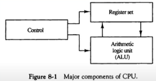
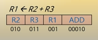
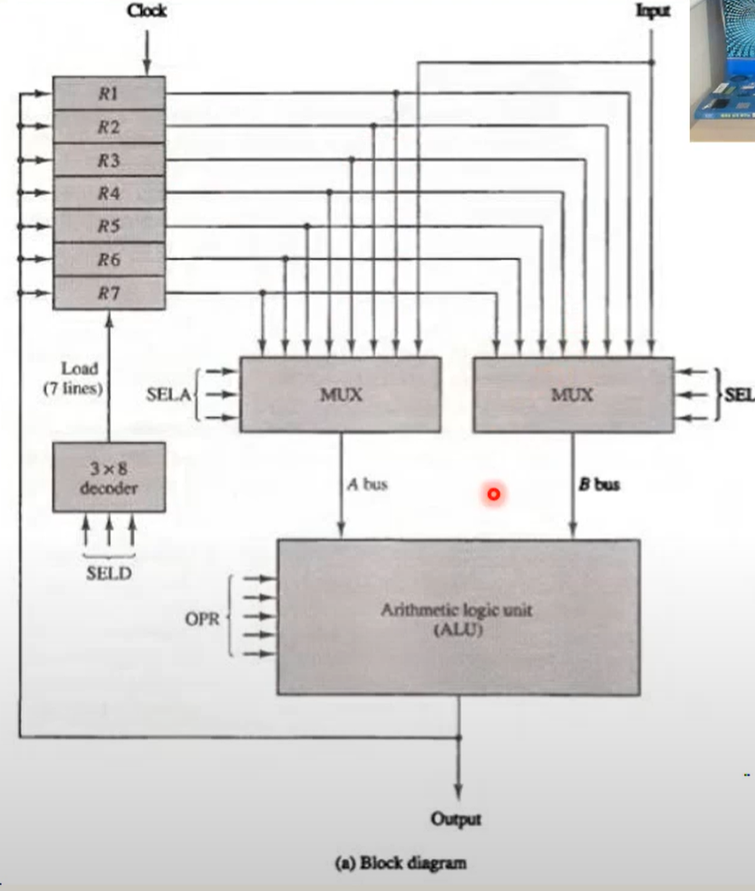
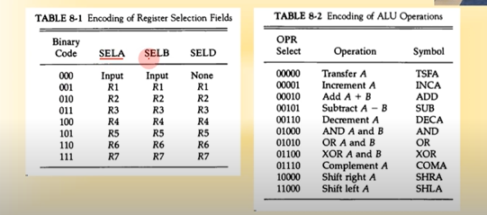
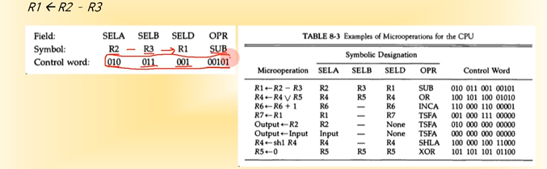
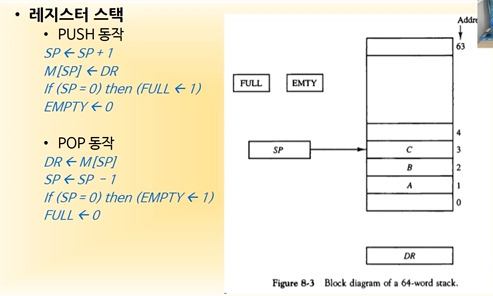
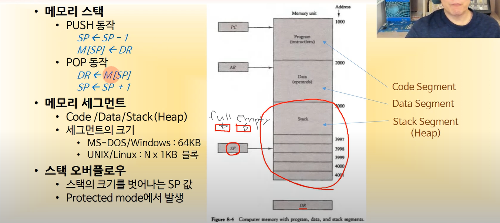
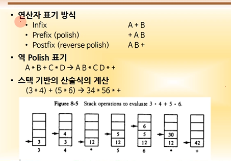

# 제 8장 중앙 처리장치

1. 범용 레지스터 구조

2. 스택 구조

3. 명령어 형식

4. 어드레싱 모드

5. 데이터 전송과 처리

6. 프로그램 제어

7. 간소화된 명령어 집합 컴퓨터(RISC)

----

1. CPU 주요 요소 (기억 제어 연산)
   
   - **기억 장치**
     
     - 레지스터 집합
     
     - 데이터의 임시 저장소
       
       - 데이터와 프로그램은 메인메모리에 저장되지만, 그것들이 수행되기 위해서는 CPU의 레지스터로 옮겨 와야 함
         
         - 명령어는 IR레지스터로
         
         - 데이터는 데이터 레지스터로
         
         - 연산의 결과는 accumulator로
           
           
   
   - **제어 장치**
     
     - CPU 명령어 처리 회로의 집합
     
     - 논리 게이트와 요소들로 구성(디코더, 멀티플렉서, 인코더, 버퍼)
     
     - 명령어에 따라서 연산 제어 수행 
       
       
   
   - **연산 장치**
     
     - ALU(산술 연산, 논리 연산 및 시프트 연산 수행하는 장치) 

----

2. 범용 레지스터 구조 
   
   - **공용 ALU를 가진 레지스터 집합 ** (어떤 source 레지스터에서 데이터를 가져와서 ALU에서 연산을 한 다음에 어떤 destination 레지스터로 보낼 것인가)
     
     
     
     - 7개의 범용 레지스터
     
     - 3 * 8 디코더 1개
     
     - 8 * 1 MUX 2개
     
     - ALU
   
   - 제어 워드 집합 (ALU 연산을 위한 제어 비트의 집합)
     
     - SELA, SELB : ALU 입력 결정
     
     - SELD : ALU 출력 저장소 결정 
     
     - OPR : 연산의 종류 지정 

SELA      SELB    SELD    OPR

(Operand1, 2)  (decoder)

R2와 R3를 가져와서 R1으로 보내라

R2 : 2임 SLEA(010)

R3 : 3임 SLEA(011)

디코더 : 1임 SLED(001)

r1과 r3로 부터 데이터를 가져와서 연산을 해야한다 -> ALU는 두개의 데이터를 가져다가 연산을 해야하는데, 각각 필요로 하는 두개의 데이터는 7개의 레지스터 중 하나의 값에서 가져와야 함 -> 이를 위해 3 비트를 가지고 있는 MUX를 사용(입력이 8개)

레지스터는 7개, MUX는 8개 -> 나머지 1개는 외부입력 (우측 상단의INPUT)

이 중 한개를 골라서  A bus, 한개를 골라서 B bus를 사용해 ALU에 보내줌 

2개의 데이터를 가지고 이항연산을 할 수 있음(*, /, +, -*)

* 단항연산자(제곱 등) -> bus하나에서만 데이터가 와도 가능(mux하나만 사용 가능)

bus : 데이터가 오는 통로 

SELA : 몇번 레지스터로 부터 가져올 것이냐 

SELㅠ : 이항 연산자인 경우 사용

ALU:OPR에서 어떤 연산을 할 지 정함 

ALU에서 빠져나갈 때, 어느 레지스터로 보낼 것인가 - decoder에서 결정(7개중 하나를 1로 만들어 해당 레지스터가 데이터를 로드할 수 있게) - SELD가 결정

**select A 하나 연산을 위해서는 : SELA, SELB, OPR, SELD 네개의 비트가 필요****

----

- 레지스터와 연산 인코딩 

00000 : 통과 (A버스를 통해서 들어온 데이터를 그대로)

00001 : 1증가

00010 : ADD 

01110 : 보수화 

10000 : 오른쪽 shift 

11000 : 왼쪽 shift

---

- 마이크로 연산의 예 

**클리어 시키기 : 같은 값으로 XOR시키면 클리어가 됨 **

---

3. 스택 구조 (업워드 그로잉 스택)

어떤 데이터를 스택에 넣고싶다

1. DR(data register)에 해당 데이터를 넣는다

2. 스택 구조이기 떄문에, 새로운 데이터가 가장 위로 쌓인다

SP(스택 포인터 - 레지스터임) : 지금 스택의 가장 위가 어디인지 표시(push가 일어나면 1 증가)

FULL, EMTY(플립플롭)

FULL : 새로운 데이터가 들어왔는데 스택이 꽉 차면 1

EMTY : 스택포인터가 0을 가리킬때 1

**push**

1. SP 1 증가 

2. 스택의 [sp]에 DR의 값을 집어넣음 

3. 만약 SP가 0이라면 FULL에 1 넣음 (맨 꼭대기 + 1 = 0), EMPTY는 0 

**POP**

현재 SP에 있는 값을 DR에 넣음 

SP 1감소 

SP가 0이라면 EMPTY 1, FULL 0

---

메모리 스택 : 메인메모리의 일부를 stack으로 잘라 쓰는 것 

왜 push인데 Sp를 감소시킬까? -> 스택의 맨 밑바닥(4001번지)가 스택의 끝으로 구현

**다운워드 그로잉 스택 **

인텔계열을 사용하면 다운워드로 구현되어있음 

이 스택이 메모리의 일부를 사용해서 쓴다고 했는데, 어느 곳에, 어떻게 스택이 만들어지나? 

메모리 세그먼트 : 프로그램을 CPU가 동작시키기 위해서 나누어 놓은 메모리의 구획, 잘라놓은 단위 

모든 프로그램은 기본적으로 3개의 세그먼트를 가지게 된다

code / data / stack(heap)

code segment : 프로그램 코드가 들어감 

data segement : 데이터가 들어감 

stack segment : heap

이 세개가 합쳐져서 하나의 process가 된다

스택 오버플로우가 일어나는 이유 : 제한된 할당 크기가 있음 -> 하나의 프로세스가 다른 프로세스에 영향을 미치지 못하게 하기 위해 

-----

