# 컴퓨터구조 part8-2

---

## 명령어 형식

- **단일 누산기 구조**
  
  - ADD X (accumulator에 있는 값에 X를 더하는 것)
  
  - AC <- AC + M[X]
  
  - **accumulator에 의해 명령어가 수행되는 경우**

- **범용 레지스터 구조**
  
  - 오퍼랜드를 전부 표시하는 방식(오퍼랜드 수에 따라 해석하는 방식이 다름)
  
  - ADD R1, R2, R3  : R1 <- R2 + R3 **(3 address** 방식)
  
  - ADD R1, R2  : R1 <- R1 + R2
  
  - ADD R1, X  : R1 <- R1 + M[X] (메모리와 레지스터를 사용)

- **스택 구조**
  
  - PUSH X
  
  - ADD
  
  - 스택의 가장 위의 데이터를 가져다가 씀

- **3주소 명령어**
  
  연산한 값을 R1과 R2, 그리고 X에 집어넣어 계산함
  
  - 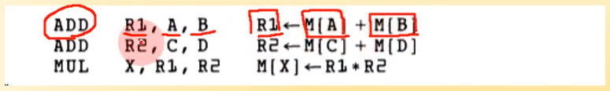

- **2주소 명령어**
  
  A를 R1에 집어넣음 -> R1과 B를 더함 -> R2에 C 집어넣음 -> R2에 D를 더함 -> R1에 R2를 곱함 -> R1값을 X에 저장함
  
  - 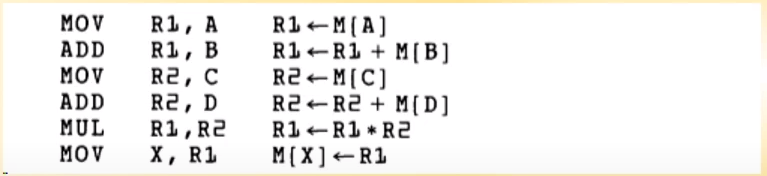

- **1주소 명령어**
  
  A 로드 -> B 더함 -> 메모리 T에 저장 -> C 로드 -> D 더함 -> T에 저장된 값과 AC에 저장된 값을 곱함 -> 곱한 값 메모리 X에 저장
  
  - 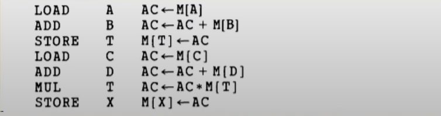

- **무주소 명령어**
  
  스택 생각하면 됨
  
  주소 없어도 스택에서 위에 있는 애(연산시 상위 2개) 가져와서 쓴다고 보면 된다
  
  - 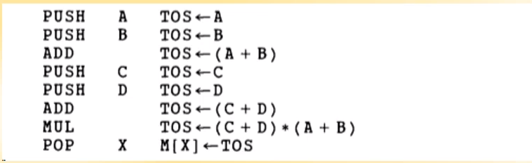

- **RISC 명령어**
  
  레지스터가 굉장히 많은 그런 형태. **모든 변수를 레지스터에 다 집어넣음. 그 후 레지스터 끼리 연산. (연산시 메모리에 접근하지 않음. 데이터 로드나 저장시에만 사용)**
  
  - 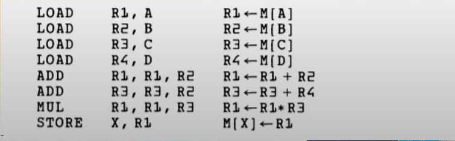

- N주소 명령어 -> N개의 레지스터나 메모리 주소로 표현하는 것

- 싱글은 누산기(accumulator) 사용

- 위의 예시는 **X = (A + B) * (C + D)**

## 어드레싱 모드

- 주소 지정 모드. 실제의 피연산자를 정하기 위해 명령어 속에 있는 주소 필드의 값을 수정하거나 다른 것으로 대체하는 것을 규정

- 프로그램이 수행되는 동안 피연산자가 짖어되는 방법은 명령어의 어드레싱 모드에 의해 좌우됨

- 사용 이유
  
  - 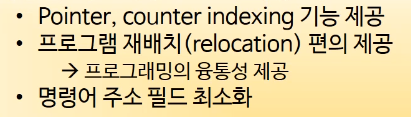

- 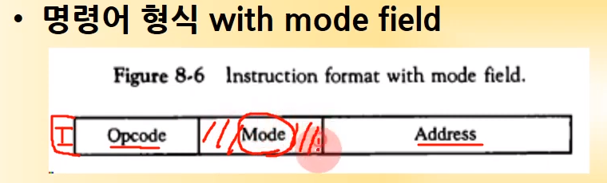
  
  - 앞에서 배울 땐 직/간접, Opcode, 주소만 있었음. 그러나 실제론 Mode 부분도 있음

- 직접 주소, 간접 주소 모드
  
  - 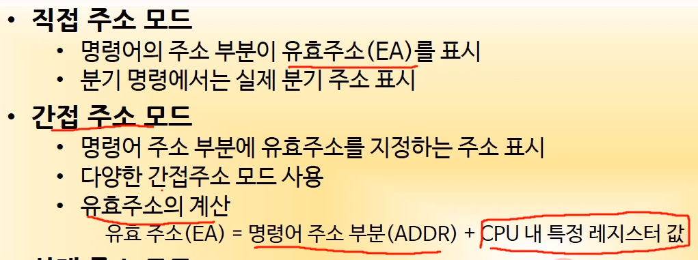

- 간접 주소 모드는 앞에서 사용했던 방법(I값 이용하는 간접주소) 이외에도 3가지가 더 있다
  
  - **상대 주소 모드**
    
    - 유효주소 = 주소 필드값과 프로그램 카운터값의 합
  
  - **인덱스 어드레싱 모드**
    
    - 유효주소 = 주소 필드값과 인덱스 레지스터값의 합
    
    - 배열의 각 원소에 대한 인덱스 주소 계산에 사용
  
  - **베이스 레지스터 어드레싱 모드**
    
    - 유효주소 = 주소필드값과 베이스 레지스터값의 합
    
    - Protected 모드의 메모리에서 세그먼트 주소 인덱싱에 사용

- **어드레싱 모드 예시**
  
  - 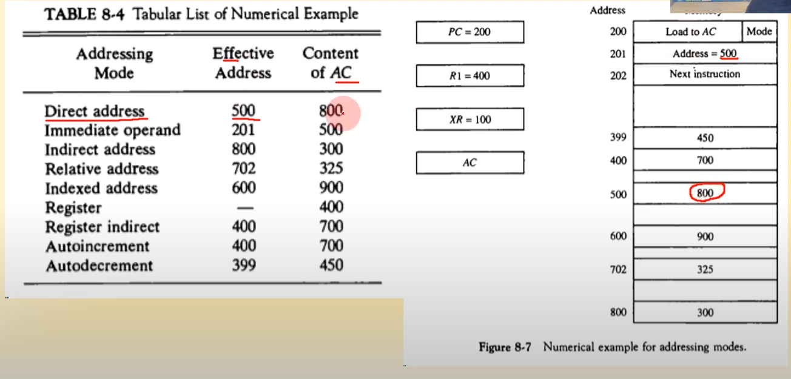
  
  - **Direct** -> 유효 500 -> 500번지 찾아가면 800 나옴
  
  - **immediate** -> 201번지에 있는 값이 곳 오퍼랜드. 오퍼랜드가 들어있는 곳이 유효주소 이므로, 유효주소는 201
  
  - **Indirect** -> 500 -> 800 -> 300
  
  - **relative** -> 주소 + PC. program counter에 있는 값을 더하자. 500 + 202 (하나의 명령이 두개의 주소-200, 201-를 쓰고 있음. 그러므로 다음 명령은 201이 아닌 202가 되어야 함) -> 702(유효주소) -> 325
  
  - **indexed** -> XR에 100 돼있음 -> XR + Address -> 600 -> 900
  
  - **Register** -> R1에 400 돼있음 -> 400
  
  - **Register indirect** -> R1에 400 -> 700
  
  - **Autoincrement** -> 수행이 끝날때까지 증가되지 않음. 400 -> 700
  
  - **Autodecrement** -> 일단 하나 줄인 다음 수행. 400 - 1 -> 450

## 데이터 전송과 처리

- **데이터 전송 명령어와 주소 모드**
  
  명령어엔 이런 것들이 있다~~
  
  - 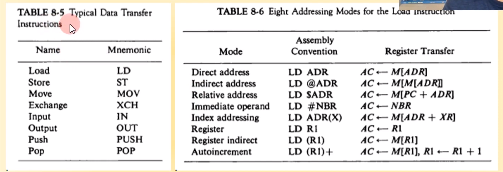

- **데이터 처리 명령어**
  
  - 산술 명령어
  
  - 논리연산 및 비트 처리 명령어
  
  - 시프트 명령어
  
  - 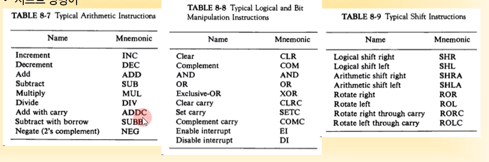

## 프로그램 제어

- **상태 비트 조건**
  
  - 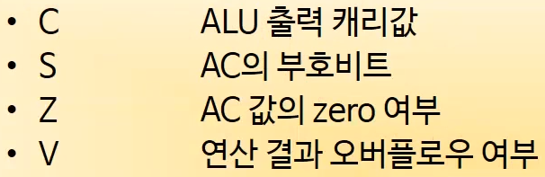
  
  - 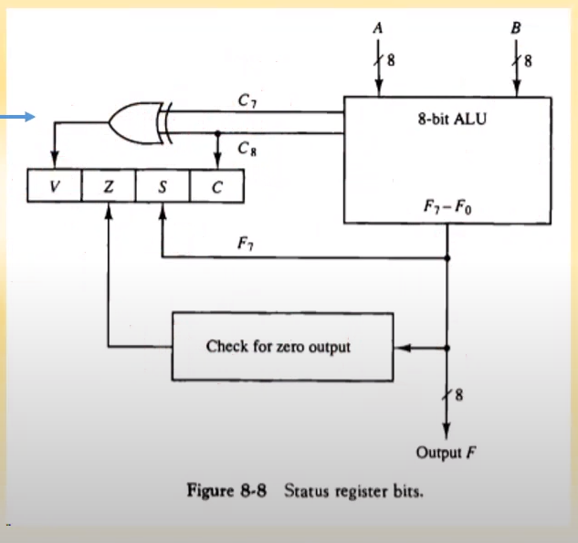
  
  - 8비트 ALU에서 최종 출력 캐리값은 **C8**

- **상태비트의 예**
  
  - 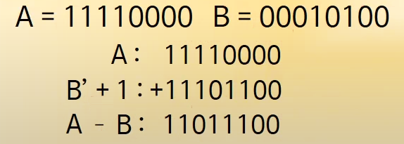
  
  - 결과가 0이 아니므로 -> Z = 0
  
  - 캐리 발생함 -> C = 1
  
  - AC의 부호비트 S = 1
  
  - 오버플로우 여부 -> C8과 C7에서 모두 캐리 발생 ->  XOR 결과 0 -> V = 0

- **조건부 분기 명령어**
  
  - 상태 비트에 따라서 분기
  
  - 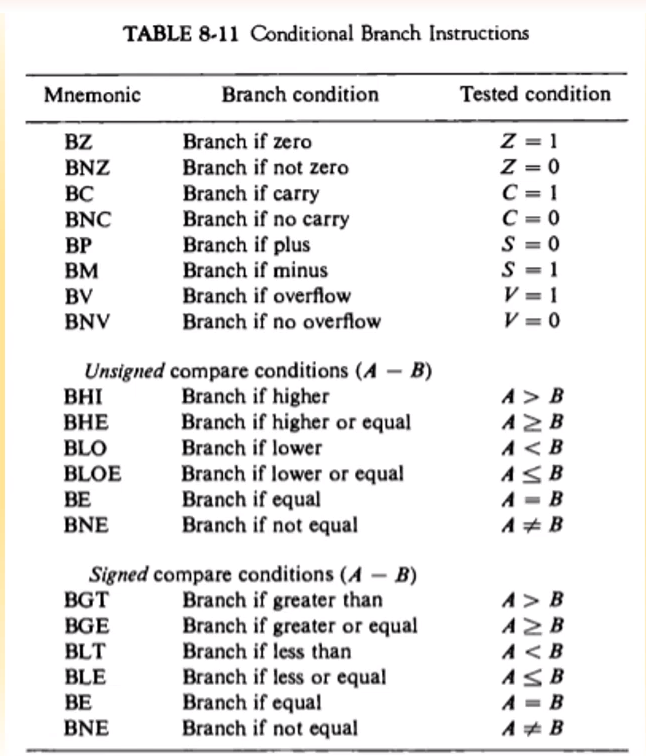
  
  - **C, S, Z, V 값에 따라 분기 여부 결정**

- **서브루틴 Call**
  
  서브루틴(함수같은 그거)을 실행하기 위해 서브루틴의 이름과 이용되는 자료를 사용하여 호출하는 일
  
  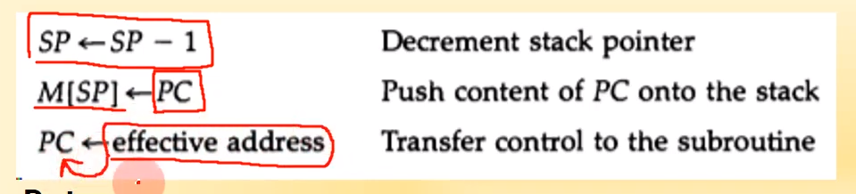

- **Return**
  
  스택에서 pop. 그 후 복귀 주소(M[SP])를 PC로 돌림
  
  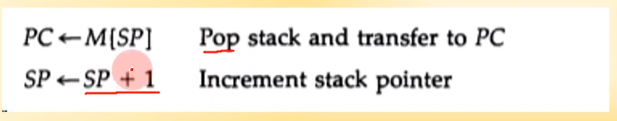

- **순환 서브루틴**
  
  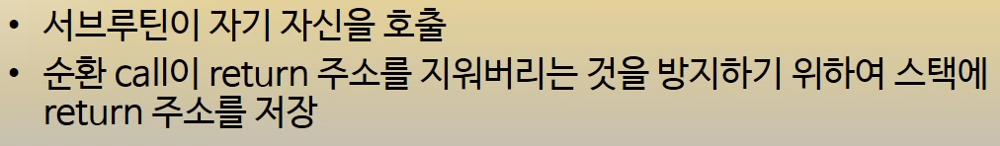
  
  

