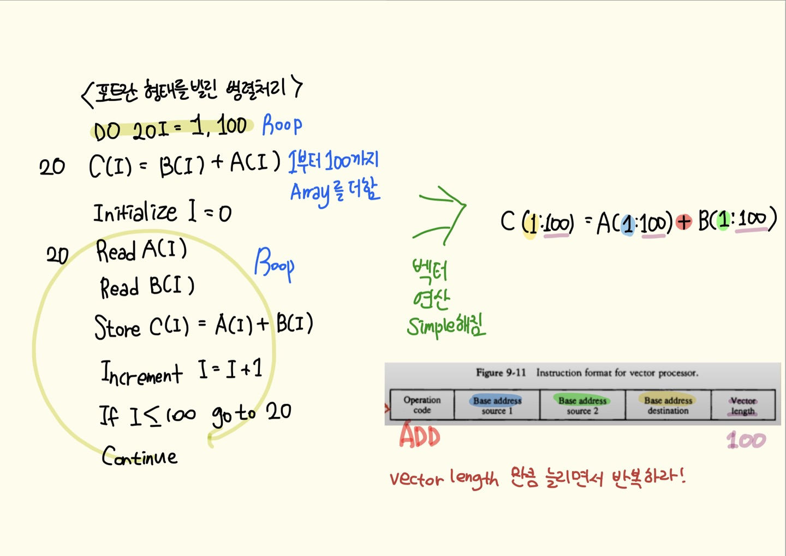
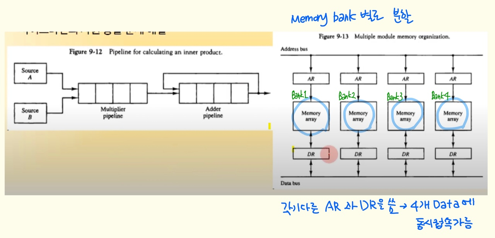
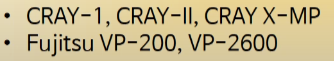
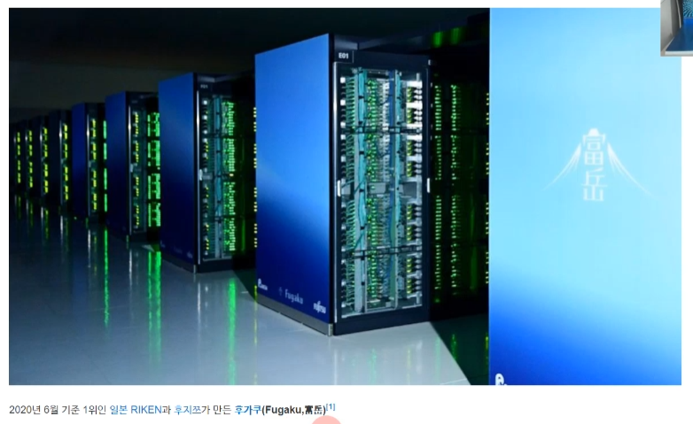
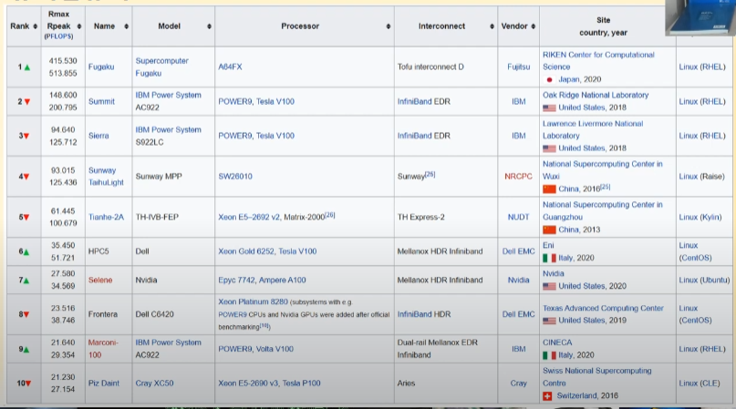
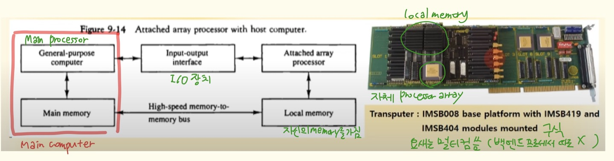
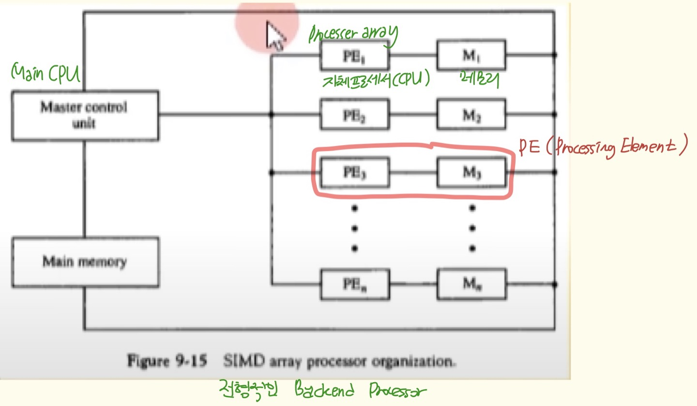
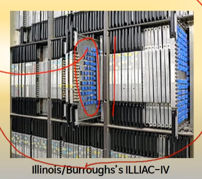

# 9장 파이프라인과 벡터 처리

----------------

## 6. 벡터처리

### 벡터처리

- 행렬 데이터 처리

- 병렬 데이터 처리

### 벡터처리가 중요한 분야(수 많은 데이터를 동시에 처리)

- 장기 기상 예보

- 석유 탐사

- 지진 데이터 분석

- 의학 검진, 분석

- 기계 역학, 비행 시뮬

- 인공지능, 전문가 시스템(알고리즘)
  
  - 인공지능에 쓰이는 하드웨어들은 대부분 벡터처리 시스템임

- 유전자 분석

- 2/3차원 이미지 처리

### 벡터 연산과 벡터 명령어

- 대부분의 슈퍼 컴퓨터, 병렬 컴퓨터들이 사용

- 프로그램이 간단함
  
  

- 벡터 컴파일러가 초록색 화살표 역할을 함

### 메모리 인터리빙(Interleaving)

- 위 그림에서의 연산의 경우, A와 B를 동시에 읽어서 더하면 더 효율적임 그러나 자원 충돌이 발생할 수 있음 → 이 문제를 해결하는 것이 메모리 인터리빙

- 두 개 이상의 명령어가 동시에 메모리에 접근

- 메모리를 여러 모듈로 분할 구성

- 파이프라인의 자원 충돌 문제 해결

- 서로 다른 주소에 동시 접속할 때, 주소만 다르면 동시 접속 가능

- **여러 데이터를 처리할 수 있으므로 벡터 처리에 유리**
  
  

### 슈퍼 컴퓨터

- 정의
  
  - 벡터 명령어 제공
  
  - 파이프라인된 부동 소수점산술연산 제공
  
  - 상업용 컴퓨터

- 성능 요소
  
  - 고속의 연산을 위한 설계
  
  - 고속 위주(저항이 적은)의 소재(백금 or 순금), 부품 사용

- Flop
  
  - 슈퍼 컴퓨터의 속도 parameter
  
  - 초당 처리할 수 있는 floating point 연산의 수
  
  - MFlop(초당 백만개), Gflop(초당 십억개) 단위

### 대표적인 슈퍼컴퓨터

### 갑자기 슈퍼컴퓨터 보여주심

- 일본거임

### 갑자기 슈퍼 컴퓨터 꺼무위키 보여주심

- [슈퍼컴퓨터 - 나무위키](https://namu.wiki/w/%EC%8A%88%ED%8D%BC%EC%BB%B4%ED%93%A8%ED%84%B0)
  
  - 관심있으면 들어가서 역대 1위 슈퍼 컴퓨터 연혁 읽어보세요.. 안타깝게도 저는 관심이 없네요..

- https://top500.org/lists/top500/list/2022/06/
  
  - TOP 500 Computer 라는 링크 들어가면 TOP 500 Computer 리스트 볼 수 있대요.. 관심있으면 들어가서 보세요..
  
  - 교수님 많이 신나셨네요..

### 슈퍼컴퓨터 TOP 10 at June 2020

## 7. 배열 프로세서

### 부가 배열 프로세서

- Backend 프로세서 array 사용
  
  - 대량의 데이터 처리 전담
  
  - Local memory에 데이터 저장
  
  - 트랜스퓨터(Transputer) 라고도 지칭 - 데이터 연산만 전문으로 수행

- Main 프로세서
  
  - 데이터 전송 프로그램 실행

### SIMD 배열 프로세서 (대부분의 배열 프로세서)

- Single Instruction Multiple Data

- Main CPU, Main memory에 다수의 PE 연결

- PE(Processing Element) 
  
  - 자체 프로세서와 local memory 포함
  
  - Array 프로세서 형태로 구현

- CRAY 슈퍼컴이 해당 형태임

### 

### ILLIAC - IV

- 대표적인 초기 SIMD 배열 프로세서

- 미국 일리노이 대학 연구실 개발

- 초기형 SIMD 슈퍼컴퓨터급 성능
  
  
  
  - 파란게 하나의 PE
