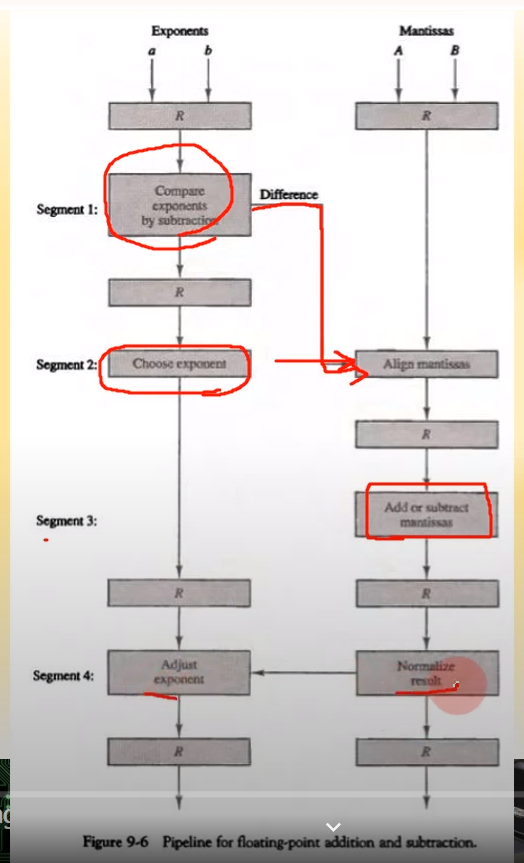
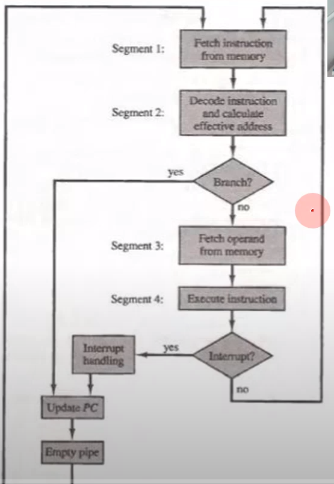
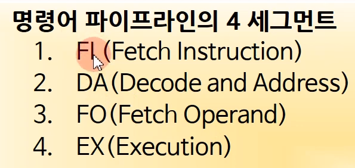
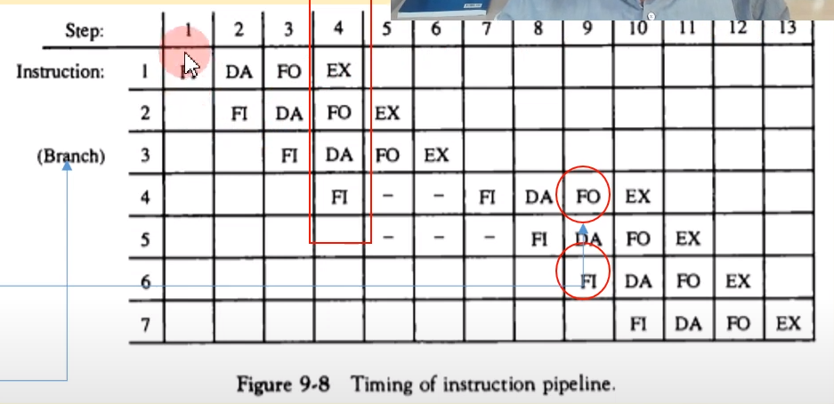
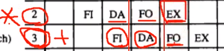
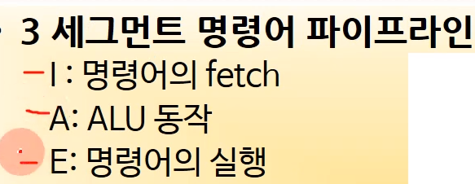
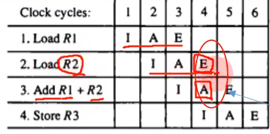
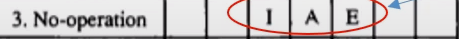

# 컴퓨터 시스템 구조 9장 part2

---

**파이프라인: 병렬처리 방식**

## 산술 파이프라인

- 산술 연산을 파이프라인화 시킴. 연산속도의 증가

- **실수의 가산**

- 세그먼트별 연산 (세그먼트가 많을수록 파이프라인의 효율이 높아짐)
  
  
  
  - 위 그림 보면 4개의 세그먼트를 가짐
  
  - 지수의 비교(보통 지수 작은쪽을 기준으로 맞춤)
  
  - 가수의 정렬
  
  - 가수의 연산
  
  - 결과의 정규화

## 명령어 파이프라인 -> CPU의 성능에 영향을 줌

- 명령 실행의 순차
  
  
  
  - 1. 메모리에서 명령어 fetch -> **세그먼트 1**
    
    2. 명령어 디코딩
    
    3. 유효주소의 계산 -> **여기까지 세그먼트 2**
    
    4. 메모리에서 피연산자 fetch -> **세그먼트 3**
    
    5. 명령어 실행
    
    6. 연산 결과의 저장 -> **여기까지 세그먼트 4**

- **4세그먼트 CPU 파이프라인**
  
  - 

4번째 클럭을 보면, 첫번째 명령 수행, 두번째 명령 fetch operand, 세번째 명령 decode, 네번째 명령 fetch instruction인 상황임을 알 수 있음 -> 명령어 파이프라인 꽉 차는 순간

3번째 명령을 보면 분기 명령임(branch) (branch: for, while, if 등등. 사실 프로그램의 대부분이 branch임)

(fetch -> decode -> 브랜치 명령어로서 몇 번 주소로 가야하는지 알려줌 -> 실행)

위의 단계에서 **decode**를 수행중일때 이미 **해당 명령의 브랜치 유무**를 알고있음

브랜치일 경우 -> 다음 명령인 4번째 명령을 가져오는 의미가 없음. FO에 저장된 주소로 점프하기 때문

**만약 FO에 저장된 주소가 15다? -> 3번 명령 실행된 후에 15번 명령 fetch. 그래서 5, 6번 클럭은 파이프라인이 비게 되는 것**

브랜치가 발생하게 되면 파이프라인이 정상적으로 동작을 못하고 중간중간 비게 됨 -> **명령어 파이프라인의 지연**

**그럼 브랜치문 만이 파이프라인이 돌아가는걸 방해하나? ㄴ**

명령어 파이프라인의 지연 원인엔 3가지가 있음

- **자원 충돌** -> 메모리같은 자원에 동시에 두군데서 접근하려 할 때 발생

- **데이터 의존성** -> 
  
  - 위의 그림과 같이 2번 명령이 곱셈, 3번 명령이 덧셈이라 하자. 3번의 오퍼랜드엔 곱셉의 연산 결과가 들어가 있어야 하지만, 같은 시간에 2번 명령의 실행(EX)이 일어나고 있어 들어가지 못함 -> 3번 명령에서 오퍼랜드(FO) 못가져옴. 이런 상황을 데이터 의존성이라고 말함

- **분기 곤란**

브랜치는 3번째인 분기 곤란에 해당됨

## RISC 파이프라인

RISC 프로세서는 파이프라인에 굉장히 큰 강점을 갖고 있음

(ALU는 산술 논리 장치)

위의 명령어를 예시로 들어보자. 명령2와 3 사이에 **데이터 의존성 문제**가 발생함(2번 명령이 완료되기 전에 3번 명령에서 값을 가져오기 때문)

이를 no-operation 코드로 해결 가능함

(2번과 3번 명령 사이에 위의 코드를 집어넣자)

-> 2번 명령의 실행이 끝나고 난 후 ADD R1 + R2를 실행할 수 있게됨

