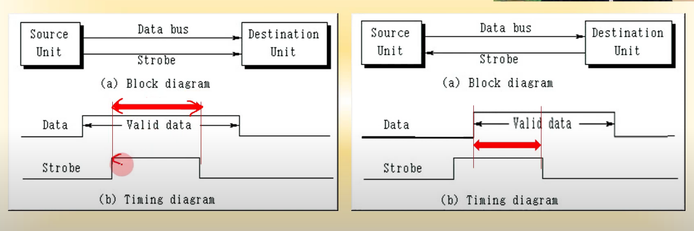
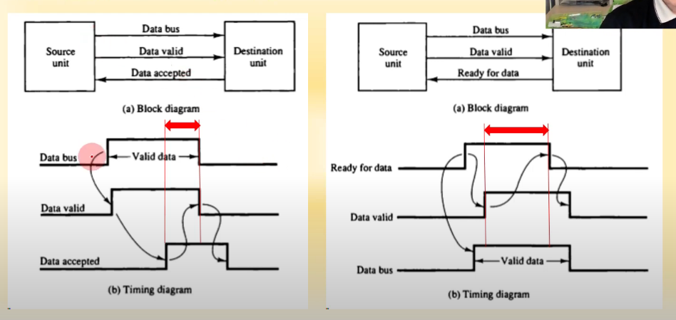
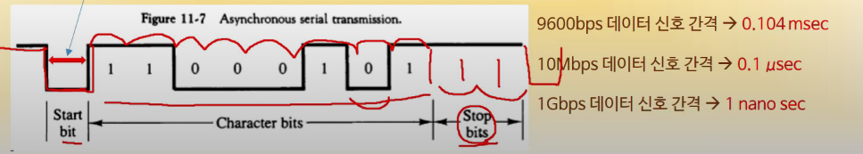
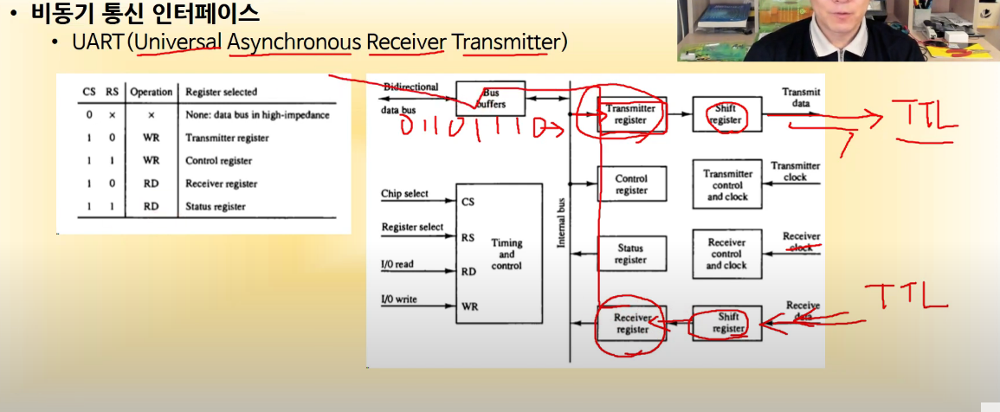
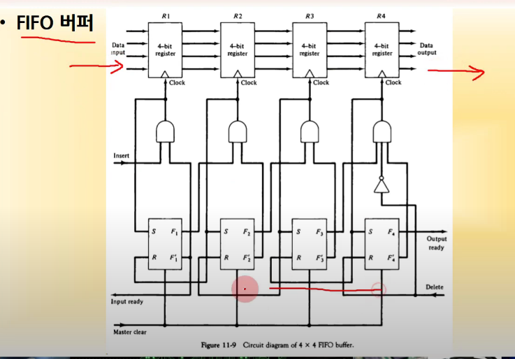
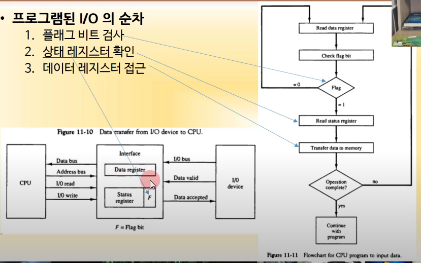

# 비동기 데이터 전송

## 전송 제어 프로토콜

### 스트로보 제어 (가장 low level)

- 송신장치가 데이터를 버스에 적재한 후 수신장치에 알려서 데이터를 전송 받도록 하는 방식

- strobe 버스 라인 사용(데스티네이션에서 나한테 보내는 데이턴지 아닌지 판별)

- 

- 소스 이니시에이트 (보낸 걸 알려줌) - 데스티네이션 이니시에이트 (받은 걸 알려줌)

- 문제점 : 스트로보 신호가 끊어질 수 있음

### 핸드셰이킹 제어

- 

- 데이터 억셉트 신호를 보내서 받았다는걸 알리고 소스에서 데이터 끊음

- 일정 시간이 지났는데도 억셉트 신호가 안온다면 고장난 끊어진 것이라 수리하면됨

- 다 이거 씀 1Gbps => 1초에 10억번 핸트셰이킹 가능ㄷㄷ (이걸로 게임한다고 비꼬심ㅠ)

## 비동기 직렬 전송(TTL)

### TTL 전송

- 0V, 5V를 0, 1로 표현

### 전송 규칙

- 데이터가 전송되지 않을 때 항상 1 유지

- 시작비트 0

- 8개의 데이터 비트

- 2개의 정지비트(1)

- 

### 비동기 통신 인터페이스(UART)

- 

- 일반적 인터페이스인데 쉬프트를 사용해 한 비트씩 주고 받음

- 한비트마다 핸드셰이킹 함

- FIFO 버퍼(쉬프트 레지스터)

- 

# 전송 모드

## 입출력 전송 모드의 종류

### 프로그램된 I/O

- 프로그램(명령어)에 의해 동작

- 플래그에 기반한 입출력

- 

## 인터럽트에 의한 I/O

- 인터럽트에 의해 입출력 수행

## 직접 메모리 접근(DMA)

- I/O 장치가 직접 메모리를 읽거나 씀(CPU 관여 x)
