# 11장 입출력 구조

## 5. 우선순위 인터럽트

### 우선순위 인터럽트

- 동시 발생된 인터럽트의 우선순위 결정
- 하드웨어 또는 소프트웨어적으로 결정

### 데이지체인 우선순위 인터럽트

- 우선순위에 따라 인터럽트 처리 프로그램의 벡터 주소(VAD)를 CPU로 전달

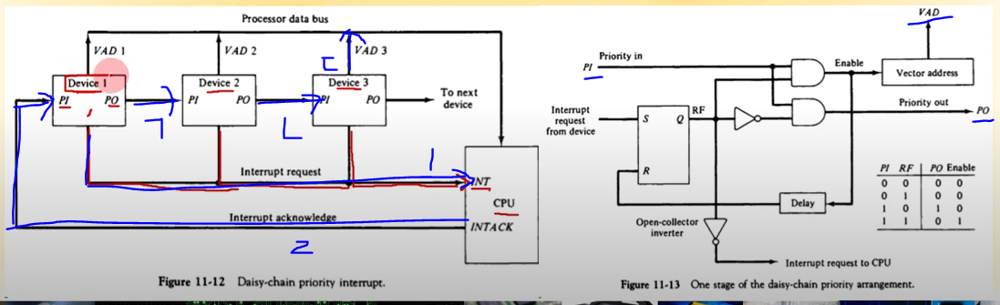

문제 ) 동시에 두개이상의 디바이스가 입출력 요청을 할 수 있음

→ 근데 입출력 버스는 하나뿐임

→ 모든 버스는 동시에 신호를 공유할 수는 없음

→ 항상 버스에는 하나의 데이터만 있어야함

→ **우선순위 부여**

- 인터럽트 request 처리 순서

  1. 인터럽트 신호를 CPU로 내보내고 CPU가 인터럽트 신호를 처리할 상황이 되면

  2. 인터럽트 acknowledge를 보냄

  3. CPU는 어떤 디바이스가 요청을 보냈는지 모르지만 acknowledge는 순서에 따라 `디바이스1`부터 인터럽트 처리 프로그램의 vector adress (VAD) 를 CPU로 전달
  4. CPU로 전달 → 프로그램카운터(PC) → JUMP → 명령어 실행

- 디바이스1과 디바이스2가 처리하겠다고 손 든 경우

  ㄱ. 디바이스1 CPU에서 처리가 끝나면 그때 자기가 가지고있던 인터럽트 acknowledge 신호를 다음 번으로 토스

  ㄴ. 역할 없는 디바이스2는 넘어감

  ㄷ. 디바이스3에서 VAD 신호 전달

**결론**

- **결론**
  - 인터럽트 acknowledge에서 가까이있는 디바이스1이 먼저 인터럽트 처리됨 → **Figure 11-12**에서는 좌측일수록 우선순위가 높은것
  - **Figure 11-13** 은 PI, PO, VAD의 내부 로직을 설명함 → SR FlipFlop 값이 뭐냐에 따라서 VAD와 PO 값도 넘겨줌(조합회로)

### 병렬 우선순위 인터럽트

- 우선순위 인코더 사용
- 우선순위에 따른 VAD 생성
- CPU에 인터럽트 전달
- Mask 레지스터 사용

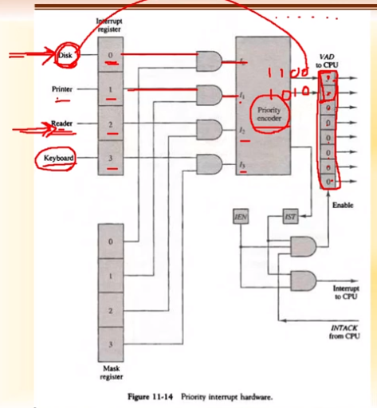

- Disk와 Reader에서 동시에 인터럽트 요청이 왔다고 가정
  - Disk가 우선순위가 더 높으면 우선순위가 높은 Disk의 x,y번째 인터럽트를 내보냄
  - VAD의 값에 따라 서로 다른 인터럽트 서비스 루틴으로 점프함
  - 따라서, 인터럽트 서비스 루틴이 시작되는 시작번지를 잘 만들어야함
    - 예시
      - Disk면 0,0
      - Printer면 0,1
      - Reader면 1,0
      - Keyboard면 1,1
- Mask register가 모든 I/O 장치에 달려있음(모두 1이어야, and 연산으로 처리 가능)

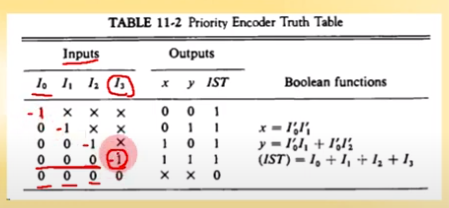

- 키보드는 디스크, 프린터, 리더 형들 중에 누구라도 손 든 경우 우선순위 후순위임
  - 아무도 인터럽트 처리 손 안든 마지막 경우에는 무정의조건
- 입력이 4개이고 출력이 2개인 조합회로
  - IST 는 각각의 논리조합 

### 인터럽트 사이클

- 인터럽트가 걸리면 인터럽트 백터 테이블(IVT)로 감 → IVT는 부팅할 때 제일 먼저 올라오는 데이터임

  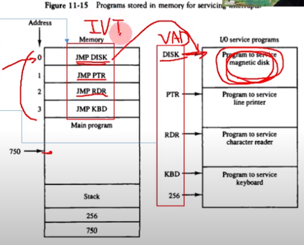

- 처리순서

  - 예시 - 디스크
    - 간접 번지에서 **Figure 11-14**에 따라서 0번째로 감 → VAD를 사용해서 jump  → 디스크에 해당하는 bias루틴이 수행 → 다시 간접번지로 돌아가서 프로그램 주소로 돌아감

- 인터럽트 사이클

  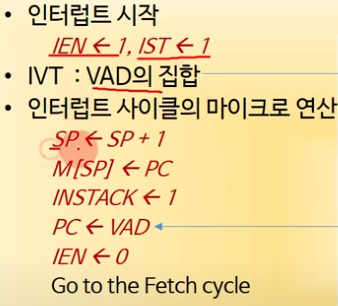

  - 인터럽트가 동시에 요청이 들어오면 스택에 넣고 PC를 VAD로 바꾼 뒤 IEN도 0으로 바꾼다.
  - 하나의 요청이 끝날 때 마다 스택에서 꺼냄 → fecty cycle로 가서 다음 인터럽트 수행

### 인터럽트 동작

- 인터럽트 벡터 테이블 (IVT)

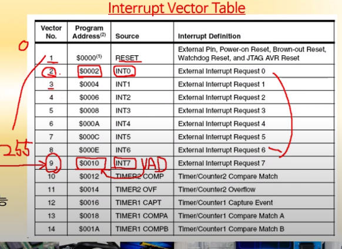

- request0번에 해당하는 인터럽트 벡터 → INT0

- 0번인 벡터는 시스템 인터럽트

- 총 256개의 벡터

- 인터럽트 동작

  

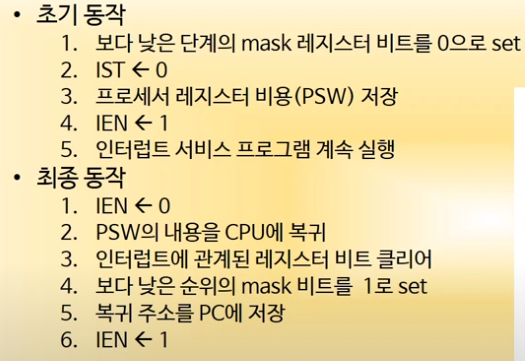

- mask 레지스터 비트를 0으로 setting에서 안 받음

- IEN을 0에서(0으로 길을 막아줌) 1로 바꿔주는 이유는 인터럽트에 갇히는 것을 방지

- 인터럽트 동작의 기계어 프로그램 분석
  - 초기동작/최종동작 부분으로 인터럽트 루틴 구분 가능
  - BIOS에서 각 인터럽트 서비스 루틴 추출에 활용

### 직접 메모리 접근

- DMA 전송 구조

  - I/O 장치가 CPU를 거치지 않고 직접 메모리를 주고 받음
  - DMA를 해주는 전용장치인 DMA 제어기가 필요
  - DMA제어기가 연결될 수 있도록 하는 CPU가 필요 → DMA 제어기도 일종의 프로세서(I/O 인터페이스와 비슷)

  

  - Bus request와 Bus grant가 연결되어 있어야함(CPU안에 내장도 가능함)
  - Control Logic이 하나의 CPU역할을 함

  

- 사이클 스틸링

  - CPU가 하나의 명령어를 수행할려면, 명령어를 메모리로부터 fetch해서 디코딩하고 실행을 한 뒤 다시 명령어를 write함 → 이러한 과정 속에서 메모리가 버스를 안 쓰고 노는 때가 있음 그 타이밍을 DMA 컨트롤러가 침투해서 버스 사용에 중복이 없게 하는 방식임  → CPU가 방해를 받지 않음 그 시간에 메모리에 접근을 하지 않기 때문  → 해당 시간을 노려서 I/O 장치와 메모리 간에 데이터를 전송함  → 그래서 훔친다는 표현인 스틸링을 사용

    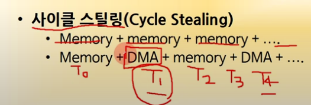

  - CPU가 메모리에 접근하지 않는 시간이 길 수록 사이클 스틸링 시간이 늘어남  → DMA 속도가 빨라짐

  - 리스크 프로세서처럼 한번에 메모리에 접근하고 명령어 수행할 때는 메모리 접근이 하나도 없다면  사이클 스틸링에 최적임  → 그래서 리스크 프로세서가 시스크보다 I/O 속도가 똑같은 조건에서 더 빠른 것

    

- DMA 전송 과정

  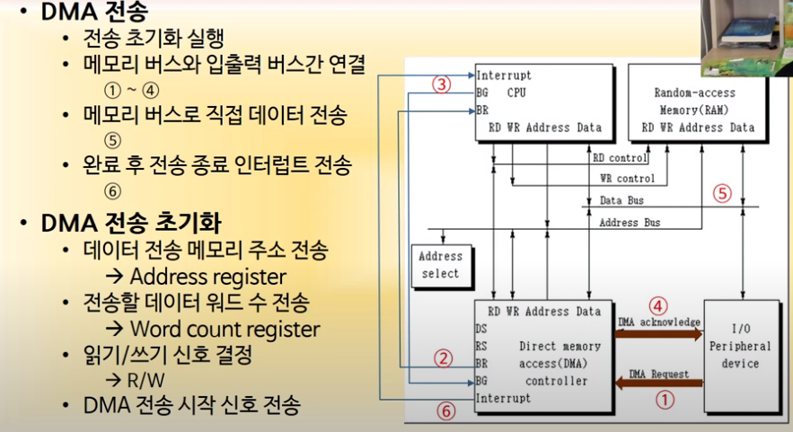

  1. 전송 초기화

     - 어디에 데이터를 전송할지, 데이터를 얼마나 전송할지, 읽기/쓰기 신호, DMA 전송 시작 신호 전송

  2. 과정

     1번 : DMA 전송 시작 신호 전송

     2번 : CPU에 버스 사용 요청

     3번 : 사이클 스틸링을 사용해서 DMA 요청을 OK 하면 BUS GRANT 신호를 보냄 

     4번 : I/O 디바이스 한테 허용 사실을 acknowledge로 알려줌

     5번 : Data bus를 호라용해서 메모리로 I/O 디바이스 데이터를 `데이터 전송 메모리 시작 주소`로 전송하거나  또는 메모리로부터 데이터를 읽어서 I/O 장치에서 쓰거나 하는 동작을 수행 → CPU를 거치지 않음 (한번 사이클 스틸링에 한 워드 씩 전송)

     6번 : DMA 전송 끝남을 인터럽트로 알림 → CPU는 BUS를 누가 쓰고있지 않겠다고 판단하고 다음 동작 수행 (CPU가 main CPU라면 DMA는 sub CPU처럼 동작)

### 입출력 프로세서

I/O 역할을 전문으로 맡아서 하는 DMA 컨트롤러의 확장판

- 입출력 프로세서의 역할

  - 입출력 장치와의 직접적인 통신을 전담

  - 채널로 호칭

  - CPU급의 DMA 제어기

    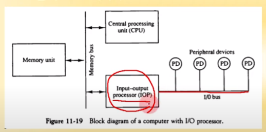

  - I/O 프로세서를 가지고 Peripheral devices가 그 뒤에 연결됨

    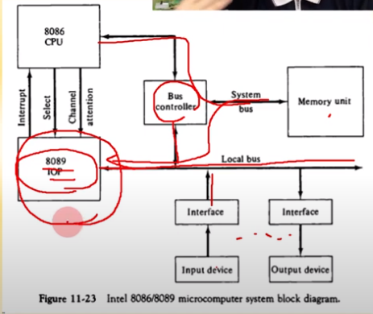

  - memory unit에서 상황에 따라 CPU로 가거나 IOP로 감

  - 8089 컴퓨터 시스템의 IOP 구조

  - 8089 IOP + BUS Controller => PC나 메인보드에서 칩셋이라고 하는 것

  - 칩셋이 뭐냐에 따라서 CPU가 수행할 수 있는 I/O 동작이 달라짐

### 직렬 통신

- 문자 지향 프로토콜

  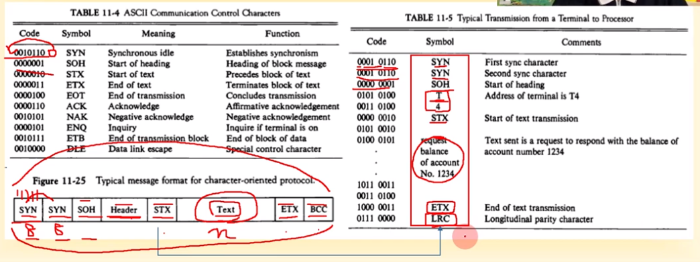

  - 문자 단위로 보냄
  - 내가 보낼려는 text 앞뒤에 starttext(STX) endtext(ETX)를 붙임  → 8비트 문자
  - Header안에는 text의 길이나 내용에 대한 정보가 들어있음 → 여러개의 문자
  - SOH는 Header시작을 알리는 StartOfHeader → 8비트 문자(한개의 문자)
  - 맨 앞에 sync 두번 → 8비트 문자 , 맨 뒤에는 BCC(text에 대한 에러 컨트롤 비트)
  - 각각의 칸은 모두 8 비트, text는 n개의 문자
  - 각각의 8비트는 비동기 직렬 통신 및 핸드 쉐이킹 방식임

- 비트 지향 프로토콜(음성, 이미지 등 문자가 아닌 경우)

  - 양 끝에 Flag
  - Address : 데이터가 보내지는 주소
  - Control : Information transfer(그냥 이미지), Supervisory(통신 속도나 통신 프로토콜), Unnumbered(또 다른 제어코드)
  - any number of bits의 개수는 다양함
  - Frame check

  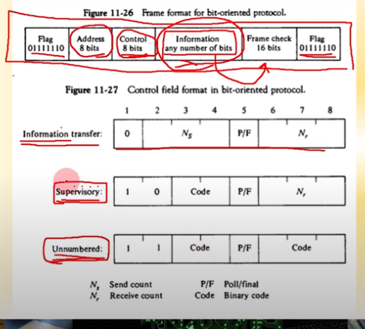

  - Poll : 시작 0
  - final : 마지막 1
  - Ns와 Nf는 일치해야함

