# 보조 기억 장치

- ## 자기 디스크(magnetic DIsk)
  
  - winchester type
    
    - hard disk / Pack disk 
  
   윈체스터 타입의 하드디스크(HDD)
  
  - floppy type
  
  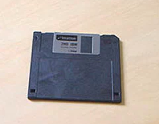플로피 디스크 FD
  
  - optical type
    
    - MO(마그네틱 옵티컬) / CD-ROM / DVD
  
  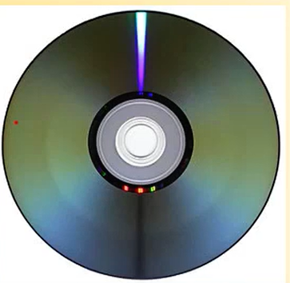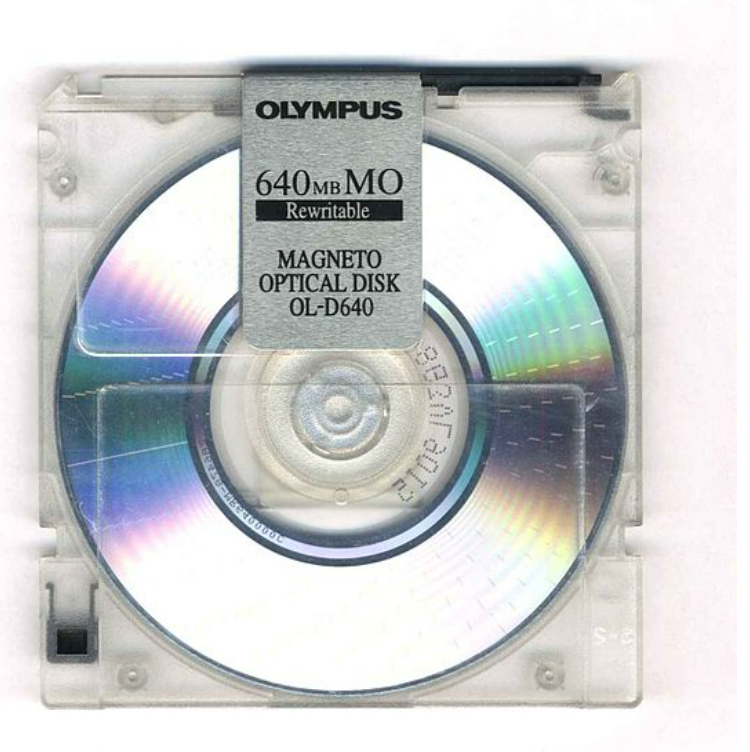

ㅇCD                                               MO(광 디스크)

- ## 자기 테이프
  
  - Reel type
  
  - Catridge type
    
    - 8mm / 6 mm DAT

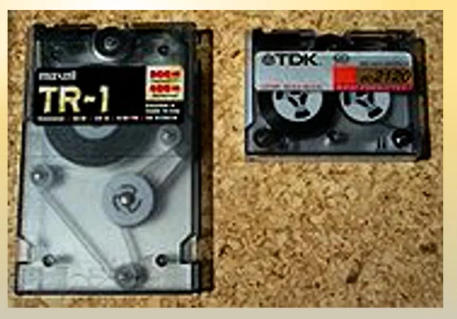

카메라 촬영등에 사용 

---

---

### 자기 디스크의 구성

- Platter 
  
  - cylinder / Track / sector 

- Spindle
  
  - long term rotation Motor

- Head / Arm(actuator)
  
  - data read, write
  
  - voice coil로 구동, sector tracking

- controller
  
  - mechanical control + bus control
  
  - CPU, RAM을 포함하는 자체 컴퓨터 

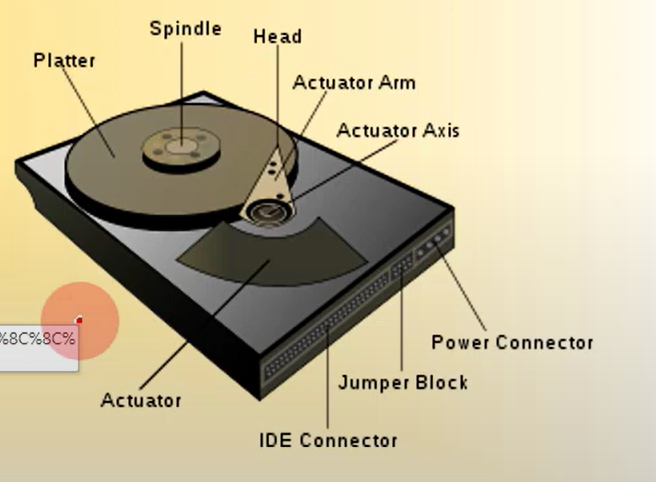

### 

platter : 하드디스크의 데이터가 저장되는 부분 

spindle: platter 를 회전시킴 

head :  디스크 platter로 부터 data를 읽고 쓸 수 있음

actuator arm : head를 움직임 

actuator : arm을 돌림

데이터를 읽어서 전기 신호로 바꿔서 전송하는 회로가 뒤에 붙어있음

IDE connector : 그 회로로 부터 컴퓨터를 연결하는 data connector 

### 디스크 용량 = platter 전체에 얼마만큼 담을 수 있는가

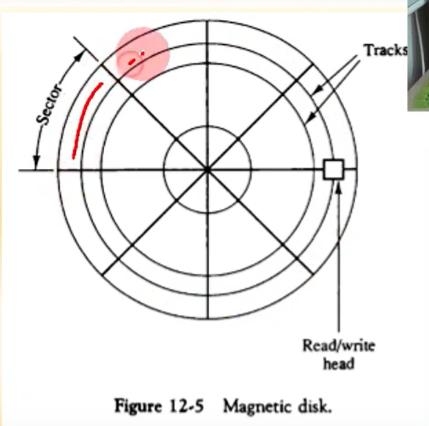ㅎ

하드 디스크는 

sector와  tracks로 구성 

한개의 sector에 저장할 수 있는 데이터의 용량은, 거의 모든 HDD에 걸쳐 다 똑같음 (512KB)

head 는 platter 한장 당 2개 

- capability = sector 수 (512kb)  + track 수(n) * head수(2 ~ 4)

- 1 TB disk = 1,099,512MB = 0.512 * 536,870, 912, 000 * 4

1테라면 track이 536,870, 912, 000만큼 필요해..? 응

track 수 :플로피면 15개 

hard : 36개

### 디스크 성능

Access time = seek time + rotational Dealy + transfer time 

하나의 데이터를 디스크가 읽어서 돌려주는 시간이 얼마나 걸리나?

seek time : head가 data가 있는 track으로 옮겨가는데 걸리는 시간 (가장 오래걸림)

rotational delay : 디스크가 돌아서 head가 있는 곳 까지 오는데 걸리는 시간(rpm이 클 수록 짧아짐)

----

## 자기 테이프

- 7 ~ 9 bit 동시 기록 -> 1 record

- reel type, 또는 cartridge type

- 최근에 DAT로 이전 

- RAID에 의해 대체중 (디스크)

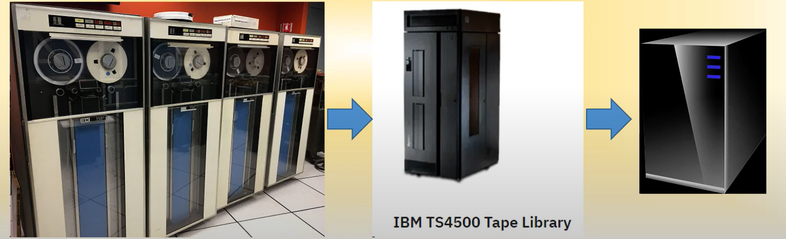

---

- RAID(redundant Array of Independent Disks)
  
  - 다수의 HDD 또는 SDD를 이용한 대용량 병렬 저장 장치
  
  - level에 따른 구조 및 기능 분류

RAID 0 : striping

RAID 1 : mirroring

RAID 2 : Hamming Code

RAID 3 : Bit Striping

RAID 4 : Block Striping

RAID 5 : Rotational Striping

RAID 6 : dual Striped party

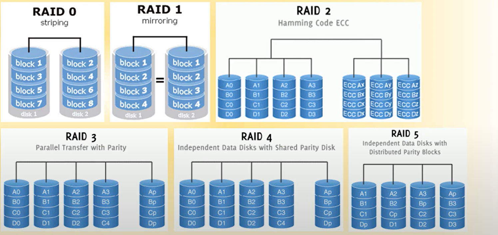

독립적인 여러개의 디스크를 모아서 만든 장치

RAID 0  : 1 3 5 7 , 2, 4, 5, 6 : 데이터를 나눠 놓음 

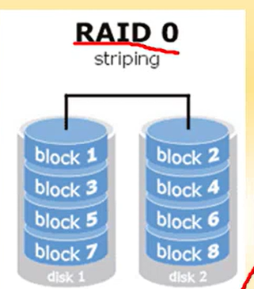

RAID 1 : 안정적, 대용량 데이터에 적합 , 같은 데이터를 두개의 디스크에 저장(은행, 금융 시스템)

- 저장 비용이 2배, 안전은 확보 가능 

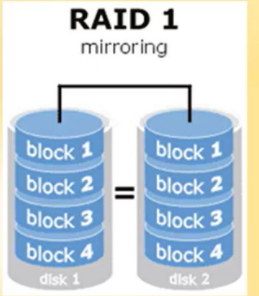

RAID 2 : hamming code 

중간 블럭에 손상이 생겨도, 나머지 블럭의 hamming code를 가지고 추적 가능

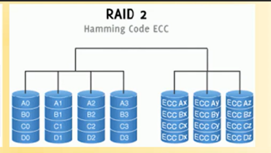

RAID 3 : hamming code 의 확장,  hamming code대신 parity를 사용

data disk + parity disk

hamming에 비해서 불안정

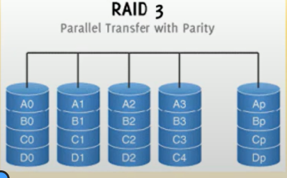

RAID 4 : 3와 방식은 비슷한데, 공유된 디스크에 사용한다는점 

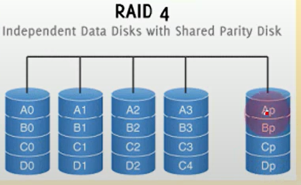

그러나 parity가 나가버리면,,? 곤란해짐 

RAID 5, 6 : 대다수의 환경

parity자체를 분산시켜놓자 

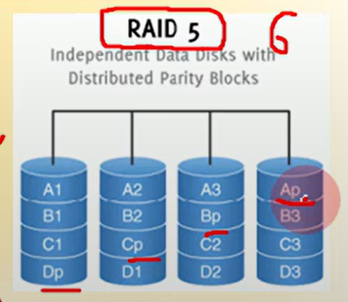

---

### 어소시어티브 메모리

- Main Memory : 주소 기반 데이터 검색

- Associative Memory : 내용 기반의 데이터 검색 

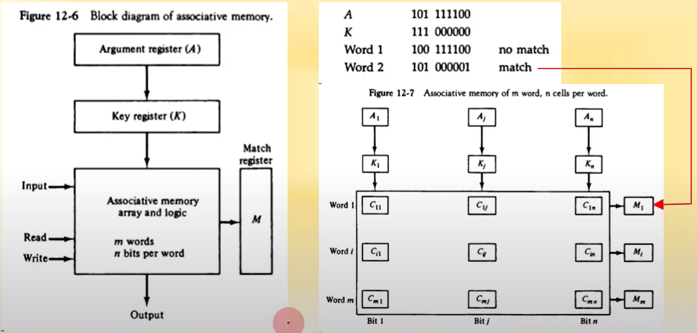

main memory의 동작 

- 주소를 주면 해당 주소에 있는 memory를 출력해줌 

- 주소를 주고  data를 주면 해댱 주소에 data를 넣음 

associative memory의 동작

- 내용 기반의 데이터 검색

- 찾고자 하는 데이터의 내용을 넘겨줌 

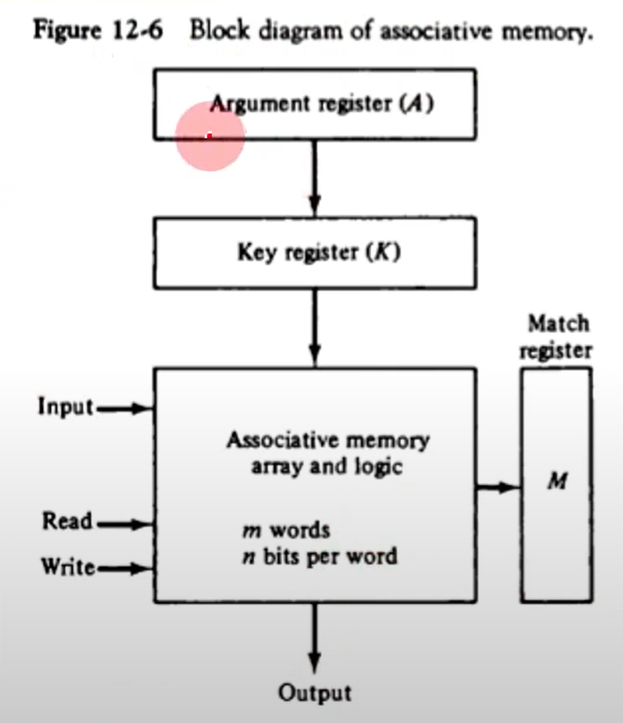

argument register : 내가 검색하고자 하는 데이터의 전체 또는 일부 넣음

key register : 그 중 어떤 bit을 마스크로 할 것인지 정함

- Key register의 역할은 argument register-A의 특정한 영역이나 키를 선택하기 위한 마스크를 제공한다.

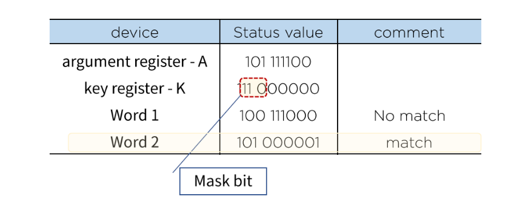

associtate memory : 이 안에 전체 혹은 부분이 일치하는 내용이 있다면, 일치하는 내용이 몇번지에 있는지를 나타내 줌 

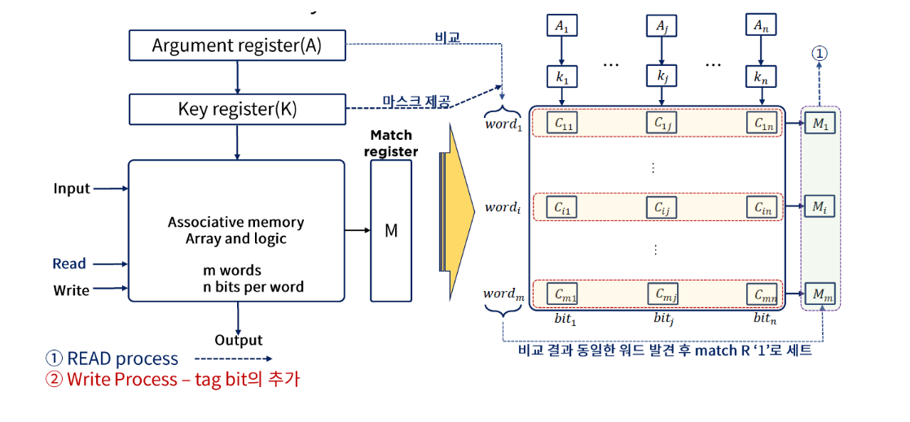

---

캐시 메모리

- 특성

- - **main memory 보다 10 ~ 100배 빠른 속도**
  
  - 주기억 장치보다 작은 용량(비싸니까)
    
    레벨이 작을 수록 cpu(레지스터)에 가까움
    
    레벨이 클 수록 메인메모리에 가까움
    
    
    
    - Level에 따른 계층적 구조
    
    CPU 내에 위치 : level 1, level 2
    
    CPU 내 외부에 위치 : level 3 (AMD 제외)
    
    - amd는 항상 CPU 바깥에 위치 

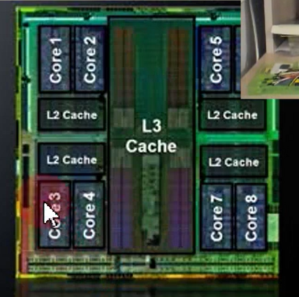

8 core 캐시 메모리 

하나의 cpu 칩임 

level 1은 core안에 위치 

core 바깥쪽 

인텔 제품은 L3가 안에 들어있음

---

cache 메인메모리와 cpu 사이에 위치

cpu에 가까움

data가 들어온다 -> cpu는 cache에 저장, data 읽을 떄도 cache에 먼저 읽어보고, 없으면 main memory에서 읽어봄 

그런데 같은 데이터가 cache와 main memory 둘 다 있을 수 있음 

cache의 data가 main으로 가야하거나, main의 데이터가 cache로 들어가야할 떄는 어떻게 해야하나? 

cpu가 데이터를 한번 읽으면 -> 메인 메모리에서 cache로 이동됨 

cpu가 데이터를 쓰면 -> cache로 저장, cache에 공간이 모자라면 밀어내야 하는데, 어떻게 밀어내나? 

주소 매핑(Address Mapping)

- 주 기억장치 주소 공간과 캐쉬 주소 공간과의 연결
  
  

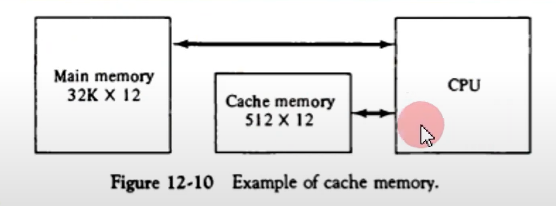

- 매핑 방식

- - 어소시에이티브 매핑(associative mapping)
  
  - 직접 매핑(direct mapping)
  
  - 세트 어소시에이티브 매핑(set associative mapping)

---

**어소시어티브 매핑**

- cache를 Address와 Data 공간으로 분할

- 데이터 젖아 시에 address와 data를 모두 저장 

- CPU address를 캐쉬의 address와 비교(argument register)사용 

- 반은 address, 반은 data기 떄문에 많을 수록 좋지만 비쌈

캐시 데이터의 접근

- match logic에 의하여 데이터 match : cache hit
  
  - data 부분을 접근하여 CPU 로 전달 

- match logic에서 match없을 시 : cache Miss
  
  - main memory를 접근 
  
  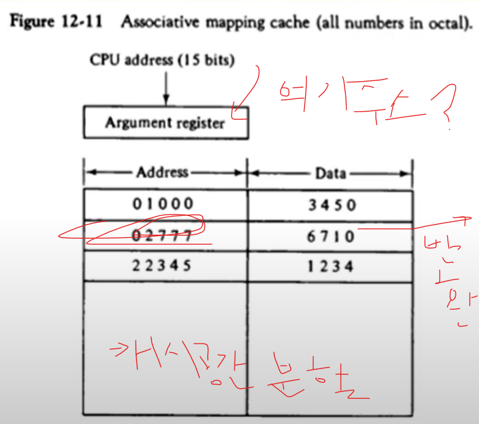

---

직접 매핑 

- CPU 주소의 일부를 캐시 주소로 사용

- 메모리 주소를 tag와 Index로 구분

- index값으로 캐쉬 접근 

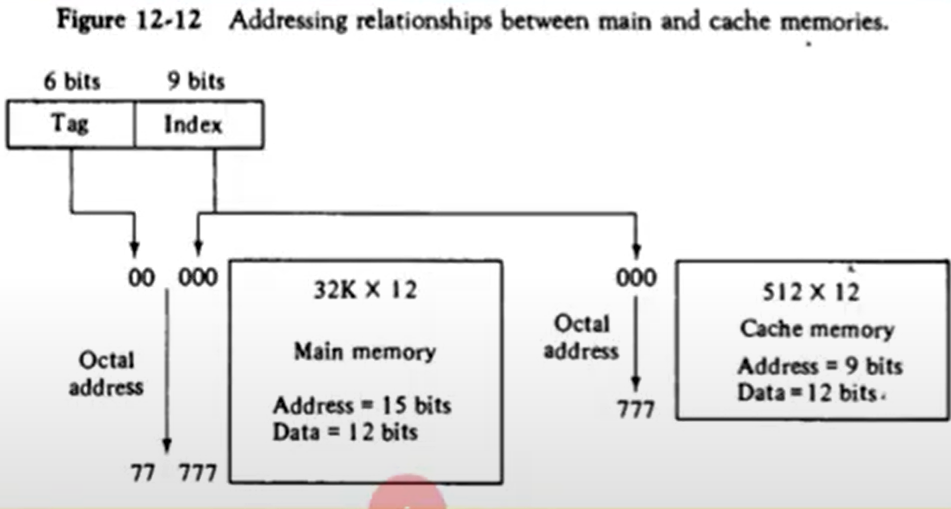

cache : 9 bit 가 필요 -> 000 부터 777 까지 주소 사용

address : 15 bit 

이 중 하위 9bit를 cache를 위한 index로 사용하는 것 

77 777 중 뒤의 777이 주소로 maping 된 것 

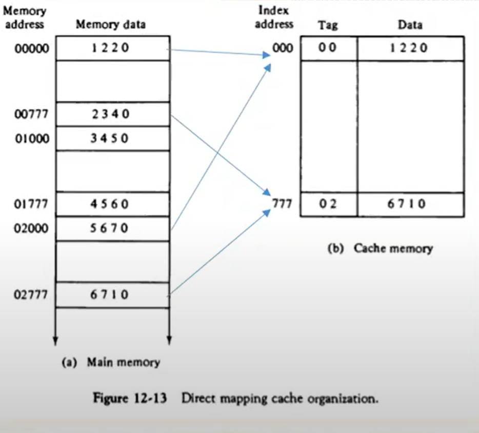

메모리 주소 00000 -> 15 bit 

캐시 주소 000 -> 9bit

cpu가 00000에 1220 data를 집어넣어라고 한다면 

000주소에 가서 data 1220 적음

tag의 역할 -> 주소가 000으로 끝나는게 하나가 아니니까 구분해줌 

그래서 tag를 저장함 

**그런데 문제가 있어요!**

00000 접근 -> 02000 접근 -> 다시 00000 접근

- tag 다시쓰고 data 다시쓰고 반복 \

- 스래싱이라고 부름

같은 주소에 대해 tag를 여러개 두자

---

**세트 어소시에이트 매핑**

- 동일한 Index에 두개 이상의 tag가 저장 

- 2- way / 4 way associative 

- tag 수 만큼 set이 있을 경우 
  
  - fully- associated mapping 
  
  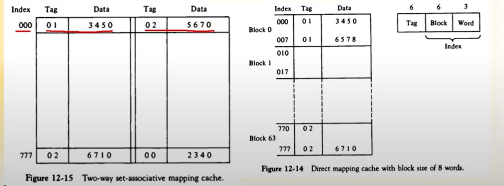

**블록을 가지는 직접 매핑** 

- Index를 block과 word로 구분 

- 같은  block 내에서는 tag값 사용

- index값으로 캐쉬 접근 

---

캐시 메모리 

- 캐시에 기록
  
  - CPU 데이터를 메모리와 캐시에 저장하는 구조 
  
  - 필요한 데이터를 cache로 부터 메인메모리로 저장할 때 방법이 2가지 있다
    
    - **write-through**
      
      - 캐시와 메모리에 동시에 저장
      
      - 캐시는 write 속도가 빠르지만, 메인메모리는 느림 -> 결론적으로 쓰기 속도 느림
      
      - system crash 발생시에 데이터 안정성 높음 
        
        
    
    - **write-back**
      
      - 캐시에 먼저 저장, 이후 버스 유휴시간에 메모리로 기록(쉬는 시간이 있을떄 메인메모리에 씀)
      
      - 쓰기 속도 빠름, system crash 발생 시 데이터 손상 가능성 높음 
      
      

- 캐시 힛트율 (cpu가 원하는 데이터가 캐시에 있을 확률)
  
  - cpu가 접근하는 데이터가 캐시에서 먼저 접근 될 확률
  
  - 일반적인 경우 85 % ~ 95% 
  
  - 캐시 미스율로 나타내기도 함 
  
  

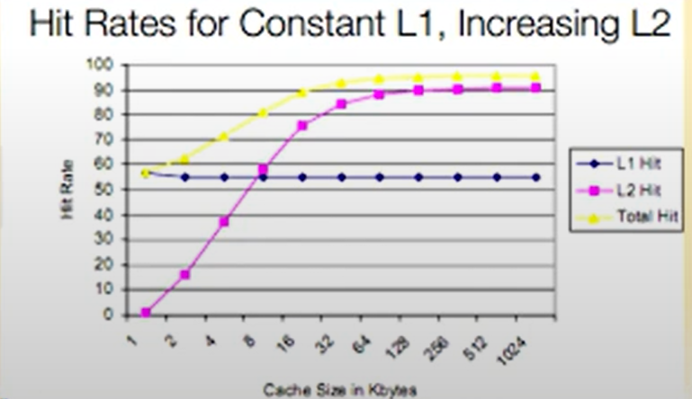

캐시 초기값 설정

- 캐시 데이터 무효화 -> valid bit를 사용

- 초기값 설정 <- 모든 valid bit를 0으로 set(컴퓨터 끌때)

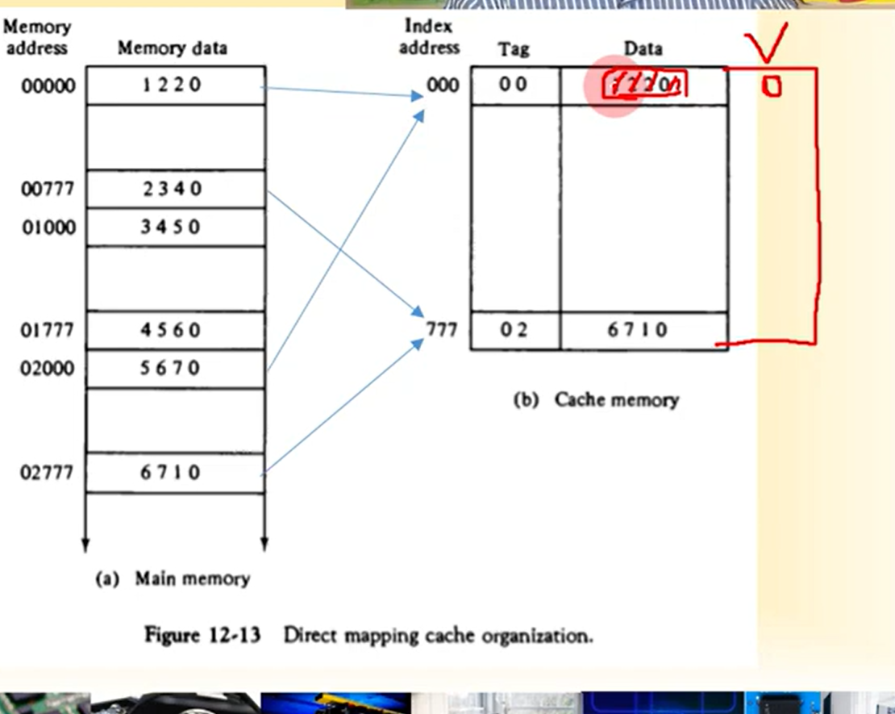

