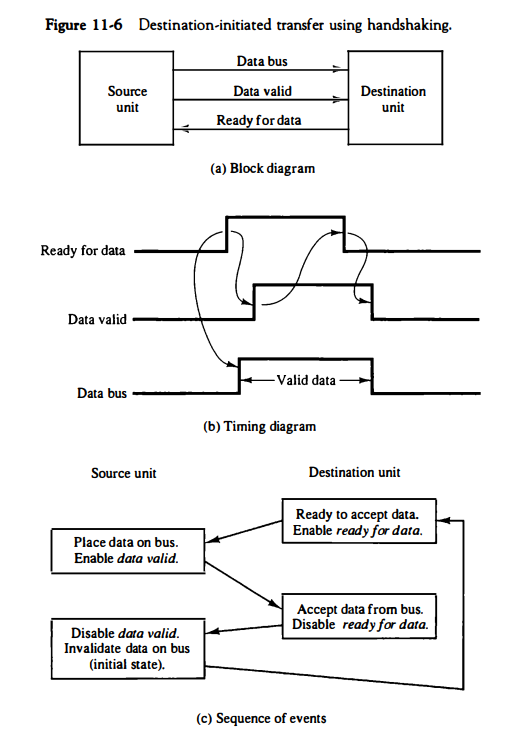

## [제 11장 Part-1](https://www.youtube.com/watch?v=jbx2HolVQqk&list=PLc8fQ-m7b1hCHTT7VH2oo0Ng7Et096dYc&index=27)

### 주변장치 (Peripheral Devices)
- 컴퓨터와 연결 방식
	- 온라인 장치 / 오프라인 장치
- 주변 장치의 종류
	- 입력 장치
		- 키보드, 마우스, 디지타이저, 마이크, 카메라 ...
	- 출력 장치
		- 모니터, 프린터, 스피커, 서보장치 등
	- 입출력 장치
		- 저장 장치, TV-인코더, LCD 터치스크린 등
- 인터페이스

- 컴퓨터와 데이터 통신 방식
	- ASCII  문자 : Alphanumeric, 제어문자
	- 
	

### 입출력 인터페이스 (Input-Output Interface)
- 입출력 인터페이스의 기능
	- CPU와 I/O 장치의 차이점 해결
	- 동작 방식 차이에 따른 데이터 신호값 변환 (TTL <- -> RS-232-C)
	- 전송 속도 동기화
	- 데이터 코드 형식과 메모리 워드 형식 간 변환
	- 주변장치들 간의 동작 순서와 순위 중재 및 조정
- I/O 버스와 인터페이스 모듈
	- 입출력 버스
	- 인터페이스가 실행하는 I/O 커맨드
		- 
- I/O 대 메모리 버스
	- 메모리와 I/O가 각자 다른 버스 사용
		- CPU와 IOP를 별도로 가지는 시스템에 사용
	- 메모리와 I/O 가 공통의 버스, 개별 제어 라인 사용
	- 메모리와 I/O 가 공통의 버스와 제어 라인 사용
- 
- 격리형 I/O
	- 별도의 입출력 명령 사용
	- 인터페이스 레지스터 주소 사용
	- 명령어에 레지스터 주소 지정
- Memory Mapped I/O
	- 메모리 주소를 인터페이스 레지스터까지 확장
	- 메모리와 입출력 공간 구별 없음
	- 특정 메모리 주소 영역에 입출력 장치 주소 overlay
	- 특정 입출력 명령어 필요없음
		- memoryRead() = I/O DeviceRead()
		- 
	- I/O 인터페이스 예
		- 입출력 버스 버퍼(bus buffer)
			- 호스트와의 양방향 데이터 전송
			- 입출력 속도를 결정 (bps)
		- 제어 장치 (Control Unit)
			- 입출력 인터페이스 선택 (CS)
			- 포트 레지스터 선택 (A, B)
			- 데이터 입력/출력 제어 (RD/WR)
		- 포트 레지스터 (Port Reigster)
			- 2개의 디바이스 연결 제어
			- 제어 레지스터
			- 상태 레지스터
		- 내부 버스 (Internal Bus)
			- 버스 버퍼와 포트 레지스터 연결
		- 

## [제 11장 Part-2](https://www.youtube.com/watch?v=9faaqyzw28I&list=PLc8fQ-m7b1hCHTT7VH2oo0Ng7Et096dYc&index=28)

### 비동기 데이터 전송 (Asynchronous Transfer)
- 스트로보 제어(strobe)
	- 
	- 
	- 핸드셰이킹 제어
		- 
	- 
- TTL 전송
	- 0V, 5V 신호로 데이터 정송
	- 시작 비트 1, 데이터 비트 8, 정지비트 2, 총 11비트 단위로 8비트 데이터 전송
	- 데이터 신호 (비트)의 간격 = 1/전송 속도
- 전송 규칙
	- 데이터 전송되지 않을 때에는 항상 1 신호 (5V) 유지
	- 문자 전송의 시작은 시작 비트 0으로 표시
	- 시작 비트 뒤로 8개의 데이터 비트 표시
	- 마지막 비트 후 2비트 이상의 1신호 유지
	- 
- 비동기 통신 인터페이스
	- UART(Universal Asynchronous Receiver Transmitter)
	- 
- FIFO 버퍼
	-  
### 전송 모드 (Modes of Transfer)
-  
- 입출력 전송 모드의 종류
	- 프로그램된 I/O (Programmed I/O)
		- 입출력 명령에 의하여 동작
		- 프로세서 레지스터와 주변장치간 데이터 전송 수행
		- 레지스터와 메모리간 데이터 전송 수행
		- 주변 장치의 플래그에 기반한 입출력 수행
	- 인터럽트에 의한 I/O (Interrupted I/O)
		- 인터럽트에 의하여 입출력 수행
		- 입출력이 준비되면 프로세서에 인터럽트 요구 수행
		- 인터럽트 처리 후 본래 프로그램 계속 수행
	- 직접 메모리 접근 (DMA: Direct Memory Access)
		- 데이터를 메모리 버스를 통하여 전송
		- DMA를 수행하는 전용 하드웨어 (DMA Controller) 사용
		- 사이클 스틸링에 의한 버스 효율화
- 프로그램된 I/O 의 순차
	- 플래그 비트 검사
	- 상태 레지스터 확인
	- 데이터 레지스터 접근
	- 
	- 
## [제 11장 Part-3](https://www.youtube.com/watch?v=ufXNH7RsAro&list=PLc8fQ-m7b1hCHTT7VH2oo0Ng7Et096dYc&index=29)

### 우선순위 인터럽트 (Priority Interrupt)
- 인터럽트 우선순위
	- 동시에 발생된 인터럽트의 우선순위 결정
	- 하드웨어 또는 소프트웨어적으로 결정
- 데이지체인(Daisy Chain) 우선순위 인터럽트
	- 우선순위에 따라서 인터럽트 처리 프로그램의 벡터 주소 (VAD)를  CPU로 전달
- 

- 병렬 우선순위 인터럽트
	- 우선순위 인코더 사용
	- 우선순위에 따른 VAD 생성 
	- CPU에 인터럽트 전달
	- Mask 레지스터 사용
- 
- 
- 인터럽트 사이클
	- 인터럽트 시작
		- IEN <- 1, IST <- 1
	- IVT : VAD의 집합
	- 인터럽트 사이클의 마이크로 연산
		- SP <- SP + 1
		- M[SP] <- PC
		- INSTACK <- 1
		- PC <- VAD
		- IEN <- 0
		- Go to the Fetch cycle
	- - 
	- 인터럽트 동작
		- 초기 동작 
			- 1. 보다 낮은 단계의 Mask 레지스터 비트를 0으로 set
			- 2. IST <- 0
			- 3. 프로세서 레지스터 비용 (PSW) 저장
			- 4. IEN <- 1
			- 5. 인터럽트 서비스 프로그램 계속 실행
		- 최종 동작
			- 1. IEN <- 0
			- 2. PSW의 내용을 CPU에 복귀
			- 3. 인터럽트에 관계된 레지스터 비트 클리어
			- 4. 보다 낮은 순위의 mask 비트를 1로 set
			- 5. 복귀 주소를 PC에 저장
			- 6. IEN <- 1
	- 인터럽트 동작의 기계어 프로그램 분석
		- 초기동작/최종동작 부분으로 인터럽트 루틴 구분 가능
		- BIOS에서 각 인터럽트 서비스 루틴 추출에 활용

### 직접 메모리 접근 (Direct Memory Access)
-  DMA 전송 구조
	- DMA를 지원하는 CPU
		- 
	- DMA 제어기
		- 
	- 사이클 스틸링 (Cycle Stealing)
		- Memory + memory + memory ...
		- Memory + DMA + memory + DMA +...
		- 
	- DMA 전송
		- 전송 초기화 실행
		- 메모리 버스와 입출력 버스간 연결 (1~4)
		- 메모리 버스로 직접 데이터 전송 (5)
		- 완료 후 전송 종료 인터럽트 전송 (6)
	- DMA 전송 초기화
		- 데이터 전송 메모리 주소 전송
			- Address reg.
		- 전송할 데이터 워드 수 전송
			- Word count reg.
		- 읽기/쓰기 신호 결정
			- R/W
		- DMA 전송 시작 신호 전송
	- 

### 입출력 프로세서 (Input-Output Processor)
- 입출력 프로세서(IOP)의 역할
	- 입출력 장치와의 직접적인 통신을 전담
	- 채널 (Channel)로 호칭
	- CPU급의 DMA 제어기
	- 
	- 

### 직렬 통신(Serial Communication)
- 문자 지향 프로토콜 (Character Oriented Protocol)
	- 
	- 
	- 
- 비트 지향 프로토콜 (Bit Oriented Protocol)
	- 
	- 
	- 비문자 데이터 전송용 Format
	- Control field에 따라서 여러 데이터 형태 결정

