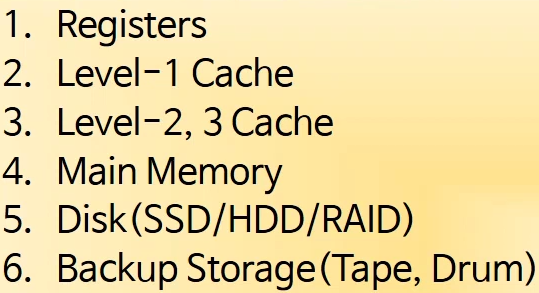
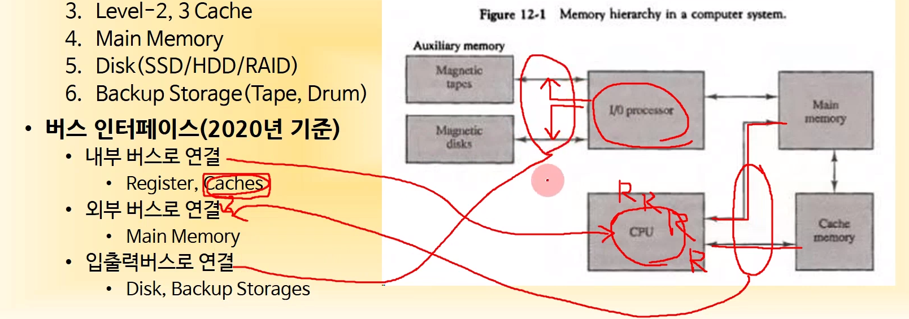
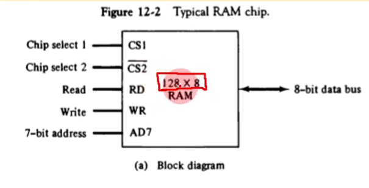
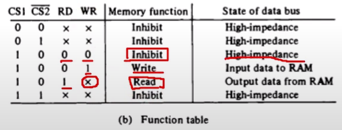
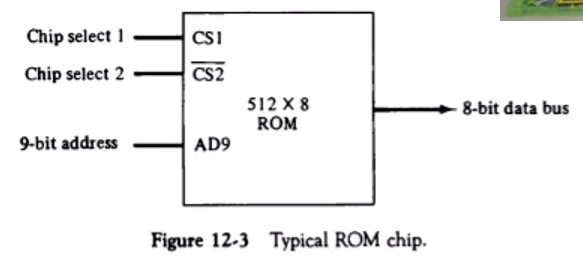
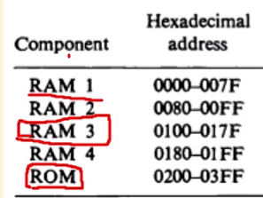
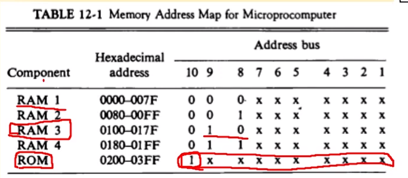
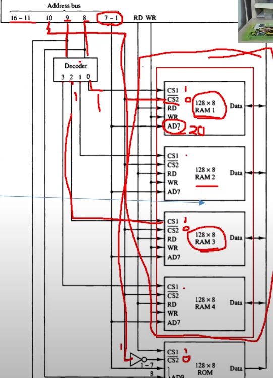
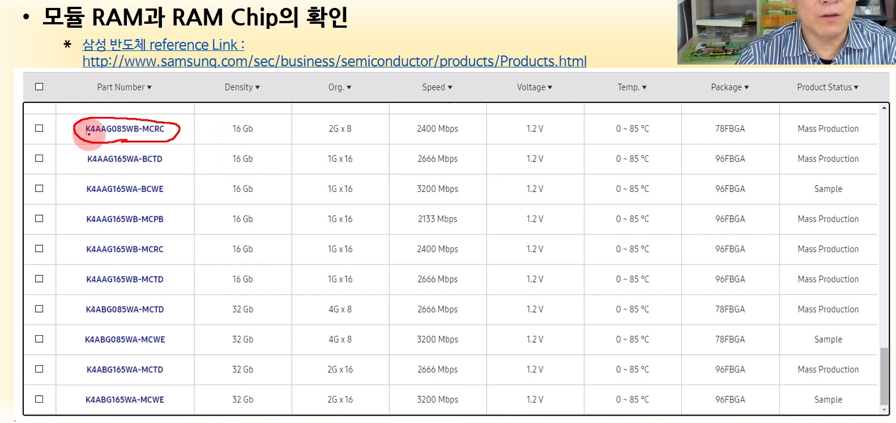
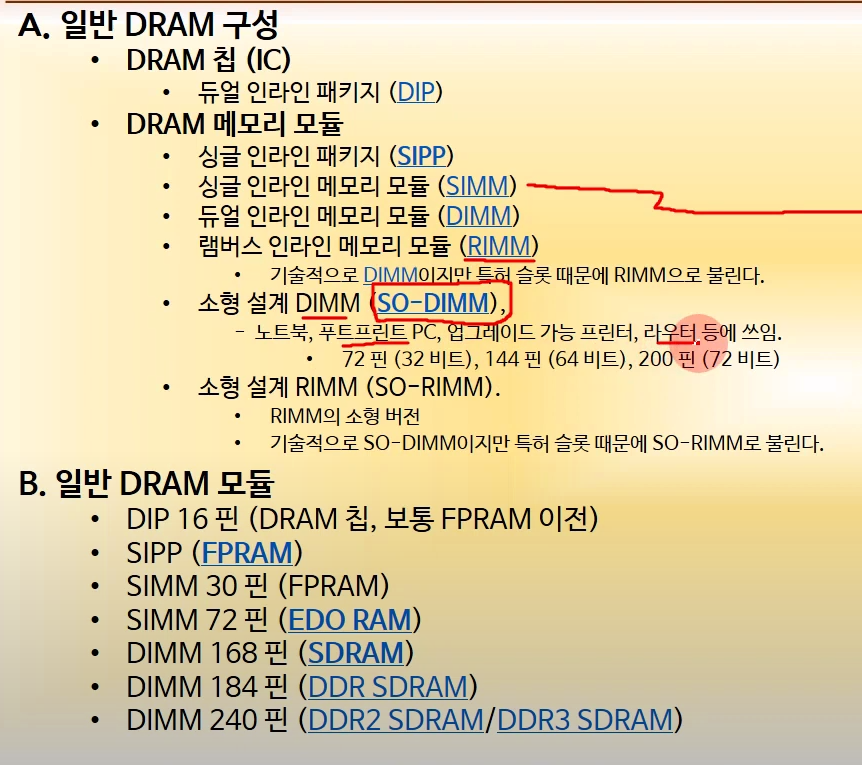

# chapter 12-1

---

## 1, 메모리 계층

### 컴퓨터 시스템의 메모리 계층

**최상위 계층 -> 레지스터** 가장 빠르고 비싼 메모리

**그 다음 -> 캐쉬**

중략

**테이프같은거 이제 안씀**

### 버스 인터페이스(2020)

메모리들을 결국은 cpu와 연결하는 그런 시스템의 구조

외부 / 내부 / 입출력 버스가 있음

**내부**: cpu 내부에 존재하는 레지스터와 레지스터를 연결하는 요소

**외부**: 캐쉬, 메인 메모리를 연결

**입출력**: 뒤에 쭉 연결되어 있는 온갖 연결장치들을 연결

---

## 2. 주기억 장치

### 정의

### RAM

### ROM

Bootstrap code? -> 전원이 꺼져도 보존되어 있어야 할 그런 애들의 데이터를 ROM에 저장

### RAM과 ROM 칩

**1. RAM chip**

128 * 8 -> 128개의 저장 공간이 있다는 의미, 그 각각의 저장공간에 들어가는 데이터의 크기가 8비트라는 뜻. -> 128바이트 라는 의미

8비트짜리 데이터를 저장하는 단위 -> word

위의 램은 한 워드의 크기가 8비트인 것. 그런 워드를 128개 저장한다는 뜻

128개 저장하려면? -> 7비트의 주소 필요(2**7)

**RD, WR**

RD(read)와 WR(write)가 모두 0 -> 작동 안함

WR만 1 -> Write

RD가 1 -> WR과는 상관 없이 Read

**CS1, CS2**

위의 표를 보면, CS2에는 --이 그어져 있음 -> **CS1이 1이고, CS2가 0일때 칩이 동작**

(CS1, CS2 둘 다 1이거나 CS1이 0인 경우 RD, WR의 값과 상관 없이 작동을 하지 않는것을 볼 수 있음)

**2. ROM chip**

RAM과 달리 읽고 쓰는 부분이 없음

512 * 8 이므로 9비트짜리임

CS1, CS2의 경우는 RAM과 같음

### 모듈 RAM의 구성

4개의 RAM 칩으로 구성된 모듈RAM을 상정

각 RAM은 128 * 8의 RAM을 상정

각 RAM의 주소를 128개씩 끊어서 할당하자

RAM1은 0 ~ 127

RAM2는 128 ~ 255

RAM3과 RAM4 또한 마찬가지.

그렇게 16진수로 나타나진 주소를 2진수로 바꾸면?

**위의 테이블(메모리 주소 맵)과 같이 표현 가능함**

여기서 잘 보면, 7비트의 데이터까지는 RAM1~4 모두 같은 값을 가질 수 있음(10진수로 치면 대충 RAM1: 1000 ~ 1099, RAM2: 12000 ~ 12099 -> 어쨌든 1의자리와 10의자리는 공통됨)

**RAM1 ~ 4를 구분지어주는 것은 결국 8, 9번 비트**

위의 그림을 보면

8, 9번 비트에 연결된 **디코더**가 하나 있음

이 디코더는 **8, 9번 비트의 값을 이용**(RAM1의 경우 8, 9번 비트값이 0, 0임 -> 0 취급 -> 디코더 에서 0 쪽으로 줄기 뻗어나감(값 1) -> 위의 그림에서 0에 해당하는 부분은 RAM1 -> RAM1에만 1, 그 외의 RAM은 0 -> 좀 전에 CS1이 1이고 CS2가 0 이면 동작한다고 했음. 이 경우 RAM1만 동작하고, 그 외의 RAM은 동작하지 않음 -> 어느 RAM에서 데이터를 읽을 지 고를 수 있게됨)

---

모듈 램 확인하기

(생략)

---

(윗 사진은 그냥 참고만 ㄱ)

**대부분 DDR4 쓴대**

