# 1. JAVA 기본1

- 데이터(값)
- 정보(의미가 있는 데이터)
- 고려대 학사관리시스템을 한 번 만들어봤으면 연세대 학사관리시스템을 만드는거는 쉽다
- 공통된 시스템을 가져다 쓰고 위에다가 추가적인 부분을 얹는다.
- 공통부분 - Framework / **Framework**는 마치 **커피 프랜차이즈**가 커피머신이랑, 원두랑 알아서
  공급해주는거랑 비슷하다(개인창업보다 신경쓸게 덜함)
- **스프링**으로 **전자정부 프레임워크**가 만들어졌다.

#### 1-1. 운영체제와 프로그램

- 운영체제 :  **시스템 하드웨어를 관리할 뿐 아니라 응용 소프트웨어를 실행**하기 위하여 하드웨어
  추상화 플랫폼과 공통 시스템 서비스를 제공하는 **시스템 소프트웨어**
- 프로그램 : 컴퓨터에서 실행될 때 특정 작업(specific task)을 수행하는 일련의 명령어들의 모음(집합)
- **명령어** -> 작업지침서, 일을 시킬 수 있는 키워드(약속된 단어) -> 이걸 모으면 **프로그램**임
- 추상적 <-> 구체적
- 사람(추상적), 홍승길(구체적) 같은 느낌

#### 1-2. JVM이란?

- 자바 바이트코드를 실행할 수 있는 주체
- 자바 바이트코드는 **플랫폼(os)에 독립적**이며 모든 자바 가상 머신은 자바 가상 머신 규격에 정의된 대로
  자바 바이트코드를 실행
- 프로그램문법 -> 컴파일 ->기계어(01000,....)
- 자바문법 -> 컴파일(jdk) -> 자바 바이트코드(기계어까진 아님)
- 바이트코드를 실행하는 역할 -> JVM(java vector machine)

#### 1-3. 컴퓨터의 자료표현

- 1G(목소리) -> 2G(+문자) -> 3G(+영상) -> 4G(All IP) -> 5G(홀로그램?을 할 수 있을 정도의 속도를 목표로 만들긴 했음)

- 비트 (bit) - 0, 1 / 흑백, 스위치 온오프 / 비트 2개면 -> 4개나타낼 수 있음(ex>동서남북)
- 키보드자판이 보통 (96가지 근방임) -> 7비트면 가능(128가지) -> 여기에 패리트비트(1비트)를 더해서
  8비트로 보내왔다. (그래서 이게 잘 쓰이니까 8비트 -> 1바이트로 단위 만든듯)
- 바이트 (Byte) - 8비트
- 2진수 (Binary) - 00001001(9) , 10001001(-119)
  맨 첫자리 부호비트(1이면 `-`, 0이면 `+`), 2의 보수 표기법
- 
- 9(00001001) -> 뒤집고(11110110) -> 1더하면(11110111) -> -9
- 정수 : 2의 보수 / 문자 : ASCII 코드 / 실수 : 부동소수점 표현
- 잡 얘기
  - 다운받을때 32비트의 의미 ex(cpu(2ghz), ram(16gb), ssd(2tb)
  - cpu가 한 클럭에 옮기는 양(32비트(x86, 86시리즈(186, 486, 586 등등)라는 의미), 64비트(x64)), 2ghz는 이걸 이제 1초에 2 기가번 한다는 의미임
  - **기본 데이터 처리 단위**
  - 32비트로는 4g가 끝임 (왜냐면 32비트 마지막 수가 42억9천번쯤됨)
  - 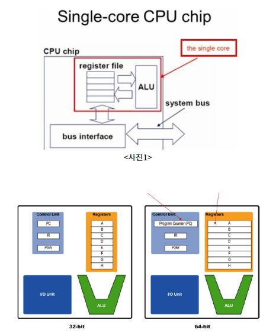

#### 1-4. 메인 메소드

- 실행 명령인 java를 실행 시 가장 먼저 호출 되는 부분
- 만약, Application에서 main() 메소드가 없다면 절대로 실핼 될 수 없음
- Application의 시작 = 특정 클래스의 main() 실행
- 형태 (고정된 형태)

- `ctrl+space` -> 자동완성
- `ctrl + shift + c` -> 주석처리
- `ctrl + shift + f` 자동 서식정렬

#### 1-5. 출력 포매팅 예시

```java
public class Test {
	public static void main(String[] args) {
		System.out.println("Hello World \n");

//		System.out.println("Welcome to SSAFY");
//		System.out.println("\\");
//		System.out.println("\"");
		System.out.println("'");
//		주석은 작업지침에서 열외입니다.
		
		System.out.printf("%d \n", 10); // 정수 (10진수)
		System.out.printf("%o \n", 10); // 정수 (8진수)
		System.out.printf("%x \n", 16); // 정수 (16진수)
		
		
		System.out.printf("%4d \n", 10); // 4칸 확보후 오른쪽부터 차지 
		System.out.printf("%-4d \n", 10); // 4칸 확보후 왼쪽부터 차지
		System.out.printf("%04d \n", 10); // 4칸 확보후 오른쪽부터 차지(빈공간은 0)
		
		System.out.printf("%f \n", 10.1); // 실수
		System.out.printf("%.2f \n", 10.1); // 실수 (소수점 둘째자리까지)
		
		System.out.printf("%s \n", "홍승길"); // 문자열
		
		System.out.printf("%s의 나이는 %d 입니다.", "홍승길", 26);
	}
}
```

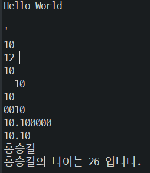

#### 1-6. 변수

- 정의
  - 데이터를 저장할 메모리의 위치를 나타내는 이름
  - 메모리 상에 데이터를 보관할 수 있는 공간을 확보
  - **적절한 메모리 공간을 확보하기 위해서 변수의 타입 등장**(어떤 크기로 어떤 형식으로..)
  - `=`를 통해서 CPU에게 연산작업을 의뢰
- 메모리의 단위
  - 0과 1을 표현하는 bit
  - 8bit = 1byte
- 선언
  - 자료형 변수명
  - int age;      string name;
  - 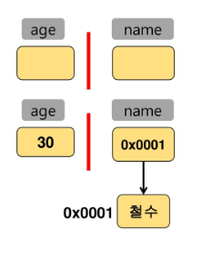
- 초기화
  - 변수명=저장할 값;
  - age  = 30;   name = "철수";
- 선언과 초기화를 동시에
  - 자료형 변수명 = 저장할 값;
  - int age = 30;
- 이름 짓는 법
  - 대소문자 구분
  - 공백 허용 x
  - 숫자로 시작할 수 없다.
  - `$` 와 `_` 를 변수이름에 사용할 수 있다. 이외의 특수문자 허용 X
  - 예약어는 사용할 수 없다
  - 예악어란 자바문법을 위해서 미리 지정되어 있는 단어를 의미한다.
  - 아래는 자바 예약어 목록이다. 아래 목록에 포함되어 있느 단어들은 변수의 이름으로
    사용할 수 없다.
- 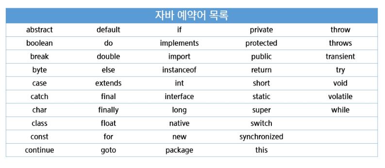
- 자료형
  - 기본 자료형과 참조 자료형(기본 자료형 8가지 외 모든 것)
  - 기본 자료형(맨 앞의 비트는 부호비트)
  - 

#### 1-7. 형변환

- 자료형의 크기 비교
- 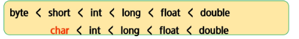
- 데이터 형변환
  - 묵시적(암묵적) : Implicit Casting
    - 범위가 넓은 데이터 형에 좁은 데이터 형을 대입하는 것
    - 예> byte b = 100; int i = b;
  - 명시적 : Explicit Casting
    - 범위가 좁은 데이터 형에 넓은 데이터 형을 대입하는 것
    - 형변환 연산자 사용 --> (타입) 값;
    - int i = 100;  byte b = i; (실패), byte b = (byte) i; (성공)

#### 1-8. 실습

```java
public class Test02 {
	public static void main(String[] args) {
		int a = 10;
		int b = a;
		System.out.printf("a: %d \n", a);
		System.out.printf("b: %d \n", b);
		
		a = 12;
		System.out.printf("a: %d \n", a);
		System.out.printf("b: %d \n", b); // b는 안바뀜
		
		// 작은집에서 큰집으로 이사갈때는 문제가 없다. (묵시적)
		short sa = 32767;
		int c = sa;
		// 큰집에서 작은집으로 갈때는.. 컨펌이 필요하다. (명시적)
		short sb = (short) c;
		
		float f = 10;
		// 같은 크기의 집이라도 컨펌이 필요한 경우 (명시적)
		int g = (int) f;
		
		System.out.println(sa);
	}
}
```

```java
public class Test03 {
	public static void main(String[] args) {
		// 사람의 정보를 변수에 담아 출력하기
		
		// 입력
		String name = "HONG";
		int age = 27; // String age = "27"; 이렇게하고 %s로 바꾸면
		// 출력은 문제없지만 연산에서 힘들어진다.
		int height = 179;
		int weight = 70;
		
		// 출력
		System.out.printf("이름은 %s 이고, 나이는 %d 입니다. \n", name, age-1);
		System.out.printf("키는 %3d이고, 몸무게는 %3d 입니다. \n", height, weight);
	}
}
```

# 2. 자바 기본문법

#### 2-1. 연산자

- 산술 연산자
- 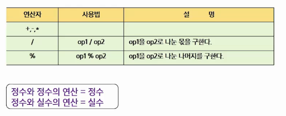
- **증감연산자**
- 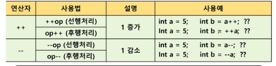
- 비교 연산자
- 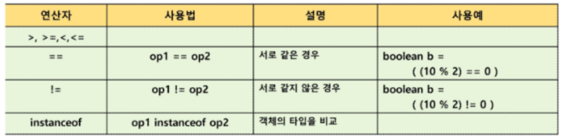
- 조건 연산자: 결과값으로 참(true), 거짓(false)이 반환
- 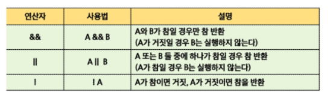
- 배정 연산자(복합대입연산자)
- 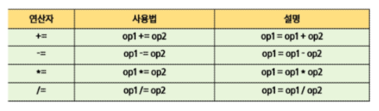
- 3항 연산자
  - 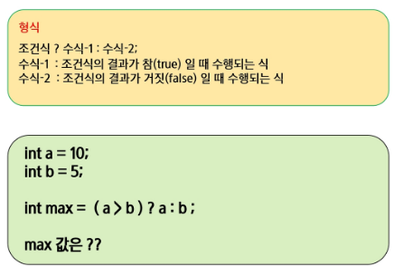

#### 2-2. 제어문(조건문)

- if 문

  - 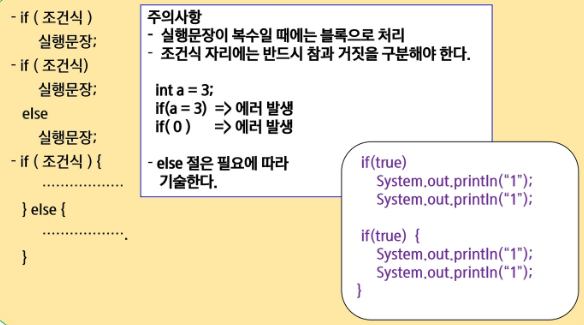

  - 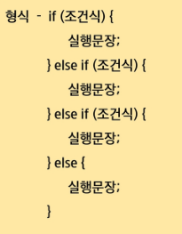

  - 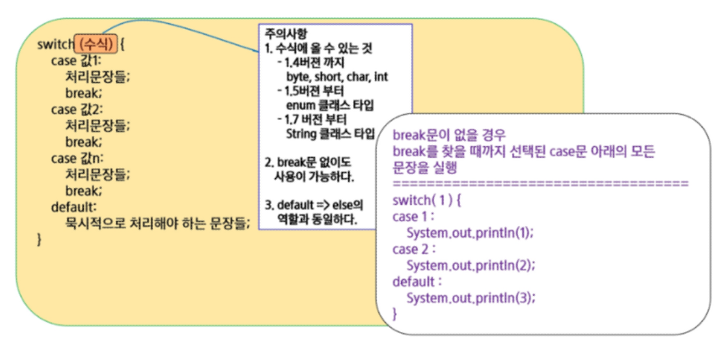

  - 달별 일자 실습

  - ```java
    public class Test08 {
    	public static void main(String[] args) {
    		int month = 2;
    		
    		switch(month) {
    		case 1:
    		case 3:
    		case 5:
    		case 7:
    		case 8:
    		case 10:
    		case 12:
    			System.out.println("31일");
    			break;
    		case 4:
    		case 6:
    		case 9:
    		case 11:
    			System.out.println("30일");
    			break;
    		case 2:
    			System.out.println("28일인데, 윤년인지 확인해봐야한다");
    			break;
    		default:
    			System.out.println("그런 월 은 존재하지 않는다");			
    		}
    	}
    }
    ```

#### 2-3. 제어문(반복문)

- for
- 
- while
- 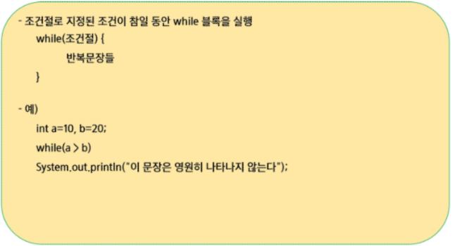
- do~while
- 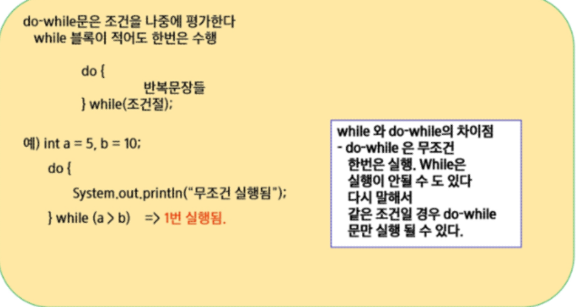
- break
  - switch문에서 switch문을 벗어나는데 사용
  - 반복문에서 반복루프를 벗어나는데 사용
  - 중첩된 반복문을 한번에 빠져나갈때
- continue
  - 반복문의 특정지점에서 제어를 반복문의 처음으로 보낸다.

- 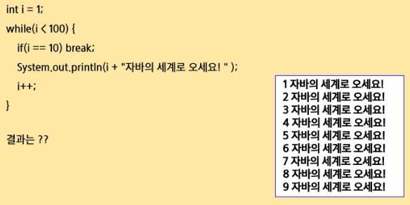

- 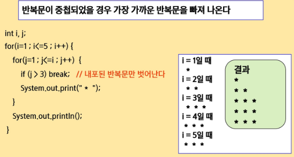

- 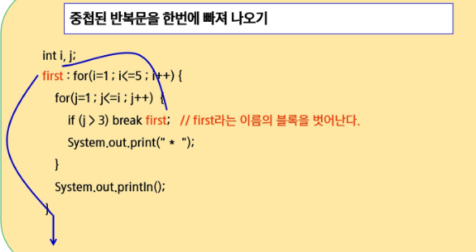

- 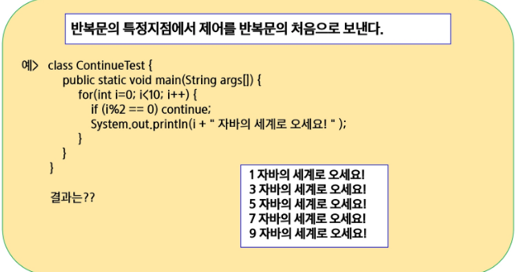

- ```java
  public class Test10 {
  	public static void main(String[] args) {
  		Scanner sc = new Scanner(System.in);
  		int num;
  		do {
  			System.out.print("숫자: ");
  			num = sc.nextInt();
  		} while (num != 0);
  		System.out.println("끝");
  	}
  }
  ```


