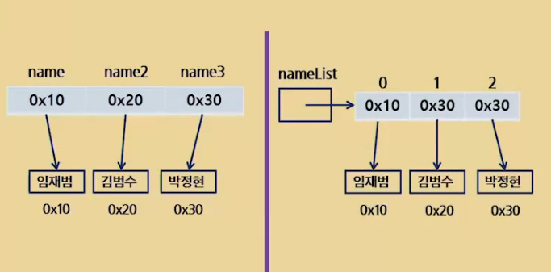
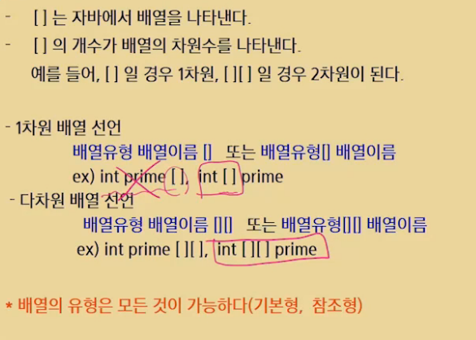
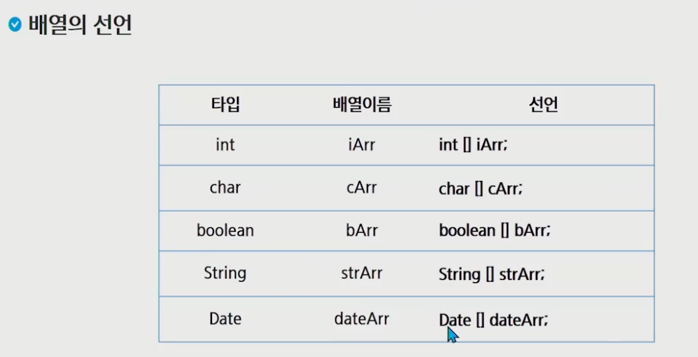
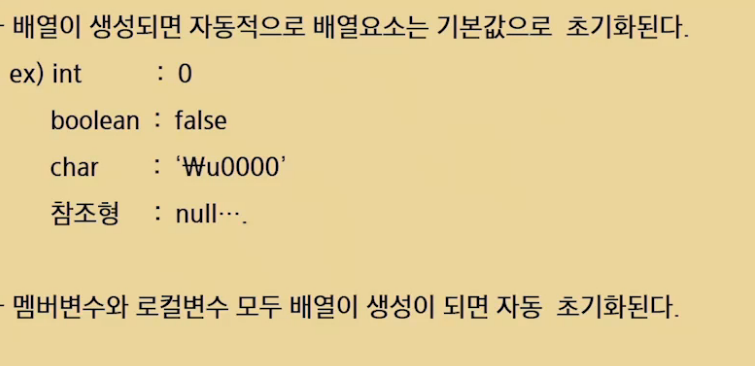
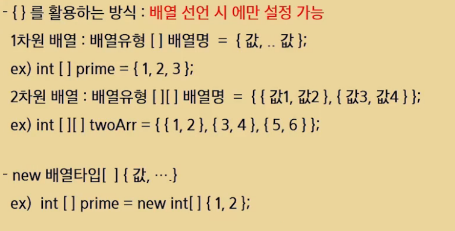
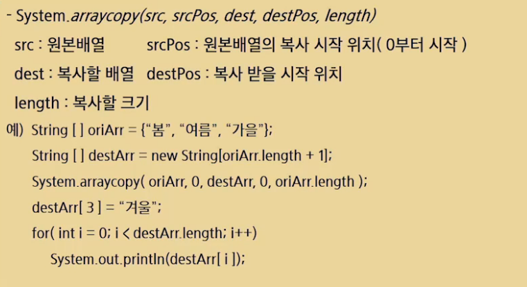
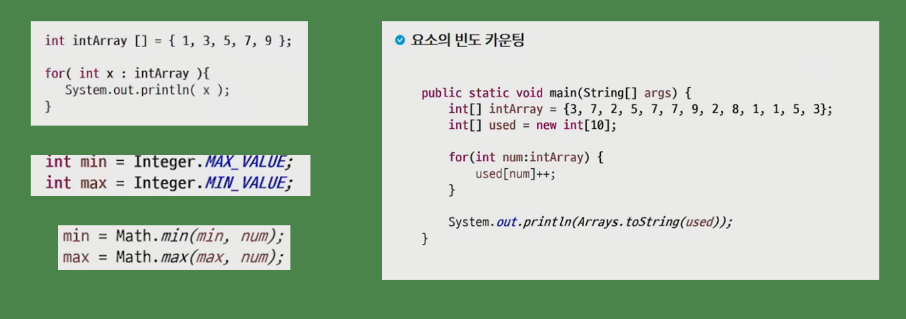

# 2차원 배열

### String 배열

- String 배열은 배열의 위치를 참조, 공간 하나하나는 문자열의 위치를 참조
- String은 저장 공간이 따로 있음, new 사용하지 않는 이유는 상수 메모리에 저장되기 때문

### 2차원 배열

- int[] : 정수를 여러개 저장할 수 있는 공간
- int\[][] : 정수 여러개의 위치를 저장할 수 있는 공간이 여러개

- int\[][] arr2 = new int\[3][];

  arr2[0] = new int[3];

### 배열의 선언

### 배열 기본값

- Int a;

  System.out.println(a);

  => 에러 발생

### 배열 초기화

### 배열 복사

### 참고

### 배열 정리

- 생일 문제 : 366일 23명이 있으면 생일이 같을 확률이 거의 50%, 40~50명이면 90% => 메뉴가 같을 확률이 높다
- 배열 : 같은 자료형 데이터들의 모임
- 배열로 선언된 변수들은 연속된 데이터 공간에 할당됨
