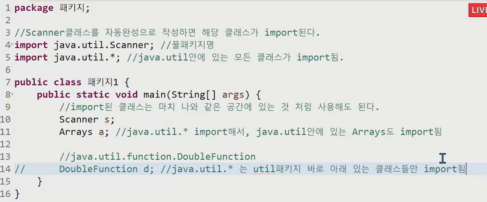
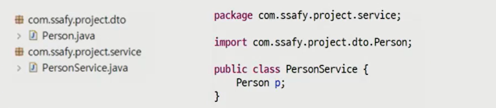
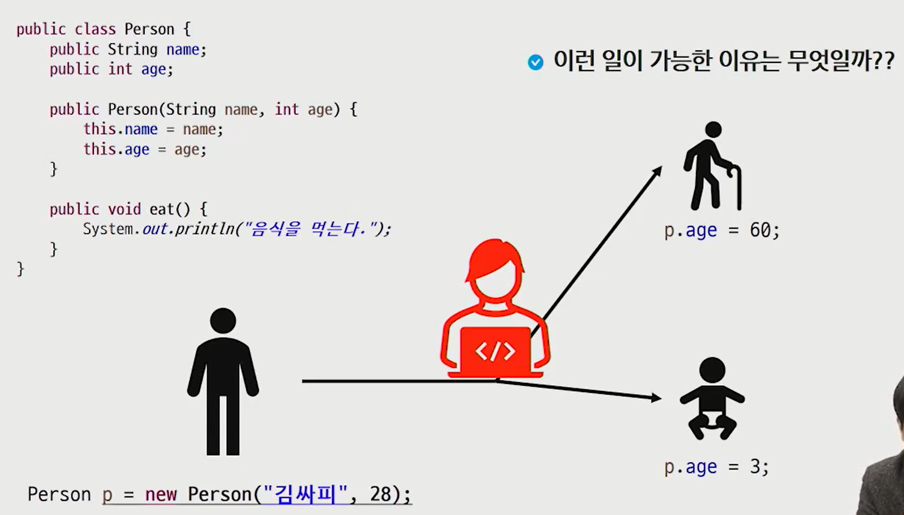
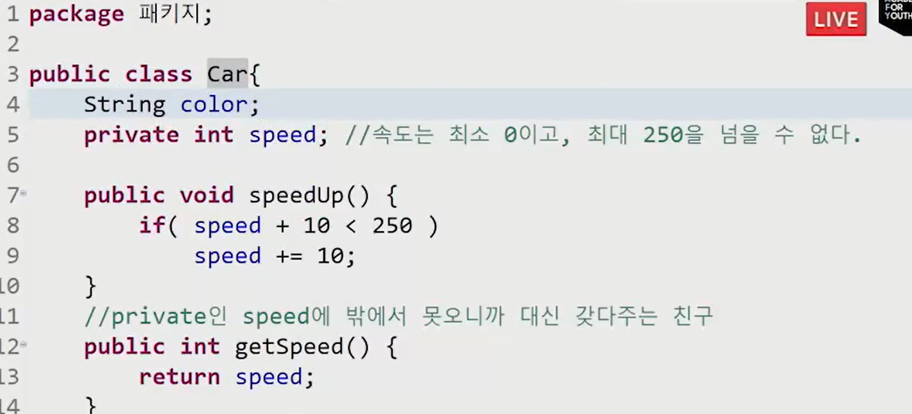
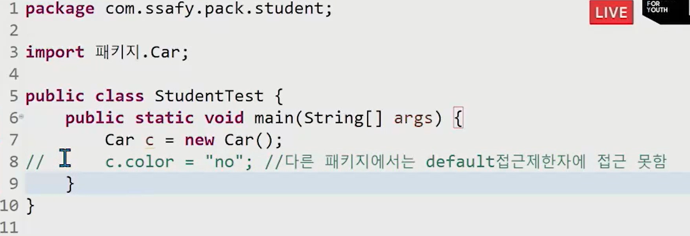
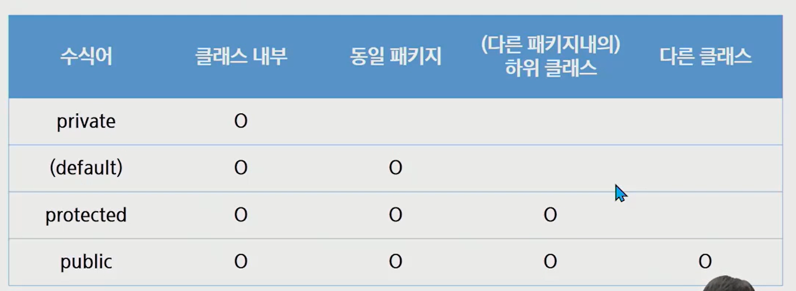
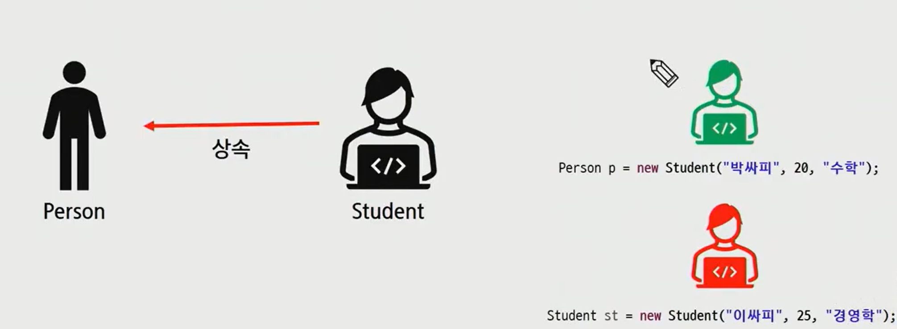
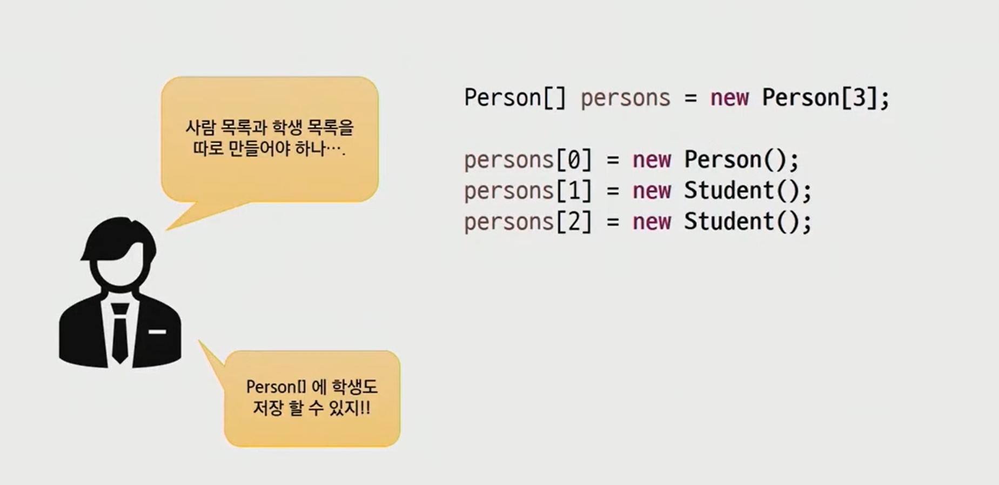

## 접근 제한자(access modifier)


### 패키지(package)

패키지

- pc의 많은 파일을 관리하기 위해서 폴더를 이용한다

- 프로그램의 많은 클래스를 관리하기 위해서 패키지를 이용한다

  - 파일은 폴더 안에 들어가고, 클래스는 패키지 안에 들어간다.

  - 하나의 공간에서 모든 클래스를 관리하게 되면 필요한 클래스를 찾기 어렵다

  - 이름이 같은 클래스도 불러오기 어려울 것이다.

    (서울의 김혜라, 부산의 김혜라는 헷갈리지 않지만, 부울경 1반 김혜라가 둘?) 

  - 같은 기능을 하는 클래스끼리 묶어둘 수도 있다.

    

- **패키지는 클래스와 관련 있는 인터페이스들을 모아두기 위한 이름 공간**

- 패키지의 구분은 .(dot)연산자를 이용한다(파일이름을 /로 구분하듯)

- 패키지의 이름은 시중에 나와있는 패키지들과 구분되게 지어야 한다

- 일반적으로 소속이나 회사의 도메인을 사용한다.


- 큰 순부터 작성
- company.company이름.pjt이름.module이름

----




### java.util.*;로 import하면 

- java.util 바로 아래의 클래스만 import된다.
- java.util.function.doubleFunction은 안불러와짐


#### import를 안하고 쓰거나, 동일한 이름의 클래스가 내가 사용하는 범주에서 겹친다면

- 전체 명시

```java
java.util.Scanner s;

```


---


### 임포트

- 다른 패키지에 있는 클래스를 사용하기 위해서는 import과정이 필요하다
  - 만약 이름이 같은 사용하고 싶은 클래스가 두개다?
  - 하나는 풀패키지명으로 작성



- PersonService.java에서 Person 클래스를 사용하기 위해서는 import해야한다
- import를 선언할 때는 import키워드 뒤에 package이름과 클래스 이름을 모두 입력하거나 해당 패키지의 모든 클래스를 포함할 때는 '*'을 사용하기도 한다. 


----


## 접근제한자

### 캡슐화

- 객체 생성 
  - p1 ->나이: 20, 이름: 김혜라, 학과: 컴퓨터공학과 를 관리하는 학사정보 클래스
  - 누군가 p1의 나이를 -3으로 수정한다면?
  - 다른 기능들이 유기적으로 작동하지 않게 될 수도 있음 
  - 보안상의 위협



- 객체의 속성(data field)와 행위(method)를 하나로 묶고 실제 구현 내용 일부를 외부에 감추어 은닉한다. 


----


### 접근제한자 : 외부객체로부터 메서드, 데이터를 막기 위한 수식어

```java
package 패키지;

class Car{
    String color;
    int speed; //속도는 최소 0이고 최대 250을 넘을 수 없다 
    
    void speedUp() {
        speed += 10;
    }
}

public class CarTest{
    public static void main(String[] args){
        Car c = new Car();
        c.speedUp(); //10 증가
        c.speedUp();//10 증가
        c.speedUp();//10 증가
        c.speedUp();//10 증가
        c.speedUp();//10 증가
        //250이 안넘게 하려면?
        
        
    }
}
```

```java
package 패키지;

class Car{
    String color;
    int speed; //속도는 최소 0이고 최대 250을 넘을 수 없다 
    
    void speedUp() {
        if( speed + 10 < 250 ) //히히 이거면 되겠지? 
        speed += 10;
    }
}

public class CarTest{
    public static void main(String[] args){
        Car c = new Car();
        c.speedUp(); //10 증가
        c.speedUp();//10 증가
        c.speedUp();//10 증가
        c.speedUp();//10 증가
        c.speedUp();//10 증가
        //250이 안넘게 하려면
        
        
        
        c.speed = 300; //..? 막을 방법이 없음
    }
}
```


### 사용자가 speed에 직접 접근을 못하게 할 수 밖에!

public : 외부에서도 접근 가능 

private : 외부에서 호출 불가

```java
package 패키지;

class Car{
    String color;
    private int speed; //속도는 최소 0이고 최대 250을 넘을 수 없다 
    
    public void speedUp() {
        if( speed + 10 < 250 ) //히히 이거면 되겠지? 
        speed += 10;
    }
}

public class CarTest{
    public static void main(String[] args){
        Car c = new Car();
        c.speedUp(); //10 증가
        c.speedUp();//10 증가

        c.speed = 300; //이제 speed에 빨간 줄이 생김
    }
}
```


### 그런데,, 내가 자동차의 속도는 150이다 라는걸 출력하고 싶을 수 있잖아? 

```java
package 패키지;

class Car{
    String color;
    private int speed; //속도는 최소 0이고 최대 250을 넘을 수 없다 
    
    public void speedUp() {
        if( speed + 10 < 250 ) //히히 이거면 되겠지? 
        speed += 10;
    }
    //private인 speed를 밖으로 내보내주는 친구 
    public int getSpeed(){
        return speed;
    }
}

public class CarTest{
    public static void main(String[] args){
        Car c = new Car();
        c.speedUp(); //10 증가

        c.speed = 300; //이제 speed에 빨간 줄이 생김
        //시속 00km이다 출력하고 싶은데?
        System.out.println("시속" + c.speed);//접근 불가
        System.out.println("시속" + c.getSpeed);//접근가능
        
    }
}
```


### 내가 speed를 78으로 바꾸고 싶다면?

```java
package 패키지;

class Car{
    String color;
    private int speed; //속도는 최소 0이고 최대 250을 넘을 수 없다 
    
    public void speedUp() {
        if( speed + 10 < 250 ) //히히 이거면 되겠지? 
        speed += 10;
    }
    //private인 speed를 밖으로 내보내주는 친구 
    public int getSpeed(){
        return speed;
    }
    
    //private인 speed를 밖에서 들여오는 친구 
    public void setSpeed(int speed) {
        this.speed = speed;
    }
}

public class CarTest{
    public static void main(String[] args){
        Car c = new Car();
        c.speedUp(); //10 증가

        c.speed = 300; //이제 speed에 빨간 줄이 생김
        //시속 00km이다 출력하고 싶은데?
        System.out.println("시속" + c.speed);//접근 불가
        System.out.println("시속" + c.getSpeed);//접근가능
        //speed의 값을 78로 만들어주고 싶다 
        
    }
}
```

```java
    //private인 speed를 밖에서 들여오는 친구 
    public void setSpeed(int speed) {
        this.speed = speed;
    }

c.setSpeed(100)
    
    100이 SetSpeed의 speed로 들어감 
    setSpeed 함수 내의 speed의 값은 100이 됨 
    this.speed -> 클래스 주소로 가니까 클래스가 가지고 있는 speed
    c의 speed를 100으로 바꿔주라는 명령
```


### 이러면 아까랑 뭐가다른데..? 유효성 검사 안해줄거면?

- 이제는 검사를 할 수 있지 

```java
    public void setSpeed(int speed) {
        if ( speed >= 0 && speed < 250)
        this.speed = speed;
    }
```


### getter와 setter

1. setter를 통해 값을 검증 
2. getter만 작성하면 읽기 전용 
3. setter만 작성하면 쓰기 전용
   - 접근 권한을 세분화 할 수 있다.

```java
package 패키지;

class Car{
    String color;
    private int speed; //속도는 최소 0이고 최대 250을 넘을 수 없다 
    
    public void speedUp() {
        if( speed + 10 < 250 ) //히히 이거면 되겠지? 
        speed += 10;
    }
    //private인 speed를 밖으로 내보내주는 친구 
    //getter(접근자)
    public int getSpeed(){
        return speed;
    }
    
    //private인 speed를 밖에서 들여오는 친구 
    //setter(설정자)
    public void setSpeed(int speed) {
        if ( speed >= 0 && speed < 250)
        this.speed = speed;
    }
}

public class CarTest{
    public static void main(String[] args){
        Car c = new Car();
        c.speedUp(); //10 증가

        c.speed = 300; //이제 speed에 빨간 줄이 생김
        //시속 00km이다 출력하고 싶은데?
        System.out.println("시속" + c.speed);//접근 불가
        System.out.println("시속" + c.getSpeed);//접근가능
        //speed의 값을 78로 만들어주고 싶다 
        
    }
}
```


### 접근 제한자 (access modifier)

- 클래스, 멤버 변수, 멤버 메서드 등의 선언부에서 접근 허용 범위를 지정하는 역할의 키워드 이다.
- 접근 제한자의 종류는 public, protected, default, private이 있다.
  - public : 모든 위치에서 접근 가능 
  - protected : 같은 패키지에서 접근이 가능, 다른 패키지에서 접근 불가능, 단 다른 패키지의 클래스와 상속 관계가 있을 경우 접근 가능 
  - default : 같은 패키지에서만 접근 허용. 접근 제한자가 선언이 안되었을 경우 기본 적용 
  - private : 자신 클래스에서만 접근이 허용 


### Default 이해하기




#### 위의 패키지.car을 import해다가 color를 변경해보자

- color앞에 접근제한자가 없다는건 자동으로 default라는 뜻 
- 



----





private -> default -> protected -> public (오른쪽으로 갈수록 접근 허용범위가 넓다)


- 그 외 제한자
  - static : 클래스 레벨의 요소 설정 
  - final : 요소를 더이상 수정할 수 없게 함 
  - abstract : 추상 메서드 및 추상 클래스 작성 

---


### 접근자(getter) / 생성자(setter)

- 클래스에서 선언된 변수 중 접근 제한에 의해 접근할 수 없는 변수의 경우 다른 클래스에서 접근할 수 없기 때문에 접근하기 위한 메서드(설정자와 접근자)를 public으로 선언하여 사용 


#### 자동 import : ctrl + shift + o 

```java
public class Person{
    private String name;
    private int age;
    
    public String getName() {
        return name;
    }
    public void setName(string name){
        this.name=name;
    }
    public int getAge(){
        return age;
    }
    public void setAge(int age){
        this.age = age;
    }
}
```

```java
package com.ssafy.pack.student;

import 패키지.car//가져와짐

//자동 import : ctrl + shift + o 
public class CarTest{
	public static void main(String[] args){
		car c = new Car();
		
}
}
```

-----


## 다형성(polymorphism)

-----


#### 자식 class로 객체 생성 : 부모 class로 객체를 찍어내고, 그 안에 자식 class 객체를 찍어내서 이어 붙임 

#### 부모와 자식 class간 같은 이름을 가진 변수, 함수가 있어도 괜찮다

- 그러나 접근 시에는 그때 그떄 가까운 위치의 것이 접근이 된다.
- this : 나 전체를 의미 
- super :  나 안의 부모의 영역

----

### 다형성(polymorphism)

- 다형성이란 많을 다, 형상 형을 가질 수 있는 성질 
- 상속 관계에 있을 때 조상 클래스의 타입으로 자식 클래스 객체를 참조할 수 있다 
- **부모 클래스의 참조변수로 자식클래스의 객체를 참조할 수 있다**
  - ​	Person p = new Student('김혜라','20','컴공');




### 다형성의 활용 1 - 다른 타입의 객체를 다루는 배열

```java
Person[] persons = new Person[3]
    
persons[0] = new Person();
persons[1] = new Student();
persons[2] = new Student();
```





### 동적 바인딩

- 함수일때는 자식이 부모를 오버라이딩했다면 자식위치의 함수가 실행됨
- 변수는 안됨 


다형성의 특징에 따라서 부모가 자식을 참조할 수 있다

Parent p = new Child();

```java
package 상속;

class Parent {
    int data = 10;
    public void print() {
        System.out.println(data)
    }
}
class Child extends Parent {
    int data = 20;
    public void print() {
        int data = 30;
        System.out.println(data); //30
        System.out.println(this.data);//20
        System.out.println(super.data);//10
    }
}
public class ExtendsTest {
    public static void main(String[] args){
        //Child c = new Child()
        c.print()
        
        **부모 클래스의 참조변수로 자식클래스의 객체를 참조할 수 있다**
        Parent p = new Child();
        System.out.println(p.data); //10
        
        //자식이 부모를 오버라이딩 한 경우, 함수면 자식의 함수가 호출됨
        //컴파일할 때 오류가 안나는 이유는 부모 클래스에 함수가 있기 떄문
        //그런데 정작 jvm이 실행을 할 떄는 자식 클래스로 가서 실행하기 떄문
        //이것을 우리는 동적 바인딩이라 부른다. 
        p.print() //30
                  //20
                  //10
        
    }
}
```


