### 다형성 - 추상클래스

> ####  main 없을 때 오류 발생하는 상황


> #### overriding 실습

- Manager


- MyManager

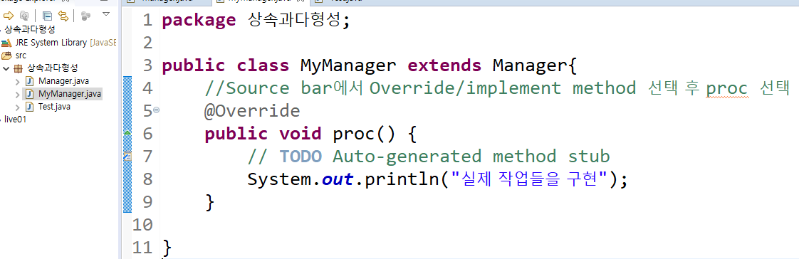


- Test와 실행시 출력 화면

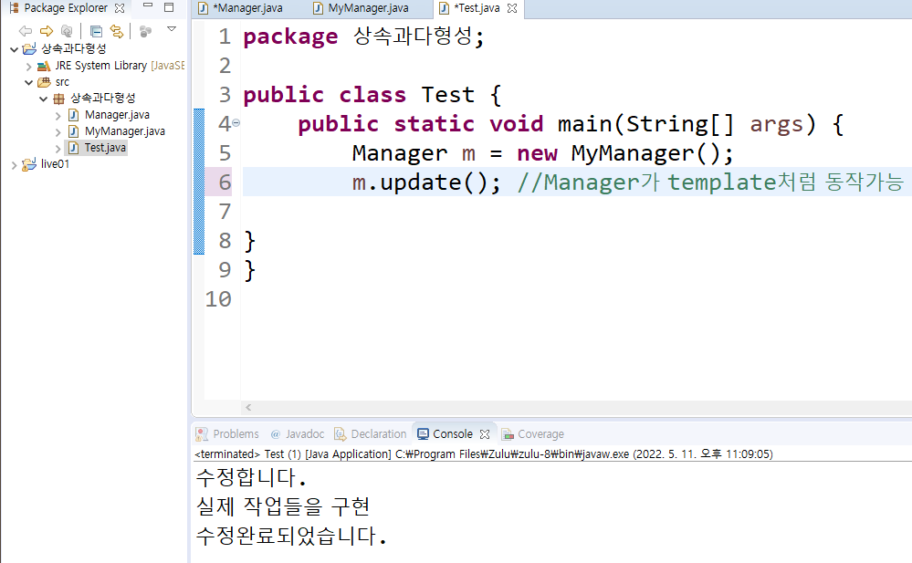


- Student 클래스 생성


**세부 실행 과정**

s를 프린트에 던져주고  println 에 커서두고 F3키로 들어가보면 

`obj.toString() -> valueOf -> println `순으로 불리는 것을 확인할 수 있음

-> 따라서  obj 부모쪽을 바라보고 있어서 obj를 불렀지만 정작 가장 막내가 호출이 되는 것임


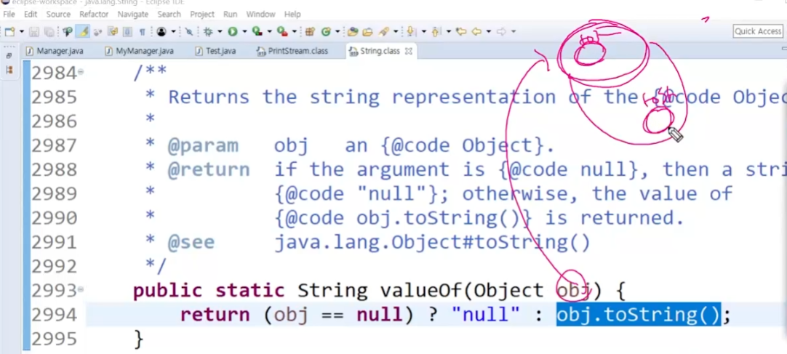

ㄴ

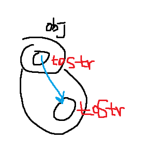


> ####  student와 person 클래스를 만들어서 추상클래스가 왜필요한지 알아보자

```java	
package 상속과다형성;
class Person{
	String name = "Hong";
	int age = 23;
//	public void eat() {
//		// 만들고 싶지 않다 
//		// 하지만 동적 바인딩을 위해서 부모 안에 원형은 있어야함
//	}
	// 있을 때 음식을 먹는다가 출력되는 것을 비교해서 확인
	public void eat() {
	// 만들고 싶지 않다 
	// 하지만 동적 바인딩을 위해서 부모 안에 원형은 있어야함
	// 그래서 존재하는 것이 추상 클래스임
}
	
}
class Student extends Person{
	public void eat() {
		System.out.println("음식을 먹는다");
	}
}

public class Test {
	public static void main(String[] args) {
		Manager m = new MyManager();
		m.update(); //Manager가 template처럼 동작가능
		Student s = new Student();
		Person p = new Student();
		p.eat(); //여기서 자식의 음식을 먹는다를 호출하고 싶으면
		// 부모 것을 안 부르고 싶어도 동적 바인딩을 위해 필요
		System.out.println(s);
		
}
}

```

- 부모에 eat() 가 없을 때 오류를 확인해보자


> ####  추상클래스 정의

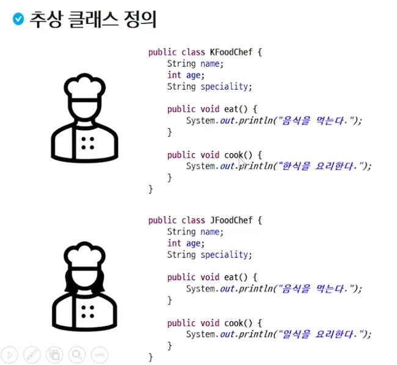


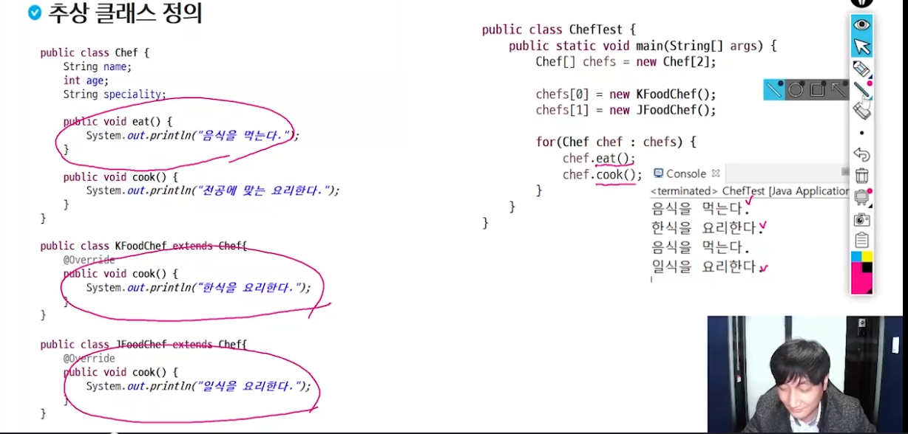


- 이 처럼 각 자손 클래스에서 override 되서 사용되는 것이 Chef 클래스의 cook 메소드인데 굳이 함수 전체를 구현 시켜 놓을 필요성이 있을까? -> 추상클래스 대두


> #### 쓰이지 않는 코드를 지우는 과정

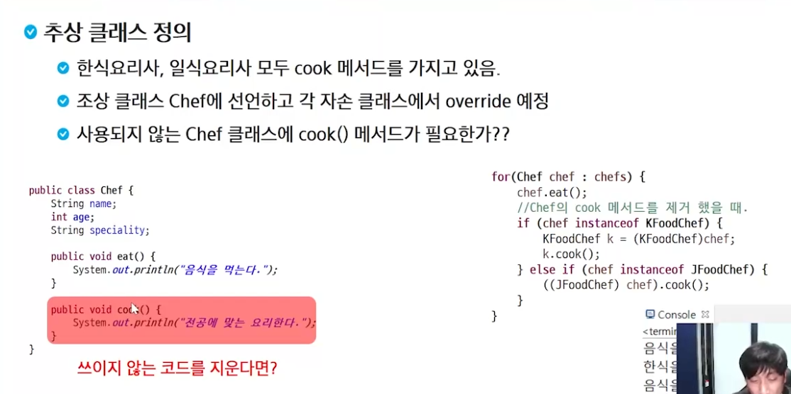


> #### 최종적인 추상 클래스의 형태 

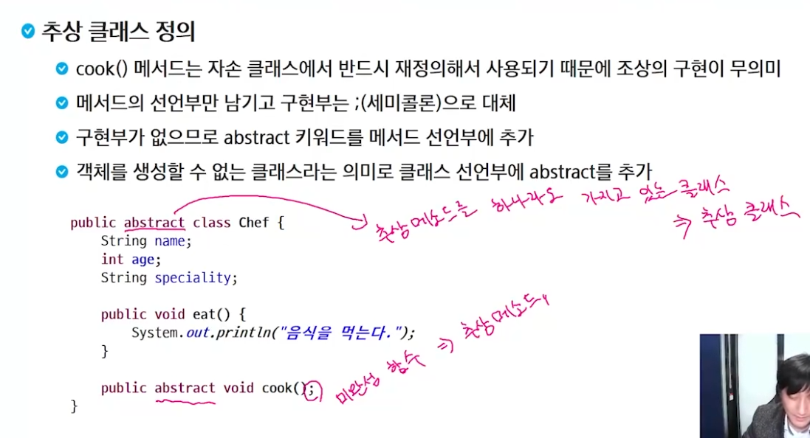


> ### Chef 실습

- 참고사항

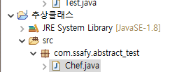

-> 앞으로는 패키지 명을 자동 형성으로 만들지 않고 되도록이면 세개 정도의 객체? 로 만듦


#### 동적 바인딩

- Chef

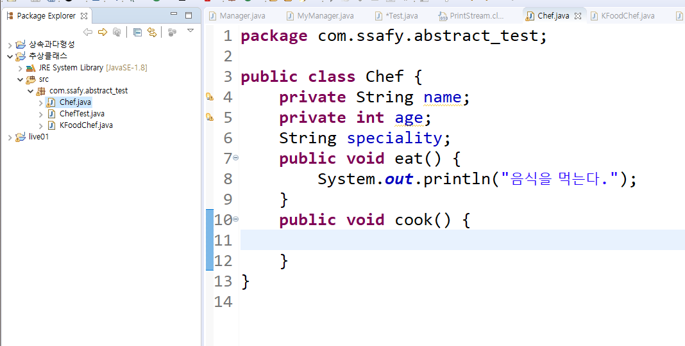


- Kfood

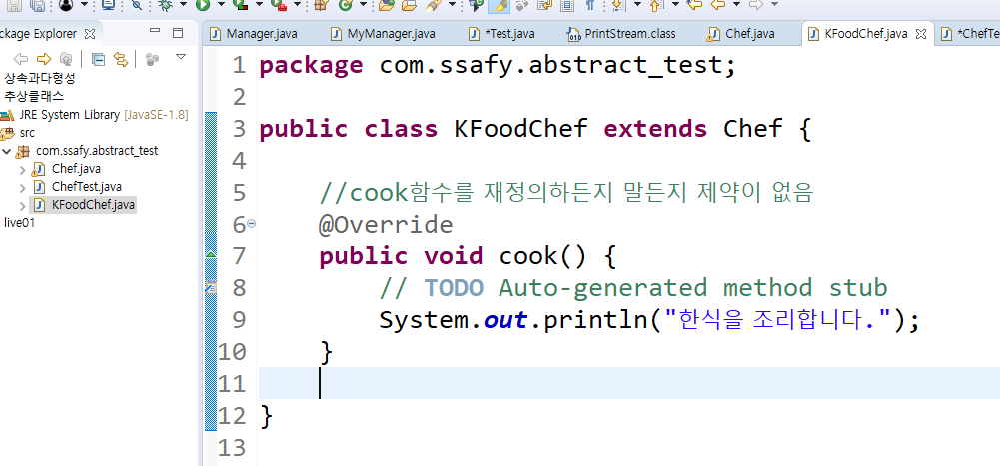


- ChefTest

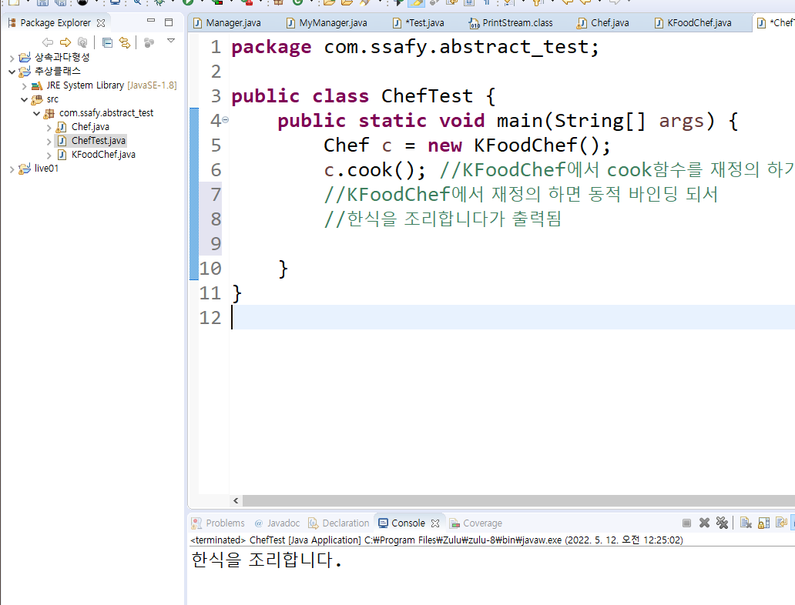


#### 추상메서드와 추상클래스로 변경

- Chef

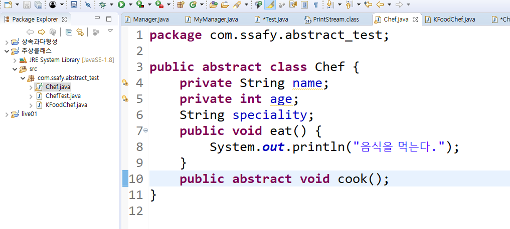

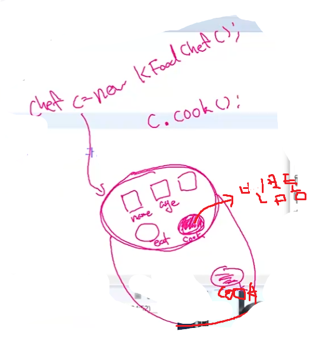


- Kfood

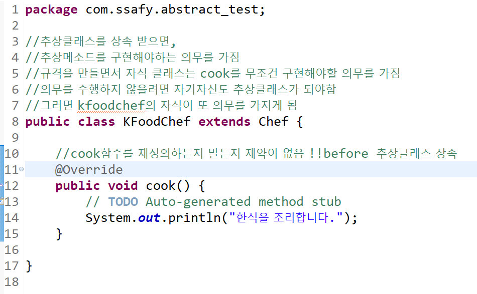


- cheftest

  - 추상클래스는 미완성이기 때문에 객체로 만들 수 없지만 (참고사항)

  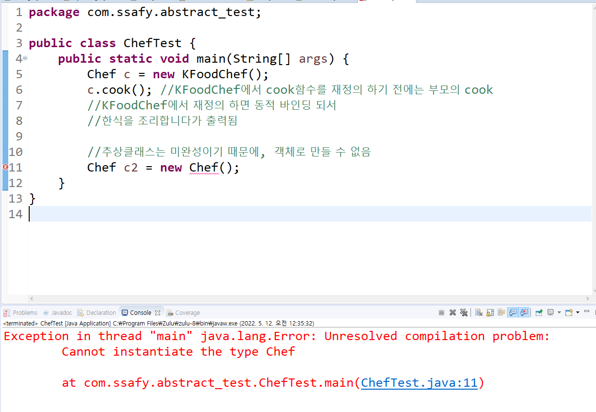

  

  

  - 비어있는 로직을 중괄호 안에 채워줌으로 써 일회용 구현 가능 -> 어나니머스 클래스, 익명클래스라고 함

  

​		-> 버튼을 눌려서 입력 될때마다 이벤트를 구현해야 할 때 이러한 방식을 활용


> #### 요약

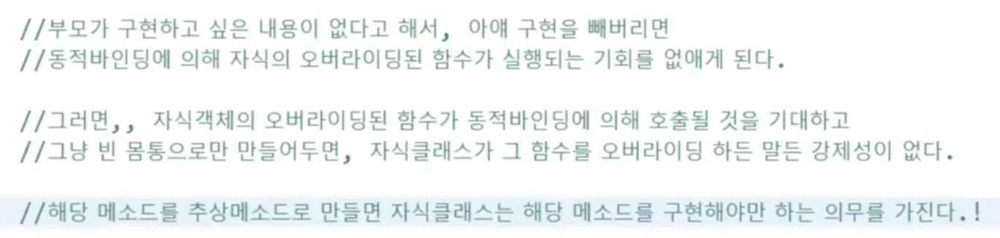


> #### why? 


-> 강한 규격을 만듦


---------------------

### 인터페이스 - 추상 메소드의 모임

> #### 개념

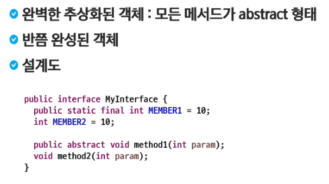


> #### 적용 규칙 


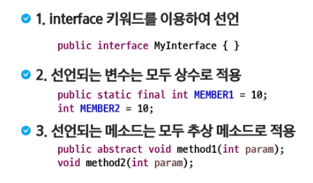


- 인터페이스는 관련있는 상수와 추상메서드를 묶어서 만든 사용자 정의 자료형이다

- 인터페이스를 implement한 클래스의 객체가 아래 그림처럼 들어갈 수 있음

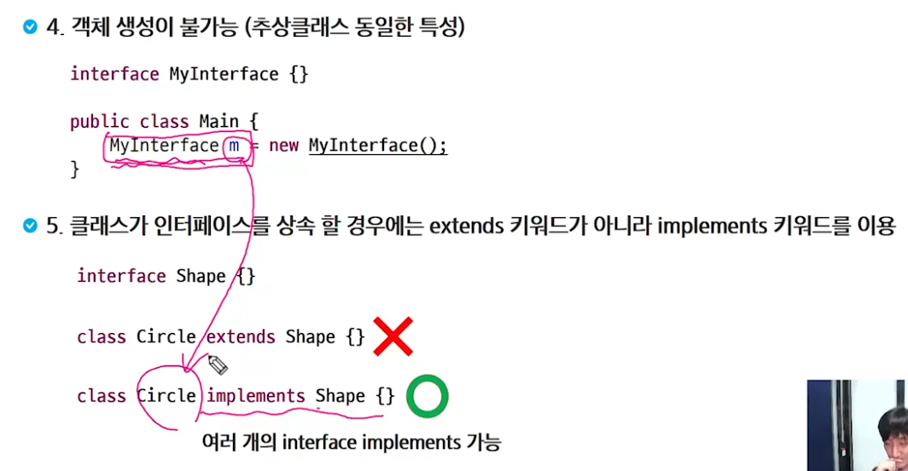


- 실제 cook이 어떻게 구현되는지랑 상관 없이 규격을 이용해서 cook이라는 전체 시스템을 만들어 놓을 수 있다

  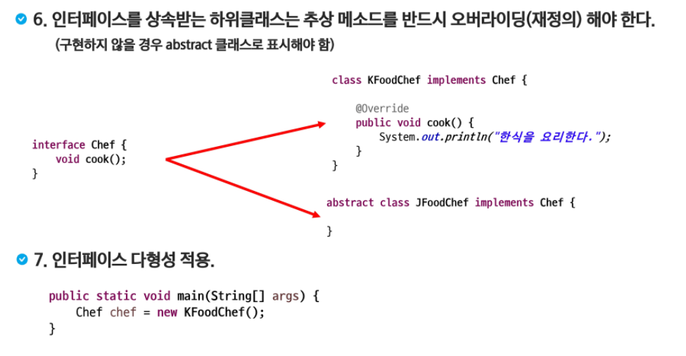


> #### 인터페이스의 필요성

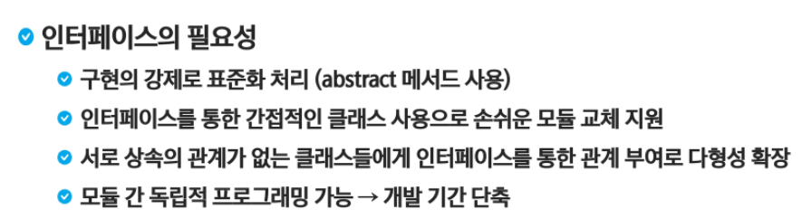
