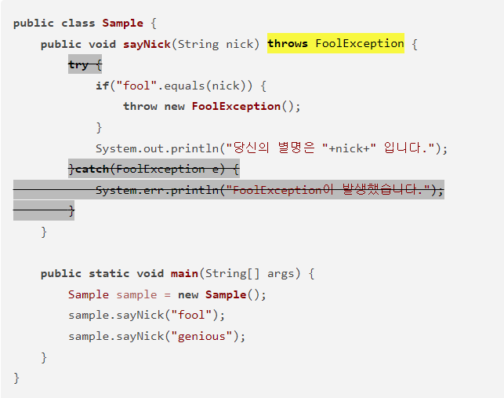

## 예외처리 복습

---

**에러**

- 메모리 부족, 스택오버플로우 등과 같이 발생하면 복구 불가
- 프로그램의 비정상적 종료를 막을 수 없음
- 원인이 **시스템발**

**예외**

- 읽으려는 파일이 없거나, 네트워크 연결이 안되는 등 수습 가능한 비교적 상태가 약한 것들
- 프로그램 코드에 의해 수습될 수 있는 상황
- **내 잘못이 1은 있음**
  - 예외 클래스의 계층
    - **checked exception:** 예외에 대한 대처 코드가 없으면 컴파일 진행 불가
    - **unchecked exception:** 예외에 대한 대처 코드가 없더라도 컴파일은 진행됨

---

**예외처리란?**

- 프로그램의 비정상 종료를 막고 정상적인 실행 상태를 유지하는 것

**예외처리 키워드**

**try / catch**

- 문제가 될만한 부분을 try 블럭에 넣자

- 문제가 발생했을 경우 실행할 코드를 catch에 넣자

- ```java
  try {
      // 예외 가능성이 있는 코드
  } catch (Exception e) {
      // 예외가 발생했을 때 처리할 코드
  }
  ```

- 예외의 종류와 Exception e가 맞으면 catch 실행, 안맞으면 catch구문 실행 안됨

- Exception 참조변수로 catch를 하면? 모두 잡힘. 그러나 인덱스에러를 위의 Exception e 부분에 써두고 0으로 나눈 경우의 예외를 처리하게 하면? catch가 정상작동하지 않음(예외처리 실패)

- catch 블록 여러개를 쭉 이어 쓸수도 있음 -> 예외의 종류에 따라 다른 결과를 보여줄 수 있을것

  - 아래로 갈수록 범위가 넓은 exception을 사용해야 할 것


**finally**

finally는 예외 발생 여부와 상관없이 언제나 발생

```java
try {
    // 예외가 발생할만한 코드
} catch (Exception e) {
    // 예외시 실행되는 부분
} finally {
    // 무조건 실행되는 부분
}
```

finally의 대단한 점: 얘는 **중간에 return**이 있어서 함수가 중단되는 경우, **finally 블록 먼저 실행하고 return으로 넘어감**

```java
...
try {
   // 예외가 발생할만한 코드
   return;
} catch (Exception e) {
    // 예외시 실행되는 부분
} finally {
    // 무조건 실행되는 부분
}
```

위 코드의 경우 중간에 **return**이 있기 때문에 try블록 이하의 부분은 실행되지 않을거라 예측할 수 있다. 그러나 **finally**부분의 경우 return이 있든 말든 일단 얜 무조건 실행돼야 하는 부분이기 때문에 실행됨


**throws**

- methods에서 처리해야 할 하나 이상의 예외를 호출한 곳으로 전달(처리 위임)
- **예외가 없어지는 것이 아닌, 단순한 전달**
- 예외를 전달받은 메서드는 다시 예외 처리의 책임이 발생
- 
- 예시 문제
- 먼저 줄이 그어져있는 try-catch문을 보자
- 만약 throws문이 없었다면? 줄 그어진 try-catch문을 이용해 예외를 처리했을 것
- throws문을 사용하면? t-c문 안써도 됨. 오류 뜨면 다른데로 던져버린다고 생각하면 될듯
- **어디로 던져주냐? -> 해당하는 메소드 호출한 애한테 던져줌**
- 위의 예시는 어떻게 될까?
  - sample.sayNick("fool") 실행
  - nick에 fool이 들어감
  - if ("fool".equals(nick))이 참이 됨 -> 아래의 throw문이 실행 (throw는 예외를 발생시켜주는 코드)
  - throw를 통해 FoolException이 실행되었으니, **throws가 감지하고 해당 예외를 던져버림**
  - 어디로?
  - **호출한 곳으로** (여기선 sample.sayNick("fool") 부분)
  - 이거 해결하려면? -> sample.sayNick("fool") 부분을 try-catch로 감싸주면 됨
  - **try catch문 없으면?** -> **프로그램 종료**(에러를 해결하지 못한다는 뜻)

---

## Singleton Pattern

생성자가 여러차례 호출되더라도 실제로 생성되는 객체는 하나이고, 최초 생성 이후에 호출된 생성자는 최초의 생성자가 생성한 객체를 리턴