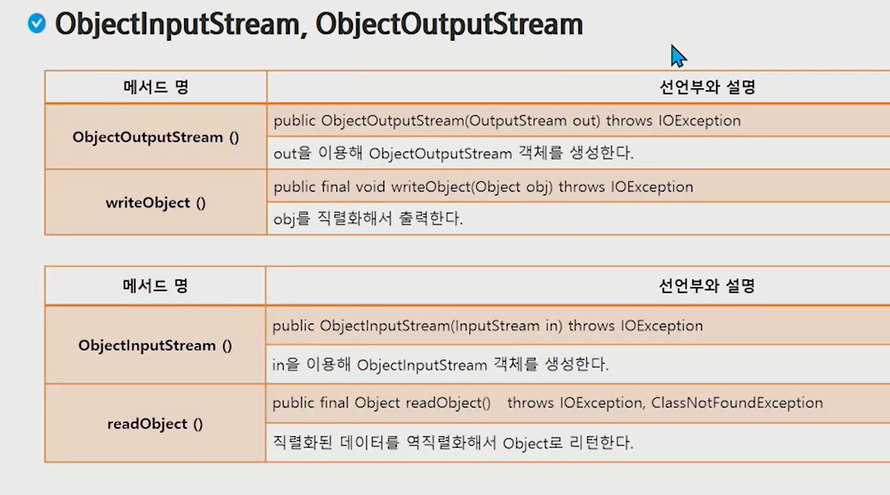

## 입출력 API

프로그램이 실행중이다는 무슨 의미일까요?

1.  CPU를 사용중이다 
   - scanner불러올 때 : CPU 사용
   - sc.nextInt() 하고 입력을 기다리는 상태? : CPU 사용 안함
2. RAM을 사용중이다 : 실행중이다(메모리를 먹고 있다)
3. SSD를 사용중이다 : 하드디스크에 설치가 되어있음을 의미


프로세스 

- 우리 프로그램이 메모리로 부터 할당받고 있는 공간


입출력

- 프로세스 내부의 데이터와 외부의 데이터가 나가거나 들어오는 것 

---


#### I/O와 Stream

- I/O : 데이터의 입력과 출력
  - 우리 프로세스를 기준으로 흘러 들어오면 : 입력
  - 흘러 나가면 : 출력
- 데이터는 한쪽에서 주고 한쪽에서 받는 구조
  - 이 때 입력과 출력의 끝단 : 노드
  - 두 노드를 연결하고 데이터를 전송할 수 있는 개념 : 스트림 
  - 스트림은 단방향으로만 통신이 가능. 하나의 스트림으로 입력과 출력을 같이 처리할 수 없음 


---


#### I/O 처리 단위 


byte : 0 1 0 1 

예 ) byte로 입력 되는건 InputStream이라는 클래스로 관리하고 있다.

----


#### java.io 패키지의 개요


FileOutputStream

- 프로세스로 부터 byte로 흘러나가는 data의 목적지가 file


노드 스트림

- 00InputStream, 00OutputStream


FileReader

- file에다 쓰면 filewriter, 읽으면 reader

---


## InputSteam과 Reader

#### inputStream의 주요 메서드 

- byte로 읽어들이는 기능을 정의하는 추상클래스


**read()**

- byte 하나를 읽어서 int로 반환한다. 더이상 읽을 값이 없으면 -1을 리턴 

- a컵에서 b컵으로 스포이드로 물 옮김

  

**read(byte b[])**

- 데이터를 읽어서 b를 채우고 읽은 바이트의 개수를 리턴 
- 0이 리턴되면 더이상 읽을 값이 없는 상황
- a컵(1090byte)에서 b컵으로 바가지(1024byte)로 물 옮김
  - 1024 + 66 : 내가 몇개를 펐었는지 알기 위해 개수를 리턴 

```java
byte[] buf = new byte[1024];

return = .read(buf)

return -> 방금 읽은 바이트의 개수
    내 버퍼 크기보다 작은 수 : 그 수 
    내 버퍼 크기보다 같거나 큰 수 : 1024
```


---


## OutputSteam과 Reader

#### OutputStream의 주요 메서드 


**write()**

- 1 byte를 출력


**write(byte b[])**

- b를 바이트로 변환해서 출력
- 바가지 크기만큼 변환
- 바가지를 보통 버퍼라고 부른다
  - buf = new byte[1024];
  - a -> 3000 b 
  - read 때처럼 사용하면 데이터의 크기가 얼마건 1024를 다 출력하게 되기 때문에 write(byte b[], int off, int len) 사용
    - 파일 용량이 커지고 찌꺼기가 남음


**write(byte b[], int off, int len)**

- b의 off부터 off + len - 1만큼을 문자열로 변환해서 출력한다. 

- int len : read에서 return된 값

---


---


### 예제 1 

#### FileInputStream과 FileOutputStream을 이용해서 복사본 만들기

default package -> New -> class 

- name : FileCopyTest

```java
public class FileCopyTest { 
	public static void main(String[] args) { 
        String path = "c:\\Users\\ 복사할 파일 경로";
    	String originFile = path + "경로의 파일 명"; //얘를 대상으로 InputStream 생성
        String destFile = path = "5일차_복사본.pdf"; //얘를 대상으로 OutputStream 생성
        
        //FileOutputStream fo = new FileOutputStream(destFile);
        ---- try catch 로 예외처리하는 방법이 어렵다. 그래서 아래의 방법을 이용
            
         try(FileOutputStream fo = new FileOutputStream(destFile);){
         //FileOutputStream 빨간줄 클릭 -> add catch clause to surrounding try 선택
           //catch 구문을 여기서 만들겠다는 뜻임
           //아래 구문이 자동 완성됨
         } catch(FileNotFoundException e) { 
         e.printStackTrace()};
    } catch (IOException e) {
        e.printStackTrace();
    }
    } 
    	
}
```

```java
 try(FileOutputStream fo = new FileOutputStream(destFile); FileInputStream fi = new FileInputStream(originFile)){
     
     byte[] buf = new byte[1024];
     int size = 0;
     while ( (size = fi.read(buf)) > 0) {
         fo.write(buf, 0, size); // 복사본 생성
     }
     new File(originFile).delete(); //원본파일 삭제 -> 비트코인 1개에 1024씩 줄게 -> 랜섬웨어
     
         } catch(FileNotFoundException e) { 
         e.printStackTrace()};
    } catch (IOException e) {
        e.printStackTrace();
    }
    } 
```


**try를 만들고 그 안에 stream을 만들면 알아서 예외처리 및 자원 정리가 가능**

- try안의 예외처리를 catch가 해줌


---


스트림 

- 파일에서 데이터가 흐르는 통로

노드 스트림 

- 데이터의 목적지나 근원지에 바로 연결되어있는 데이터의 흐름

보조스트림 

- 가공이 목적임


---


### 보조 스트림의 개념과 종류


system.in/out/err : 내가 건드리지 못하는  system의 표준스트림

- read하면 byte단위로 읽어주니까 Scanner사용해서 읽었음 


bufferedReader가 더 빠름 like 바가지로 데이터 읽어왔던 것 처럼 

그렇다면 system.in -> InputStreamReader로 char로 변환 -> char을 BufferedReader로 다시 변환하는 과정을 연습해보자 


### 예제 2 

#### 문자열 버퍼로 읽기 

```java
public class FileCopyTest { 
	public static void main(String[] args) { 
		new InputStreamReader(System.in);// system.in -> InputStreamReader로 char로 변환
        BufferedReader br = new BufferedReader(new InputStreamReader(System.in)); //성능 빨라짐 buffered바가지가 더 큼
    } 
    	
}
```


buffered - 8192 byte 크기의 버퍼 사용


read 자동완성 시키면 앞에서 봤던 걔네가 나옴 

**read()**

**read(byte b[])**

----여기서 readline  선택 

```java
public class FileCopyTest { 
	public static void main(String[] args) { 
		new InputStreamReader(System.in);// system.in -> InputStreamReader로 char로 변환
        BufferedReader br = new BufferedReader(new InputStreamReader(System.in)); //성능 빨라짐 buffered바가지가 더 큼
        br.readline(); //엔터가 들어올 때 까지 한줄을 읽습니다.
    } 
    	
}
```

---


### swea 최빈수 문제 풀기

https://swexpertacademy.com/main/code/problem/problemDetail.do?contestProbId=AV13zo1KAAACFAYh

어느 고등학교에서 실시한 1000명의 수학 성적을 토대로 통계 자료를 만들려고 한다.

이때, 이 학교에서는 최빈수를 이용하여 학생들의 평균 수준을 짐작하는데, 여기서 최빈수는 특정 자료에서 가장 여러 번 나타나는 값을 의미한다.

다음과 같은 수 분포가 있으면,

10, 8, 7, 2, 2, 4, 8, 8, 8, 9, 5, 5, 3

최빈수는 8이 된다.

최빈수를 출력하는 프로그램을 작성하여라 (단, 최빈수가 여러 개 일 때에는 가장 큰 점수를 출력하라).


답

``` java
public class 최빈수v1 { 
public static void main(String[] args){
    Scanner sc = new Scanner(system.in);
    int T = sc.nextInt();
    for(int tc = 1; tc <= T; tc++) {
        int tc_num = sc.nextInt();
        int[] cnt = new int[101];
        for(int i = 0; i <1000; i ++)
            cnt[sc.nextInt()]++;
        
        int max = 0;
        int maxIdx = 0;
        for(int i = 0; i <= 100; i++)
            cnt[sc.nextInt()]++;
        
        int max = 0;
        in maxIdx = 0;
        for(int i = 0; i <= 100; i++){
            if(max <= cnt[i]){
                max = cnt[i];
                maxIdx = i;
                
            }
        }
        System.out.println("#" + tc + " " + maxIdx);
    }
}

}
```


#### bufferedreader활용

```java
public class 최빈수v1 { 
public static void main(String[] args){
    BufferedReader br = new BufferedReader(new InputStreamReader(System.in));
    int T = Integer.parseInt(br.readLine());
    for(int tc = 1; tc <= T; tc++) {
        int tc_num = Integer.parseInt(br.readLine());
        int[] cnt = new int[101];
        StringTokenizer st = new StringTokenizer(br.readLine());
        for(int i = 0; i <1000; i ++){
            int n = Interger.parseInt(st.nextToken());
            cnt[n]++;
        }
            
            
        
        int max = 0;
        int maxIdx = 0;
        for(int i = 0; i <= 100; i++)
            cnt[sc.nextInt()]++;
        
        int max = 0;
        in maxIdx = 0;
        for(int i = 0; i <= 100; i++){
            if(max <= cnt[i]){
                max = cnt[i];
                maxIdx = i;
                
            }
        }
        System.out.println("#" + tc + " " + maxIdx);
    }
}

}
```

readLine()은 눌러서 add throws


---


### 보조 스트림 활용 


**직렬화** 

- 여러개의 변수를 한줄로 세우는 것 
- 객체를 저장하거나 네트워크로 전송하기 위해 연속적인 데이터로 변환하는 것 
- 반대의 경우는 역직렬화


**직렬화 되기 위한 조건** 

- Serializable 인터페이스를 구현할 것 
  - 해당 클래스가 생성될 때 부터 필요 
- 클래스의 모든 멤버가 Serializable 인터페이스를 구현해야함
- 직렬화에서 제외하려는 멤버는 transient 선언 


#### serialVersionUID

- 클래스의 변경 여부를 파악하기 위한 유일 키


- 직렬화 할 떄의 UID와 역 직렬화 할 때의 UID가 다른 경우 예외 발생
- 직렬화 되는 객체에 UID가 설정되지 않을 경우 컴파일러가 자동 생성
  - 멤버 변경으로 인한 컴파일시마다 변경 -> InvalidClassException 초래
- 직렬화 되는 객체에 대해서 serialVersionUID 설정 권장


**직렬화 대상 클래스** 


---


## 객체 읽고 쓰기




---


### 예제 3

#### 객체 저장 / 불러오기 

```java
public class StudentWriteTest {
    public static void main(String[] args) {
        Student s = new Student(10, 'Hong');
        try(ObjectOutputStream os = new ObjectOutputStream(new FileOutputStream('Stuent.dat')))
    } catch ...
}
```

```java
public class StudentWriteTest {
    public static void main(String[] args) {
        Student s = new Student(10, 'Hong');
        try(ObjectinputStream os = new ObjectinputStream(new FileinputStream('Stuent.dat')))
    } catch ...
}
```

