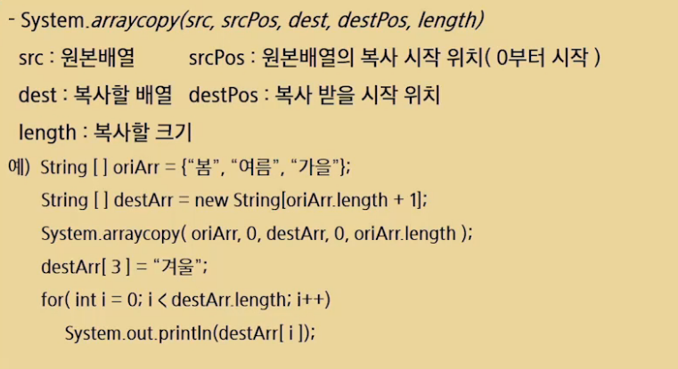

### 2차원 배열

#### - 문자열의 1차원 배열의 구조


-> 문자열은 참조 자료형 이기 때문에 바로 값이 들어갈 수 없고, 문자열을 만들고 해당 위치를 기억하는 방식으로 배열이 생성됨

**참고)** 문자열은 new를 사용하지 않아도 그냥 선언했을 때 상수 메모리 라는 곳에 따로 저장됨


>  #### 2차원 배열 예시


#### - 배열 개념


-> 명명은 타입 명시를 위해서 후자를 사용하도록 함


#### - 배열의 선언


#### - 자동초기화


> #### 자동초기화 예시


 #### - 중괄호를 이용한 배열 초기화


#### - 배열 복사




> #### 복사 예시

1. 복사 후 null 값 생성 확인


2. null 값에 겨울 집어 넣기


#### - for-each


-> 두개의 코드 동작은 완전 동일, 복사한 값을 사용하기 때문에 read only


> #### for-each를 활용한 최대값 최소값 찾기

1. normal


2. Integer 꾸러미, Math 꾸러미 활용

   -> Integer 꾸러미 내에서 가장 큰 값, 가장 작은 값

   -> Math 라이브러리 활용 시 숫자 2개 중 작은 값과 큰 값으로 대체 가능


#### - 요소의 빈도 카운팅


#### 2차원 배열 탐색


-> for 문을 두번 돌면 됨


#### 델타탐색

햄인 낼름


#### SWEA 2001. 파리퇴치

https://swexpertacademy.com/main/code/problem/problemDetail.do?contestProbId=AV5PzOCKAigDFAUq&categoryId=AV5PzOCKAigDFAUq&categoryType=CODE&problemTitle=%ED%8C%8C%EB%A6%AC&orderBy=FIRST_REG_DATETIME&selectCodeLang=ALL&select-1=&pageSize=10&pageIndex=1

#### 문제


#### 입력 예시


> #### 텍스트파일 읽어오는 법과, 2차원 배열 입력 과정


-> 그냥 arr를 읽을려고 하면 메모리 위치만 찍힘


```java
package 배열;
import java.util.*;
import java.io.FileInputStream;
import java.io.FileNotFoundException;

public class CatchFly {
	public static void main(String[] args) throws FileNotFoundException {
		System.setIn(new FileInputStream("src/배열/input.txt"));
		Scanner sc = new Scanner(System.in);
		int T = sc.nextInt(); //test 횟수
		//tc 반복문
		for (int t = 1; t <= T; t++) {
			int N = sc.nextInt(); // 배열 크기
			int M = sc.nextInt(); // 파리채 크기
			int[][] arr = new int[N][N]; //N*N 크기의 2차원 배열 생성
			for (int i=0; i<N; i++) {
				for (int j=0; j<N; j++) {
					arr[i][j] = sc.nextInt(); //2차원 배열에 값 입력
				}
			}
			
			int max = 0; //파리 최대 갯수
			//N-M+1 범위 내에서 반복 하되
			for (int i=0; i<N-M+1; i++) { 
				for (int j=0; j<N-M+1; j++) {
					int sum = 0;
					// 파리채 크기 만큼 순회해서 파리를 잡을 수 있음
					for (int k=0; k<M; k++) {
						for (int l=0; l<M; l++) {
							sum += arr[i+k][j+l];
						}
						
					}
					if (max < sum) {
						max = sum;
					}
				}
			}
		System.out.println("#"+ t + " " + max);
		}
	}
}
```

