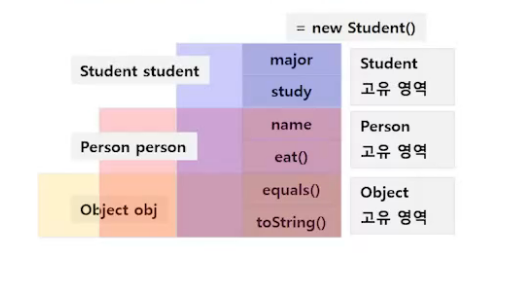
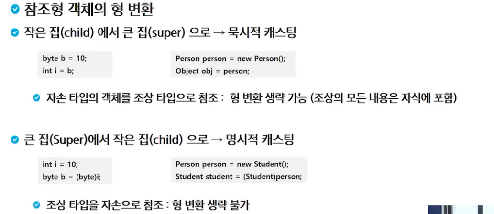
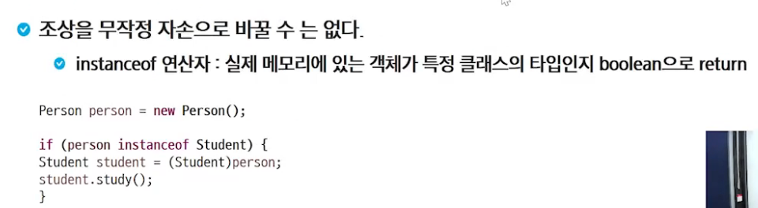
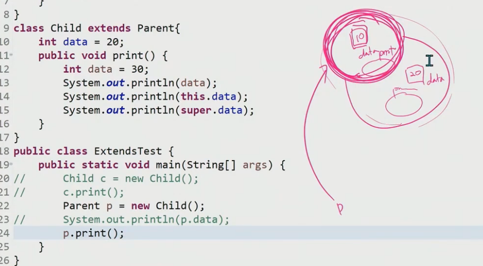
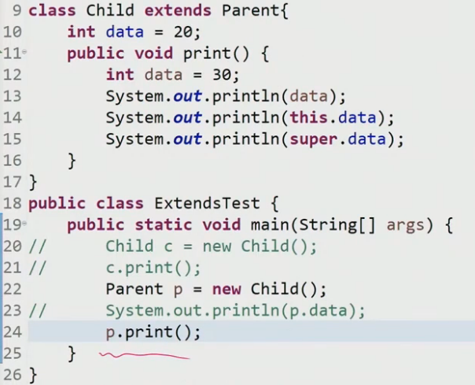

# 다형성

- 다형성이란 하나의 객체가 여러 가지 타입을 가질 수 있는 것을 의미함
- 자바에서는 이러한 다형성을 부모 클래스 타입의 참조 변수로 자식 클래스 타입의 인스턴스를 참조할 수 있도록 하여 구현하고 있음

### 참조 변수의 다형성

- 부모 클래스 타입의 참조 변수로 자식 클래스 타입의 인스턴스를 참조할 수 있음
- 인스턴스 : 어떤 클래스에 속하는 생성된 구체적인 실체
- 참조변수 : 생성되는 인스턴스의 주소값을 저장

```java
class Parent { ... }

class Child extends Parent { ... }

...
// 참조변수 = 인스턴스
Parent pa = new Parent(); // 허용

Child ch = new Child();   // 허용

Parent pc = new Child();  // 허용
//참조변수가 사용할 수 있는 멤버의 개수가 실제 인스턴스의 멤버 개수보다 적어서 생성 가능

Child cp = new Parent();  // 오류 발생.
//참조변수가 사용할 수 있는 멤버의 개수가 실제 인스턴스의 멤버 개수보다 많아서 생성 불가
```



### 참조형 객체의 형 변환






### 참고



- parent의 시선으로 보기 때문에 parent의 데이터인 10 출력



- data - 30, this.data - 20(현재 클래스의 멤버변수), super.data - 10(부모 클래스의 멤버변수)

### 동적바인딩

- 함수가 오버라이딩 되어 있으면 자식의 함수가 호출된다.

