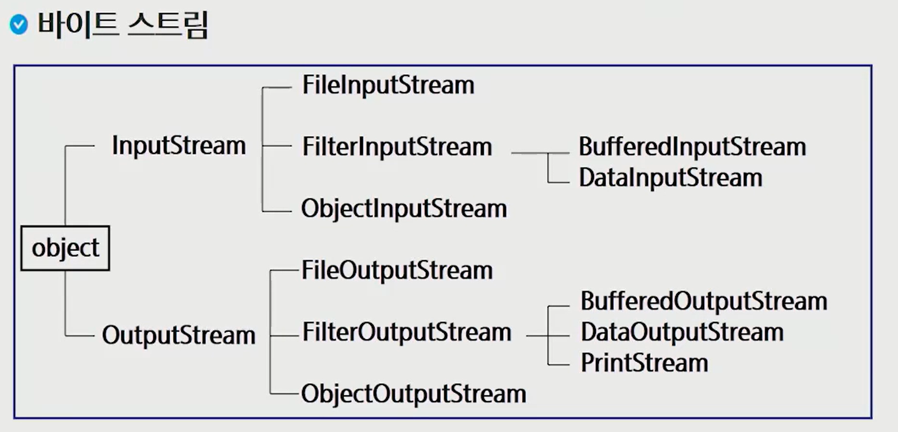
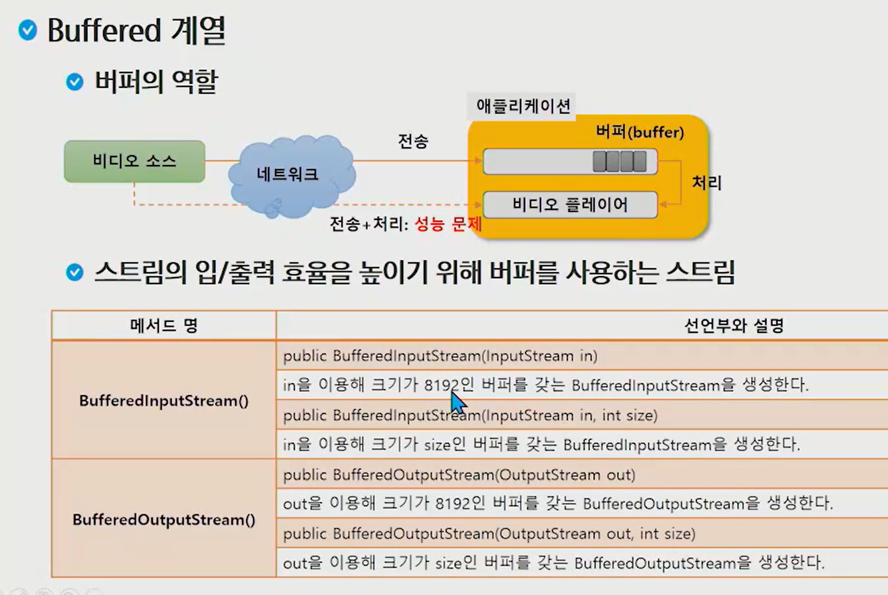

노드 스트림 

- 데이터의 목적지나 근원지에 바로 연결되어있는 스트림(데이터의 흐름)


#### java.io 패키지의 개요



FileOutputStream

- 프로세스로 부터 byte로 흘러나가는 data의 목적지가 file


노드 스트림

- 00InputStream, 00OutputStream
- 데이터의 목적지나 근원지에 바로 연결되어있는 데이터의 흐름


FileReader

- file에다 쓰면 filewriter, 읽으면 reader


## nputSteam과 Reader

#### inputStream의 주요 메서드 

- byte로 읽어들이는 기능을 정의하는 추상클래스


## inputStream의 read함수는 종류가 3개 

1. #### int read() -> int를 return 하는 함수 

2. #### int read(byte b[]) -> int를 return하는 byte 배열을 매개변수로 받는 함수 

3. #### int read(byte b[], int offset, int len) -> int를 return하면서 byte 배열 + int 2개를 받는 함수 


**read()**

- byte 하나를 읽어서 int로 반환한다. 더이상 읽을 값이 없으면 -1을 리턴 

  - byte하나를 읽는데 왜 byte로 반환하지 않고 int로 반환하나?  근원지로 부터 더이상 읽을 값이 없으면 -1을 리턴하기 위해

- a컵에서 b컵으로 스포이드로 물 옮김

  

**read(byte b[])**

- 데이터를 읽어서 b를 채우고 읽은 바이트의 개수를 리턴 
- 0이 리턴되면 더이상 읽을 값이 없는 상황
- a컵(1090byte)에서 b컵으로 바가지(1024byte)로 물 옮김
  - 1024 + 66 : 내가 몇개를 펐었는지 알기 위해 개수를 리턴 

```java
byte[] buf = new byte[1024];

return = .read(buf)

return -> 방금 읽은 바이트의 개수
    내 버퍼 크기보다 작은 수 : 그 수 
    내 버퍼 크기보다 같거나 큰 수 : 1024
```


---

## OutputSteam과 Reader

#### OutputStream의 주요 메서드 


**write()**

- 1 byte를 출력


**write(byte b[])**

- b를 바이트로 변환해서 출력
- 바가지 크기만큼 변환
- 바가지를 보통 버퍼라고 부른다
  - buf = new byte[1024];
  - a -> 3000 b 
  - read 때처럼 사용하면 데이터의 크기가 얼마건 1024를 다 출력하게 되기 때문에 write(byte b[], int off, int len) 사용
    - 파일 용량이 커지고 찌꺼기가 남음


**write(byte b[], int off, int len)**

- b의 off부터 off + len - 1만큼을 문자열로 변환해서 출력한다. 
- int off : 얼마나 건너뛸지, 보통 0
- int len : read에서 return된 값
  - int read()에서 읽은 개수를 int로 변환해서 알려준다고 했기 때문에, 그걸 int len에 넣어주면, 읽은 만큼만 쓰기 때문에 남는 공간이 생기지 않음

**: byte b[] 바가지에 있는것을 0칸 건너뛰고 len길이만큼만 써준다.**

----


#### **write(byte b[])**  와  **write(byte b[], int off, int len)**

- byte b[]크기가 1024이고 출력할 값이 100 남아있는 상황 
  - **write(byte b[])** : 1024 만큼 사용해서 출력 
  - **write(byte b[], int off, int len)** : 100만큼 사용해서 출력하게 할 수 있음 
    - int len : read에서 return된 값
    - int read()에서 읽은 개수를 int로 변환해서 알려준다고 했기 때문에, 그걸 int len에 넣어주면, 읽은 만큼만 쓰기 때문에 남는 공간이 생기지 않음

----


### 예제 3가지 해보기

1. ##### 파일 복사하기

2. ##### 문자열 버퍼로 읽기

3. ##### 객체 저장 / 불러오기 


### 예제 1 

#### FileInputStream과 FileOutputStream을 이용해서 복사본 만들기

default package -> New -> class 

- name : FileCopyTest


```java
package study;

import java.io.FileOutputStream;

public class filecopytest {
	String path = "C:\\Users\\Rorakim\\eclipse-workspace\\study\\src\\study\\";
	String originFile = path + "test.java"; //얘를 대상으로 inputStream을 만들어야하고
	String destFile = path + "test_복사본.pdf"; //얘를 대상으로 OutputStream을 만들어야하고
	
	FileOutputStream fo = new FileOutputStream(destFile);
//	이렇게 하면 fileOutputStream에 빨간줄이 생긴다. 왜? 
// 	Default constructor cannot handle exception type FileNotFoundException thrown by implicit super constructor. Must define an explicit constructor
// 	throws를 함. -> file이 없으면 어떻게할거냐?	
// 	try catch로 해결해주기에는 방법이 너무 복잡
}
```


### try안에 stream을 만들어보면?

```java
package study;

import java.io.FileOutputStream;

public class filecopytest {
	public static void main(String[] args) {
		String path = "C:\\Users\\Rorakim\\eclipse-workspace\\study\\src\\study\\";
		String originFile = path + "test.java"; //얘를 대상으로 inputStream을 만들어야하고
		String destFile = path + "test_복사본.java"; //얘를 대상으로 OutputStream을 만들어야하고
		
		try(FileOutputStream fo = new FileOutputStream(destFile);){

		}
	}
}
```


빨간 줄에 마우스 호버 

1. add throws declaration : 내가 속해있는 함수에서 저 예외를 처리하고 싶지 않으니 던져버려라
2. add catch to surrounding try : 내가 여기서 catch구문을 만들겠다.


```java
package study;

import java.io.FileNotFoundException;
import java.io.FileOutputStream;
import java.io.IOException;

public class filecopytest {
	public static void main(String[] args) {
		String path = "C:\\Users\\Rorakim\\eclipse-workspace\\study\\src\\study\\";
		String originFile = path + "test.java"; //얘를 대상으로 inputStream을 만들어야하고
		String destFile = path + "test_복사본.java"; //얘를 대상으로 OutputStream을 만들어야하고
		
		try(FileOutputStream fo = new FileOutputStream(destFile);){

		} catch (FileNotFoundException e) {
			// TODO Auto-generated catch block
			e.printStackTrace();
		} catch (IOException e) {
			// TODO Auto-generated catch block
			e.printStackTrace();
		}
	}
}
```


### 복사본 파일 생성되는 최종 코드 

```java
package study;

import java.io.FileInputStream;
import java.io.FileNotFoundException;
import java.io.FileOutputStream;
import java.io.IOException;

public class filecopytest {
	public static void main(String[] args) {
		String path = "C:\\Users\\Rorakim\\eclipse-workspace\\study\\src\\study\\";
		String originFile = path + "test.java"; //얘를 대상으로 inputStream을 만들어야하고
		String destFile = path + "test_복사본.java"; //얘를 대상으로 OutputStream을 만들어야하고
		
//		fo로 outputStream만들어주고, fi로 inputstream 만들어줌
		try(FileOutputStream fo = new FileOutputStream(destFile);
				FileInputStream fi = new FileInputStream(originFile)){
			
//			크기가 1024인 buf라는 이름을 가진 바가지 생성
			byte[] buf = new byte[1024];
//			읽은 크기 
			int size = 0;
//			읽은 것이 있을 때 까지
			while ( (size = fi.read(buf)) > 0) {
//				write하겠어 
				fo.write(buf, 0, size);
			}

		} catch (FileNotFoundException e) {
			// TODO Auto-generated catch block
			e.printStackTrace();
		} catch (IOException e) {
			// TODO Auto-generated catch block
			e.printStackTrace();
		}
	}
}

```


### 랜섬웨어의 원리

```java
 try(FileOutputStream fo = new FileOutputStream(destFile); FileInputStream fi = new FileInputStream(originFile)){
     
     byte[] buf = new byte[1024];
     int size = 0;
     while ( (size = fi.read(buf)) > 0) {
         fo.write(buf, 0, size); // 복사본 생성
     }
     new File(originFile).delete(); //원본파일 삭제 -> 비트코인 1개에 1024씩 줄게 -> 랜섬웨어
     
         } catch(FileNotFoundException e) { 
         e.printStackTrace()};
    } catch (IOException e) {
        e.printStackTrace();
    }
    } 
```

-----

----


## 보조스트림

**스트림** 

- 파일에서 데이터가 흐르는 통로

**노드 스트림** 

- 데이터의 목적지나 근원지에 바로 연결되어있는 데이터의 흐름

**보조스트림** 

- 가공이 목적임


---


### 보조 스트림의 개념과 종류


system.in/out/err : 내가 건드리지 못하는  system의 표준스트림

- read하면 byte단위로 읽어주니까 Scanner사용해서 읽었음 


bufferedReader가 더 빠름 like 바가지로 데이터 읽어왔던 것 처럼 

그렇다면 system.in -> InputStreamReader로 char로 변환 -> char을 BufferedReader로 다시 변환하는 과정을 연습해보자 

### 

## system.in을 read로 바꿔보자 

```java
package study;

import java.io.BufferedReader;
import java.io.InputStreamReader;

public class BufferedReaderTest {
	public static void main(String[] args) {
//		system.in은 InputStream이다.
//		InputStream은 byteStream중에서 입력을 받는 최상위 class
// 		InputStreamReader라는 보조stream에 때려넣기
//		타입이 reader로 변환된 상태
		new InputStreamReader(System.in);
		
//		bufferedreader에 또 한번 연결 
//		buffered의 크기는 8192
//		효율적으로 read가능 
		BufferedReader br = new BufferedReader(new InputStreamReader(System.in));

	}	
}
```



```java
public class FileCopyTest { 
	public static void main(String[] args) { 
		new InputStreamReader(System.in);// system.in -> InputStreamReader로 char로 변환
        BufferedReader br = new BufferedReader(new InputStreamReader(System.in)); //성능 빨라짐 buffered바가지가 더 큼
        br.readline(); //엔터가 들어올 때 까지 한줄을 읽습니다.
    } 
    	
}
```

----

----


### swea 최빈수 문제 풀기

https://swexpertacademy.com/main/code/problem/problemDetail.do?contestProbId=AV13zo1KAAACFAYh

어느 고등학교에서 실시한 1000명의 수학 성적을 토대로 통계 자료를 만들려고 한다.

이때, 이 학교에서는 최빈수를 이용하여 학생들의 평균 수준을 짐작하는데, 여기서 최빈수는 특정 자료에서 가장 여러 번 나타나는 값을 의미한다.

다음과 같은 수 분포가 있으면,

10, 8, 7, 2, 2, 4, 8, 8, 8, 9, 5, 5, 3

최빈수는 8이 된다.

최빈수를 출력하는 프로그램을 작성하여라 (단, 최빈수가 여러 개 일 때에는 가장 큰 점수를 출력하라).


답 

```java
package study;

import java.util.Scanner;

public class Solution {
	public static void main(String[] args) {
		Scanner sc = new Scanner(System.in);
//		첫줄에는 테스트케이스 개수인 T가 주어진다
		int T = sc.nextInt();
//		tc는 1부터 T까지 늘어나면서 반복되며
		for(int tc = 1; tc <= T; tc++) {
//			각 테스트케이스의 맨 앞에는 몇번째 테스트케이스인지 주어진다
			int	tc_num = sc.nextInt();
//			cnt array를 위한 101짜리 배열을 생성한다
			int[] cnt = new int[101];
			
//			학생수가 1000명이기때문에 1000개의 값을 읽어들이며 cnt의 index에 맞게 숫자를 증가해줌
			for(int i = 0; i < 1000; i++)
				cnt[sc.nextInt()]++;
			
			int max = 0;
			int maxIdx = 0;
			for(int i = 0; i <= 100; i++) {
				if(max <= cnt[i]) {
					max = cnt[i];
					maxIdx = i;
				}
							
			}
			System.out.println("#" + tc + " " + maxIdx);
		}
	}
}
```


#### buffered reader를 사용해 더 빠르게 풀어보자!

```java
package study;

import java.io.BufferedReader;
import java.io.InputStreamReader;
import java.util.Scanner;
import java.util.StringTokenizer;

public class 최빈수 {
	public static void main(String[] args) {
//		Scanner sc = new Scanner(System.in);
		BufferedReader br = new BufferedReader(new InputStreamReader(System.in));
		
//		첫줄에는 테스트케이스 개수인 T가 주어진다
//		int T = sc.nextInt();
//		readline은 문자열이니까 int로 변환
		int T = Integer.parseInt(br.readLine());
		
//		tc는 1부터 T까지 늘어나면서 반복되며
		for(int tc = 1; tc <= T; tc++) {
			
//			각 테스트케이스의 맨 앞에는 몇번째 테스트케이스인지 주어진다
//			int	tc_num = sc.nextInt();
			int tc_num = Integer.parseInt(br.readLine());
			
//			cnt array를 위한 101짜리 배열을 생성한다
			int[] cnt = new int[101];
			
//			한 줄에 공백으로 구분되는 여러개의 글자가 나올 때 : 토크나이저 이용
			StringTokenizer st = new StringTokenizer(br.readLine());
			
			
//			학생수가 1000명이기때문에 1000개의 값을 읽어들이며 cnt의 index에 맞게 숫자를 증가해줌
			for(int i = 0; i < 1000; i++) {
				
//				토크나이저로 자른 애들을 n에 하나씩 받기
				int n = Integer.parseInt(st.nextToken());
				cnt[n]++;}
			
			int max = 0;
			int maxIdx = 0;
			for(int i = 0; i <= 100; i++) {
				if(max <= cnt[i]) {
					max = cnt[i];
					maxIdx = i;
				}
							
			}
			System.out.println("#" + tc + " " + maxIdx);
		}
		
	}
}
```


-----

----


### 보조 스트림 활용

객체 직렬화

- 객체를 저장하거나 네트워크로 전송하기 위해 연속적인 데이터로 변환하는 것 
- 반대의 경우는 역 직렬화 


**직렬화 되기 위한 조건** 

- Serializable 인터페이스를 구현할 것 
  - 해당 클래스가 생성될 때 부터 필요 
  - 직렬화가 되어도 되는 객체입니다 라고 마킹 해주는 개념
- 클래스의 모든 멤버가 Serializable 인터페이스를 구현해야함
- 직렬화에서 제외하려는 멤버는 transient 선언 


**직렬화 대상 클래스** 


---


## 객체 읽고 쓰기


---


### Object단위로 읽어서 저장하고, Object단위로 저장한걸 다시 읽어보자

```java
#student.java

package study;

import java.io.Serializable;

public class Student implements Comparable<Student>, Serializable{
	private int id;
	private String name;
}

```

```java
#studentlistwriteTest.java
    
package study;

import java.awt.List;
import java.util.ArrayList;

public class StudentListWriteTest {
	public static void main(String[] args) {
		List<Student> list = new ArrayList<>();
		list.add(new Student(1, "Hong"));
		list.add(new Student(2, "kim"));
		list.add(new Student(3, "lee"));
		list.add(new Student(4, "park"));
		list.add(new Student(5, "Hong"));
	}

}

```


### StudentList.dat 파일 생성하기

```java
package study;

import java.awt.List;
import java.io.FileOutputStream;
import java.io.ObjectOutputStream;
import java.util.ArrayList;

public class StudentListWriteTest {
	public static void main(String[] args) {
		List<Student> list = new ArrayList<>();
		list.add(new Student(1, "Hong"));
		list.add(new Student(2, "kim"));
		list.add(new Student(3, "lee"));
		list.add(new Student(4, "park"));
		list.add(new Student(5, "Hong"));
		
        //file단위로 byte로 읽어들이는 애를 -> 객체단위로 바꾸는 보조스트림을 연결해 놓은 것
		try(ObjectOutputStream os = new ObjectOutputStream(new FileOutputStream("studentList.dat")))
			os.writeObject(list);
	}

}
```


### StudentList.dat 파일 읽기

```java
package study

import java.io.FileInputStream;
import java.io.ObjectInputStream;

public class StudentListReadTest {
	public static void main(String[] args) {
		try(ObjectInputStream ois = new ObjectInputStream(new FileInputStream("StudentList.dat"))
			List<Student> list = (List<Student>) ois.readObject();
				for (Student s : list)
					System.out.println(s);
				
				)
	}

}
```

