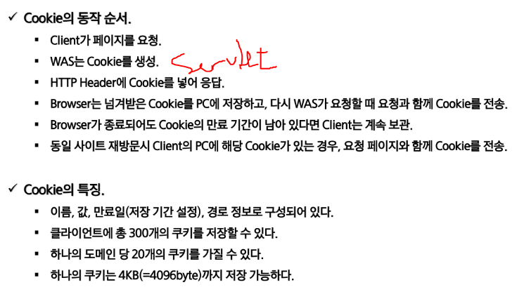

#### 1. HttpSession

- 세션은 서버에 저장됨, was 메모리에 object로 저장
- 쿠키는 클라이언트 컴퓨터에 텍스트로 저장됨

- request.getSession(false) 이면 세션을 찾았을 때 없으면 null return
- true이면 세션만들어서 return
- 사용방법은 request랑 비슷하다.

#### 2. CooKie

- 
- session -> server에 저장(was의 메모리에), object를 저장
- cookie -> client(txt), 문자열만 저장 가능
- stateless -> 응답하고 바로 끊어버림, 로그인상태를 유지하는 경우 문제 발생(로그인 하고 다른 페이지로 간다던가)
- 
- 클라이언트가 서버에 요청을 보낼 때, 헤더에 넣어서 전송
- key, value -> (문자열, 문자열) / sessino ("userInfo", dto)
- 브라우저별로 저장되는 쿠키가 다름 엣지에서 로그인하고 크롬들어간다고 로그인 되어있는 거 아님
- 세션관리, 개인화, 트래킹
- 쿠키는 컴퓨터 달라지면 안된다.(오늘 이 팝업 안보기 등등, 오늘 본 상품)
- 
- 쿠키는 클래스다
- https://javaee.github.io/javaee-spec/javadocs/javax/servlet/http/Cookie.html
- 쿠키 생존시간 설정가능
- 
- 구체적으로 어떤 도메인에서 쓰이는지 설정할 수 있다.

- 

- name, value, domain, age, path 일반적으로 5개 설정
- 

- 

- 클라이언트의 브라우저가 받아서 텍스트로 만듦
- 

#### 3. HttpSession 2

- 톰캣 web.xml 파일에 session-timeout에서 session 유효기간 설정 가능
- web-inf의 web.xml에서 error-page 설정 가능(404에러시 보여주는 화면)
- 
- 로그인할때 세션 쿠기 만들기(member servelet)
- 
- 로그인할때 쿠기 가져오기
- 

- 로그인 안했는데도 글 목록이 보이는 거 해결하기(ilst.jsp)
- 글 쓸 때 유저 로그인 정보 가져오기(세션이용)
- 
- forward, redirect 차이
- 
- https://doublesprogramming.tistory.com/63
- 로그인 했을 때만 글목록을 보여주기
- 
- 

