### Servlet API


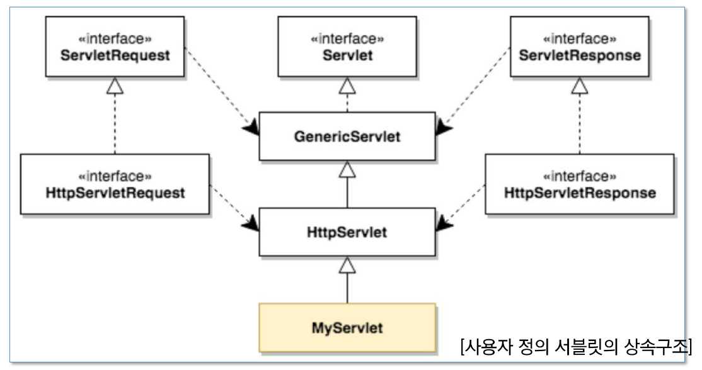

myServlet - 내가 만드는 서블릿, HTTPServlet을 상속 받아야 함

HTTPServlet - GenericServlet을 상속받고 있음 

GenericServlet - Servlet이라는 인터페이스를 구현함


HTTPServletResponse - ServletResponse를 상속 받음 

https://docs.oracle.com/javaee/7/api/index.html


- API문서에 내가 찾는게 없다면?
  - 상속해주고 있는 곳으로 가서 찾아봐라

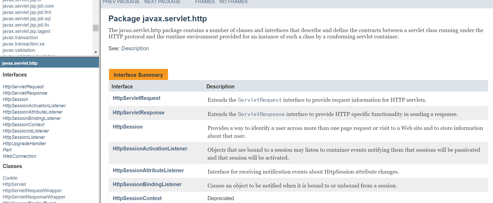

| [HttpServletResponse](https://docs.oracle.com/javaee/7/api/javax/servlet/http/HttpServletResponse.html) | Extends the [`ServletResponse`](https://docs.oracle.com/javaee/7/api/javax/servlet/ServletResponse.html) interface to provide HTTP-specific functionality in sending a response. |
| ------------------------------------------------------------ | ------------------------------------------------------------ |
|                                                              |                                                              |


----


PrintWriter

```java
public class HelloSsafy extends HTTPServlet{
    private static final long serialVersionUID = 1L;
    
    protected void doGet(HttpServletRequest request, HttpServletResponse response) throws ServletException, IOExeption {
        PrintWriter out = response.getWriter();
        out.println("");
        out.println("<html>");
        out.println("    <body>");
        out.println("    hello Ssafy !!! <br>");
        out.println("    </body>");
        out.println("</html>");
    }
}
```


### 그런데,, 한글이 깨진다

- HTML을 ""에 넣어 문자열로 전송하면서, html이라는 사실을 안알려줬기 때문

```java
public class HelloSsafy extends HTTPServlet{
    private static final long serialVersionUID = 1L;
    
    protected void doGet(HttpServletRequest request, HttpServletResponse response) throws ServletException, IOExeption {
        PrintWriter out = response.getWriter();
        //setContentType을 이용해 text를 보낼 때 html로 인식하게함
        //여기에서 쓴 문자들은 utf-8로 인식하라는 뜻
        response.setContentType("text/html;charset=utf-8");
        out.println("");
        out.println("<html>");
        out.println("    <body>");
        out.println("    hello Ssafy !!! <br>");
        out.println("    </body>");
        out.println("</html>");
    }
}
```


### 이제 되겠지!


### 여전히 에러 엔딩

왜?

- response로 받아온 애들을 형식에 맞게 해놓고 printwriter를 통하게 해야함 
- 요구르트 빨대를 -> 버블티에 꽂아놓고 왜 안되나 하는격
- 빨대를 먼저 규격에 맞는 걸로 골라주자 
  -  response.setContentType("text/html;charset=utf-8");

```java
public class HelloSsafy extends HTTPServlet{
    private static final long serialVersionUID = 1L;
    
    protected void doGet(HttpServletRequest request, HttpServletResponse response) throws ServletException, IOExeption {
        
        //setContentType을 이용해 text를 보낼 때 html로 인식하게함
        //여기에서 쓴 문자들은 utf-8로 인식하라는 뜻
        response.setContentType("text/html;charset=utf-8");
        PrintWriter out = response.getWriter();
        out.println("");
        out.println("<html>");
        out.println("    <body>");
        out.println("    hello Ssafy !!! <br>");
        out.println("    </body>");
        out.println("</html>");
    }
}
```


#### 근데 이렇게 가능..? html다 일일이 out.println("") 써줄수 없음

- 그래서 JSP가 나왔다!
- servlet = html in java 
  - java에서 html문법을 쓸 수 없어서 쌍따옴표로 묶은 것 
- JSP = java in html
  - html 코딩 쫙 하고 중간중간에 java넣어줄게


### sevlet일때, java를 사용하려면

평소랑 똑같이 사용가능 

**안녕하세요 김혜라로 바꾸기**


```java
public class HelloSsafy extends HTTPServlet{
    private static final long serialVersionUID = 1L;
    
    protected void doGet(HttpServletRequest request, HttpServletResponse response) throws ServletException, IOExeption {
        String.name = "김혜라"
        
        //setContentType을 이용해 text를 보낼 때 html로 인식하게함
        //여기에서 쓴 문자들은 utf-8로 인식하라는 뜻
        response.setContentType("text/html;charset=utf-8");
        PrintWriter out = response.getWriter();
        out.println("");
        out.println("<html>");
        out.println("    <body>");
        out.println("    hello Ssafy !!! <br>");
        out.println("    안녕하세요" + name + "!!!");
        out.println("    </body>");
        out.println("</html>");
    }
}
```


자바 파일 바뀔 때 마다 서버 껐다켜라. 새로고침은 늦게 먹는다!

---

---


# Servlet's life-Cycle

#### servlet Life-Cycle

- servlet class는 javaSE에서의 class와 다르게 main method가 없다. 즉 객체의 생성부터 사용의 주체가 사용자가 아닌 Servlet Container(서블릿 엔진)에 있다
  - JAVA -> main method가 없으면 실행이 안됨
  - Sevlet을 실제로 가동해주는 engine을 통해 실행되는 것
    - 이것을 WAS라고 부른다 -> 우리는 WAS중 Tomcat을 사용 중
  - Tomcat이 Servlet을 실행해주는 것


- Client가 요청(request)하게 되면 Servlet Container는 Servlet 객체를 생성(한번만)하고, 초기화(한번만)하며 요청에 대한 처리(매번 반복 -> doGet)를 하게 된다. 또한 Servlet 객체가 필요없게 되면 제거하는 일 까지 Container가 담당하게 된다. 
  - 서블릿 객체는 하나지만, 이걸 관리해주는 스레드가 여러개 만들어져서 여러명의 클라이언트를 동시에 받을 수 있게함


### 언제 만들어지고, 언제 초기화되고, 언제 실행을 하고 언제 제거가 되는지 일련의 과정 

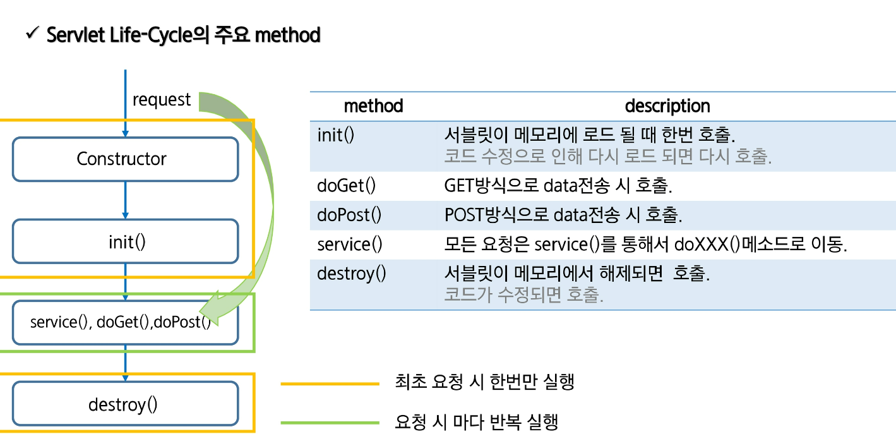

https://docs.oracle.com/javaee/7/api/index.html

javax.servlet -> servlet 

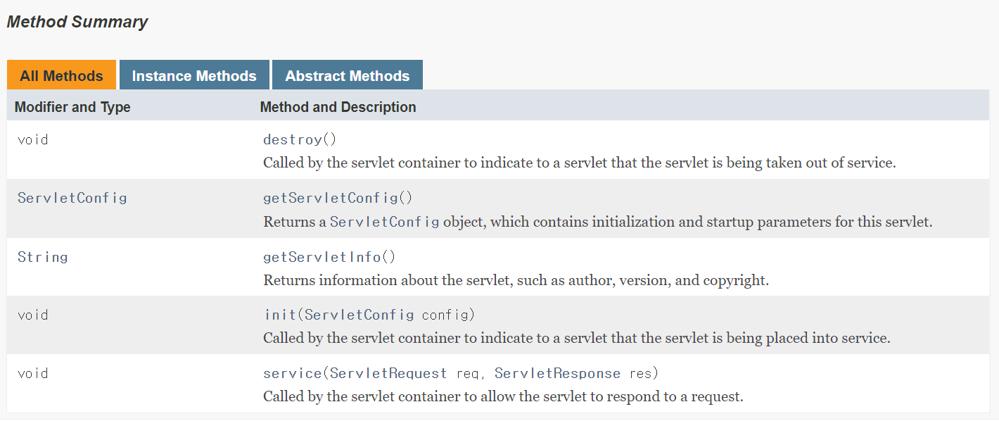

이 중 life cycle에 관련 있는 메서드 

- init()

  - 서블릿이 메모리에 로드될 때 한번 호출

  - 코드 수정으로 인해 다시 로드되면 다시 호출 

  - 소스를 수정하면 destroy가 호출되어 기존의 서블릿을 제거하고, 다시 init호출 

    

- service()

  - 클라이언트의 숫자 만큼 생성
  - 모든 요청은 service()를 통해서 doXXX()메서드로 이동(doGet(), doPost())

- destroy()

  - 서블릿이 메모리에서 해제되면 호출(서버를 끄면)
  - 코드가 수정되면 호출(기존의 서블릿이 구버전이 되기 때문에 삭제)

----

---


### Project Explorer

우클릭 -> new -> project -> web -> dynamic web project

project name : basic_web

next 2번 

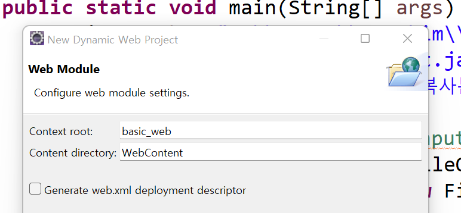

- basic_web 너무 길어서 다른 이름으로 바꾸고 싶어요 
- 일단 finish 누르기


받은 파일의 

backend_0322_배포 > basic_web 가져올 것임 


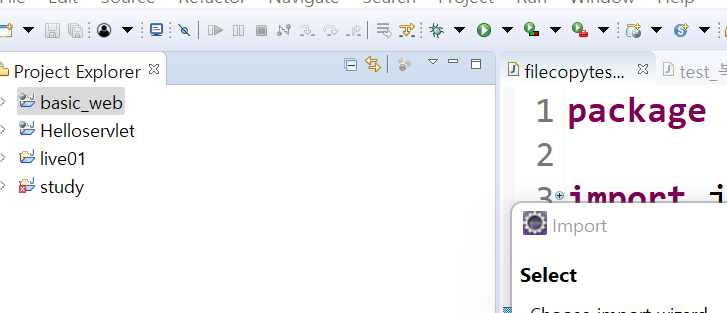

basic_web -> 우클릭 -> import -> import -> General -> file System -> next

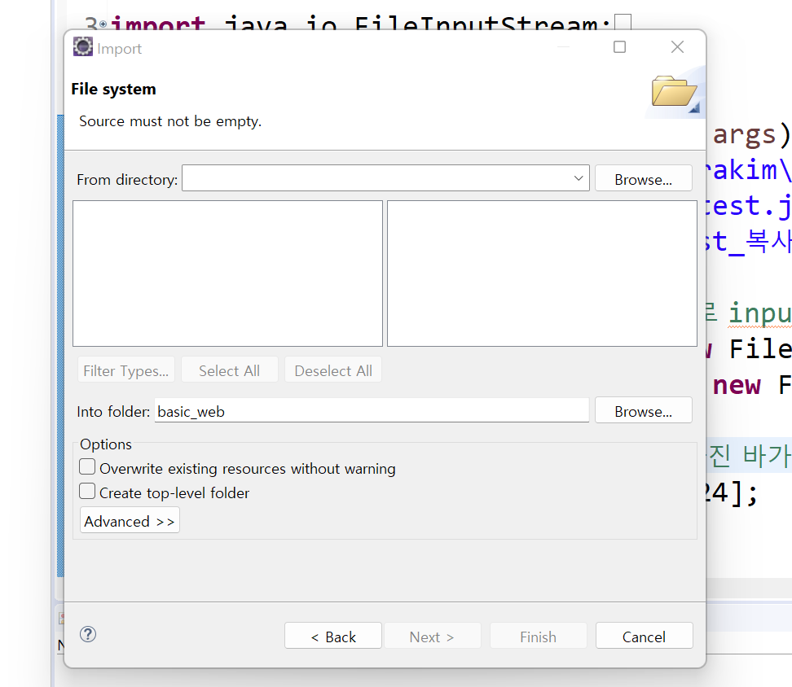


browse -> backend_0322_배포 > basic_web선택


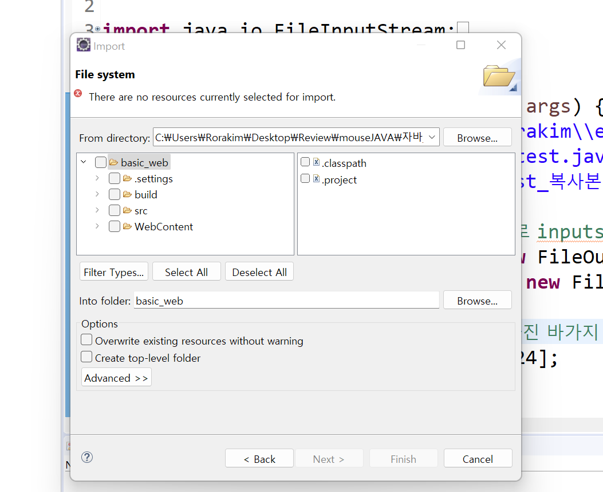

src와 webContent만 가져오기 -> 덮어쓰기

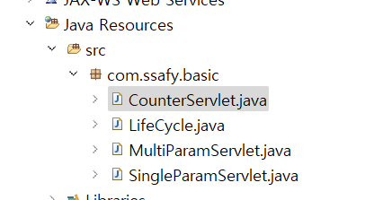

예제 담겨있는 것 확인 

---


#### WebContent -> index.html

ctrl f 11로 실행

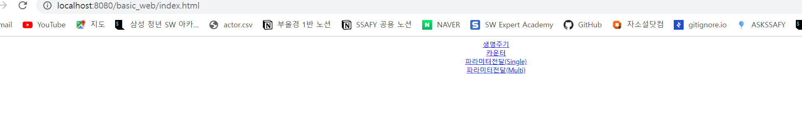

생명주기 누르면 404 뜨는 이유?

```html
<!DOCTYPE html>
<html>
<head>
<meta charset="UTF-8">
<title>Insert title here</title>
</head>
<body>
<div align="center">
	<a href="/bw/lifecycle">생명주기</a><br>
	<a href="/bw/counter">카운터</a><br>
	<a href="/bw/param/single.html">파라미터전달(Single)</a><br>
	<a href="/bw/param/multi.html">파라미터전달(Multi)</a><br>
</div>
</body>
</html>
```

context root를 bw라고 저장해주지 않고 basic_web이라고 저장했잖아

basic_web 우클릭 -> properties -> web project setting

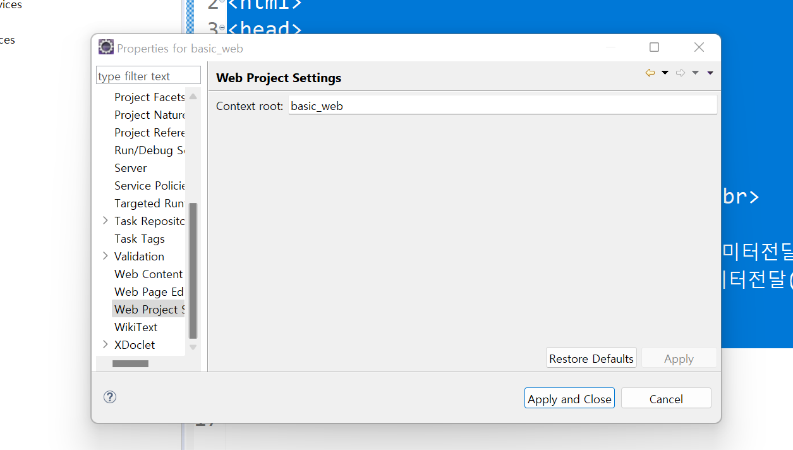


해주면 되겠지? 

404 ending...

**이미 basic_web이라는 이름으로 Tomcat에게 등록했기 때문**


servers -> server.xml 

ctrl shift f (정렬) -> 맨 끝으로 감 

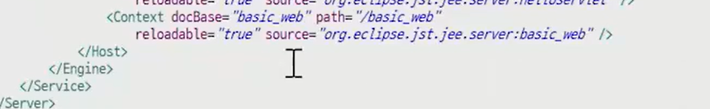

Tomcat path bw로 바꿔줌 


### 생명주기

```java
package com.ssafy.basic;

import java.io.IOException;
import javax.servlet.ServletException;
import javax.servlet.annotation.WebServlet;
import javax.servlet.http.HttpServlet;
import javax.servlet.http.HttpServletRequest;
import javax.servlet.http.HttpServletResponse;

//lifecycle이라는 이름을 가진 servlet으로 들어오겠다
@WebServlet("/lifecycle")
public class LifeCycle extends HttpServlet {
	private static final long serialVersionUID = 1L;

    //생성되면 호출
	@Override
	public void init() throws ServletException {
		System.out.println("init() method call!!!!");
	}

    //클릭으로 get 호출
	protected void doGet(HttpServletRequest request, HttpServletResponse response) throws ServletException, IOException {
		System.out.println("doGet method call!!!!");
	}

	@Override
	public void destroy() {
		System.out.println("destroy() method call!!!!");
	} 

}

```

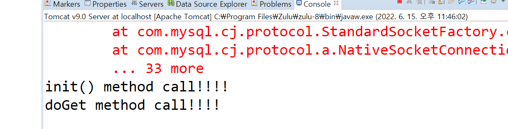

---


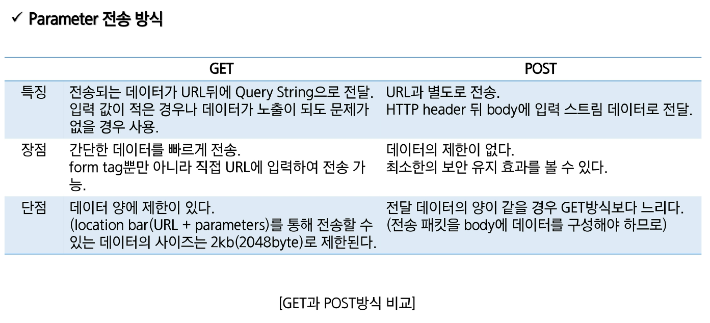


### URI

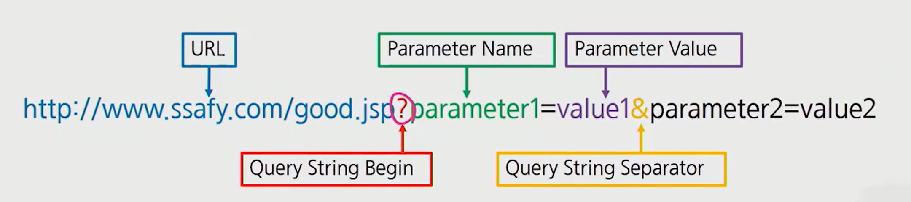


당신은 0000번째 방문자입니다!


### 데이터베이스의 작업 순서

1. 드라이버 로딩 
2. DB와 연결 ( connection )
3. SQL 실행 준비 -> statement
4. SQL 실행

---


### 워크벤치

```sql
create database ssafyweb;

use ssafyweb;
create table counter ( cnt int );

insert into counter values (1);

commit;

select * from counter;
```

 이렇게 하면 


새로고침하면 증가한다고 한다.

---

---


```java
package com.ssafy.basic;

import java.io.IOException;
import java.io.PrintWriter;
import java.sql.*;

import javax.servlet.ServletException;
import javax.servlet.annotation.WebServlet;
import javax.servlet.http.HttpServlet;
import javax.servlet.http.HttpServletRequest;
import javax.servlet.http.HttpServletResponse;

@WebServlet("/counter")
public class CounterServlet extends HttpServlet {
	private static final long serialVersionUID = 1L;
	
	@Override
	public void init() throws ServletException {
		try {
//			2-1. Driver Loading
			Class.forName("com.mysql.cj.jdbc.Driver");
		} catch (ClassNotFoundException e) {
			e.printStackTrace();
		}
	}

	//	당신은 XXXXXXXX번째 방문자입니다.
	protected void doGet(HttpServletRequest request, HttpServletResponse response) throws ServletException, IOException {
		int cnt = 0;
		int totalLen = 8;
		int zeroLen = 0;
//		1. data get
		
//		2. logic
//			2-2. DB Connection (conn 생성)
//			2-3. SQL 실행 준비
//		 		SQL문
//				pstmt 생성 (치환변수 값 세팅)
//			2-4. SQL 실행
//				a. DML (I U D) : int cnt = pstmt.executeUpdate();
//				b. Query (S) : 	ResultSet rs = pstmt.executeQuery();
//								rs.next() [단독, if, while]
//								rs.getXXX("col_name");
//			2-5. DB close (역순)
		
//		DB Logic
		Connection conn = null;
		PreparedStatement pstmt = null;
		ResultSet rs = null;
		try {
			//2-2. DB Connection (conn 생성)
			conn = DriverManager.getConnection("jdbc:mysql://127.0.0.1:3306/ssafyweb?serverTimezone=UTC&useUniCode=yes&characterEncoding=UTF-8", "ssafy", "ssafy");
			
			//2-3. SQL 실행 준비
			String sql = "select cnt from counter";
			pstmt = conn.prepareStatement(sql);
			rs = pstmt.executeQuery();
			rs.next();
			cnt = rs.getInt(1);
			pstmt.close();
            
            //현재 cnt에는 1이 담겨있음
			//database에 1을 더해놓음
			sql = "update counter set cnt = cnt + 1";
			pstmt = conn.prepareStatement(sql);
			pstmt.executeUpdate();
		} catch (SQLException e) {
			e.printStackTrace();
		} finally {
			try {
				if(rs != null)
					rs.close();
				if(pstmt != null)
					pstmt.close();
				if(conn != null)
					conn.close();
			} catch (SQLException e) {
				e.printStackTrace();
			}
		}
		
        //가정을 해보자
//		Business Logic
		String cntStr = cnt + ""; //"138"
		int cntLen = cntStr.length(); // 3
        
        //totalLen : 0의 갯수 : 8
		zeroLen = totalLen - cntLen;
		
//		3. response page
		response.setContentType("text/html;charset=utf-8");
		PrintWriter out = response.getWriter();
		out.println("<html>");
		out.println("	<body>");
		out.println("		<div align=\"center\">");
//		out.print("당신은 ");
        
        //0부터 zerolen까지 -> 5까지
		for(int i=0;i<zeroLen;i++)
			out.print("");
		for(int i=0;i<cntLen;i++)
			out.print("");
//		out.println("번째 방문자입니다.");
		out.println("		</div>");
		out.println("	</body>");
		out.println("</html>");
	}

}

```


----

----


### Servlet을 이용한 파라미터 전달 

post방식은 encoding안하면 다 깨짐 


##### single.html

```html
<!DOCTYPE html>
<html lang="ko">
<head>
	<title>SSAFY-파라미터전달</title>
	<meta charset="utf-8">
	<meta name="viewport" content="width=device-width, initial-scale=1">
	<link rel="stylesheet" href="https://maxcdn.bootstrapcdn.com/bootstrap/4.5.2/css/bootstrap.min.css">
	<script src="https://ajax.googleapis.com/ajax/libs/jquery/3.5.1/jquery.min.js"></script>
	<script src="https://cdnjs.cloudflare.com/ajax/libs/popper.js/1.16.0/umd/popper.min.js"></script>
	<script src="https://maxcdn.bootstrapcdn.com/bootstrap/4.5.2/js/bootstrap.min.js"></script>
</head>
<body>
	<div class="container">
		<div class="col-lg-5">
			<h5 class="text-center">Servlet을 이용한 파라미터 전달(Single)</h5>
			<form name="paramform" method="post" action="/basic_web/singleparam.ssafy">
				<div class="form-group">
					<label for="userid">아이디:</label> <input type="text"
						class="form-control" placeholder="아이디 입력" name="userid">
				</div>
				<div class="form-group">
					<label for="username">이름:</label> <input type="text"
						class="form-control" placeholder="이름 입력" name="username">
				</div>
				<div class="form-group">
					<label for="area">지역:</label> <select name="area"
						class="custom-select">
						<option value="0">서울</option>
						<option value="1" selected>대전</option>
						<option value="2">구미</option>
						<option value="3">광주</option>
						<option value="4">부울경</option>
					</select>
				</div>
				<button type="submit" class="btn btn-primary">전송</button>
			</form>
		</div>
	</div>
</body>
</html>
```


##### SingleParam

```java
package com.ssafy.basic;

import java.io.IOException;
import java.io.PrintWriter;

import javax.servlet.ServletException;
import javax.servlet.annotation.WebServlet;
import javax.servlet.http.HttpServlet;
import javax.servlet.http.HttpServletRequest;
import javax.servlet.http.HttpServletResponse;

/*
 * 안녕하세요 안효인(ssafy)님!!! 
 * 아이디의 글자색을 서울 : 파랑, 대전 : 오렌지, 구미 : 핑크, 광주 : 초록, 부울경 : 보라
 */

@WebServlet("/singleparam.ssafy")
public class SingleParamServlet extends HttpServlet {
	private static final long serialVersionUID = 1L;
      
/////get방식//////////
	protected void doGet(HttpServletRequest request, HttpServletResponse response) throws ServletException, IOException {
		System.out.println("doGet call!!!!");
//		1. data get
		String name = request.getParameter("username");
		String id = request.getParameter("userid");
		int area = Integer.parseInt(request.getParameter("area"));
		
//		2. logic >> 인사의 글자색을 서울 : 파랑, 대전 : 오렌지, 구미 : 핑크, 광주 : 초록, 부울경 : 보라
		String color[] = {"blue", "orange", "pink", "green", "purple"};
		
//		3. response page
		response.setContentType("text/html;charset=utf-8");
		PrintWriter out = response.getWriter();
		out.println("<html>");
		out.println("	<body>");
		out.println("	<h2 style=\"color:" + color[area] + "\">안녕하세요. " + name + "(" + id + ")님!!!</h2>");
		out.println("	</body>");
		out.println("</html>");
	}

    
/////post 방식//////////
	protected void doPost(HttpServletRequest request, HttpServletResponse response) throws ServletException, IOException {
		System.out.println("doPost call!!!!");
//		1. data get
		request.setCharacterEncoding("utf-8");
		String name = request.getParameter("username");
		System.out.println(">>>>>>>>>>>>" + name);
		String id = request.getParameter("userid");
		int area = Integer.parseInt(request.getParameter("area"));
		
//		2. logic >> 인사의 글자색을 서울 : 파랑, 대전 : 오렌지, 구미 : 핑크, 광주 : 초록, 부울경 : 보라
		String color[] = {"blue", "orange", "pink", "green", "purple"};
		
//		3. response page
		response.setContentType("text/html;charset=utf-8");
		PrintWriter out = response.getWriter();
		out.println("<html>");
		out.println("	<body>");
		out.println("	<h2 style=\"color:" + color[area] + "\">안녕하세요. " + name + "(" + id + ")님!!!</h2>");
		out.println("	</body>");
		out.println("</html>");
	}

}

```

