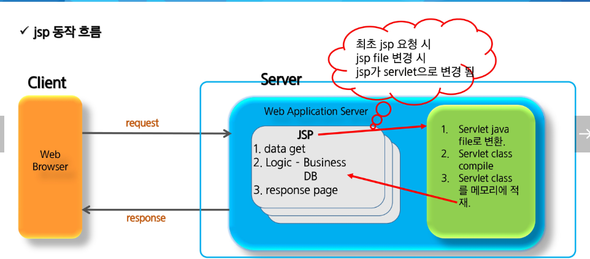
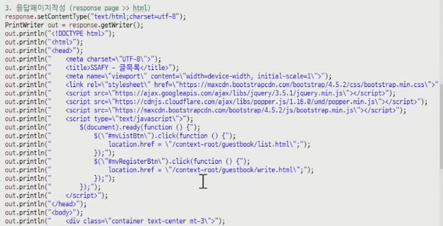

# 쥐잡듯 JAVA - 5주차

## JSP

### Java Server Page

자바 서버 페이지는 HTML 내에 자바 코드를 삽입하여 웹 서버에서 동적으로 웹페이지를 생성하여 웹 브라우저에 돌려주는 언어이다.

JSP 실행시에는 자바 Servlet으로 __변환된__ 후 실행되므로 Servlet과 거의 유사하지만, 서블릿과 달리 HTML 표준에 따라 작성되므로 웹 디자인하기에 편리한 장점이 있다. => 빠른건 JSP가 더 빠르다 왜?



최초 요청시에만 JSP가 Servlet으로 변경되고 그 이후에는 JSP가 변경되지 않는 이상 변환이 일어나지 않음

### Servlet으로 작성시



이와같은 괄호 따옴표의 지옥을 맛볼 수 있다.


### JSP 에러

에러 뜰 당시에 JSP파일의 길이를 넘어선 위치에서 에러 뜨는 걸 확인할 수 있는데, 이것은 servlet으로 변환된 파일의 에러 위치를 표시해준 것이기 때문이다.

#### 변환된 servlet의 파일 위치

(c => ahi => )워크 스페이스 => .metadata => .plugins => org.eclipse.wst.server.core => tmp0 => work => catalina(tomcat의 이름) => localhost(도메인이름) => (실행시킨 프로젝트명? ~~잘모르겠다~~)  => org => apache => jsp => filename_jsp.java

해당 파일은 servlet 형태로 작성되어있고 에러뜬 위치를 파악할 수 있다.


### 예시 JSP

가장 위쪽에 존재하는 설정에서 인코딩을 UTF-8로 자동으로 설정해주므로 한글 깨짐이 없음

```jsp
<%@ page language="java" contentType="text/html; charset=UTF-8" pageEncoding="UTF-8" %>
<%
String name = "안효인";
%>
<!DOCTOYPE html>
<html>
    <head>
        <meta charset="UTF-8">
        <title>Insert Title here</title>
    </head>
    <body>
        Hello SSafy!!!<br>
        안녕하세요 <%= name %>!!! <br>
        이름 : <% out.println(name); %>
    </body>
</html>
```

해당 예시에서 out객체가 존재하지않는데 작동이 잘 되는 이유는 servlet으로 변환 시 자동으로 만들어주는 객체가 존재하기 때문

내장객체 종류

- pageContext
- session
- application
- config
- out
- page
- _jspx_out
- _jspx_page_context


### 스크립팅 요소

#### 선언

> 멤버 변수 선언이나 메소드를 선언하는 영역

형식 : <%! java code %>

단순히 <% %>으로 선언한 변수는 _jspService 라는 메소드 안에 있지만

선언 형식을 사용하는 순간 전역 변수로 선언되어진다

예)

```jsp
<%!
String name;
public void init() {
    name = "안효인";
}
%>
```


#### 스크립트릿

> Client 요청 시 매번 호출 영역으로, Servlet으로 변환 시 service() method에 해당되는 영역
>
> request, response에 관련된 코드 구현

형식 : <% java code %>

로직처리 및 request, response와 관련된 코드들이 들어간다

예)


#### 표현식

> 데이터를 브라우저에 출력할 때 사용

형식 : <%= 문자열 %>

이 두개는 같은 표현이다.

<%= name %> == <% out.print(name); %>

다만 주의할 점으로 <%= %>에는 세미콜론이 이미 포함되어있는 문구이기 때문에 문자열 뒤에 세미콜론을 작성하지 않는다.


#### 주석

> 코드 상에서 부가 설명을 작성

형식 : <%-- 주석 --%>

##### html 주석과 JSP 주석의 차이

html 주석 : 서버에서 클라이언트로 보내주기는 하지만 화면에는 표시되지 않는다

jsp 주석 : 서버에서 원천 차단하여서 html에도 나타나지 않음

```jsp
<%
String test = null;
%>
...
<body>
    <!-- 1111 <%= test.length() %> -->
    <%-- 2222 <%= test.length() %> --%>
</body>
```

위 예시처럼 작성 시

html 주석은 서버에서 실행을 다 한 뒤 가져온 것을 화면에서 보여주지 말라는 것이고,

jsp 주석은 서버자체에서 실행을 하지 않기 때문에 에러가 발생하지 않는 것이다.

비슷한 예로

javascript에서 java코드를 기입할 때 조건부로 만들면,
javascript부분의 java코드는 먼저 서버로 다 넘어가진 상태에서 java 코드가 실행된 후 결과를 html에서 받은 뒤 javascript 부분이 실행되기 때문에 서순이 맞지 않다.

### JSP 지시자 (Directive)

1. page Directive

   > 컨테이너에게 현재 JSP페이지를 어떻게 처리할 것인가에 대한 정보를 제공

   형식 : <%@ page attr1="val1" attr2="val2" %>

   속성

   - language : 기본값 = java
     - 스크립트에서 사용할 언어 지정
   - info
     - 현재 JSP페이지에 대한 설명
   - contentType : 기본값 = text/html;charset=ISO-8859-1
     - 브라우저로 내보내는 내용의 MIME 형식 지정 및 문자 집합 지정
   - pageEncoding : 기본값 = ISO-8859-1
     - 현재 JSP 페이지 문자집합 지정
   - import
     - 현재 JSP 페이지에서 사용할 Java 패키지나 클래스를 지정
   - session : 기본값 = true
     - 세션의 사용 유무 설정
   - errorPage : ="에러페이지위치주소"
     - 에러가 발생할 때에 대신 처리될 JSP 페이지 지정
   - isErrorPage : 기본값 =false
     - 현재 JSP페이지가 에러 핸들링 하는 페이지인지 확인하는 요소
   - buffer
     - 버퍼의 크기
   - autoflush 
     - 버퍼의 내용을 자동으로 브라우저로 보낼 지에 대한 설정
   - isThreadsafe
     - 현재 JSP페이지가 멀티 쓰레드로 동작해도 안전한지 여부를 설정하는 것으로 false인 경우 JSP페이지는 SingleThread로 서비스 된다.
   - extends
     - 현재 JSP 페이지를 기본적인 클래스가 아닌 다른 클래스로부터 상속하도록 변경

2. include Directive

   > 특정 jsp file을 페이지에 포함
   >
   > 여러 jsp 페이지에서 반복적으로 사용되는 부분을 jsp file로 만든 후 반복 영역에 include 시켜 코드를 줄일 수 있다.

   형식 : <%@ include file="/template/header.jsp"%>

3. taglib Directive

   > JSTL 또는 사용자에 의해서 만든 커스텀태그를 이용할 때 사용되며 
   > JSP페이지 내에 불필요한 자바 코드를 줄일 수 있다.

   형식 : <%@ taglib prefix="c" uri="http://java.sun.com/jsp/jstl/core" %>


### JSP 기본객체

- request : html 폼 요소의 선택 값 등 사용자 입력 정보를 읽어올 때 사용
- response : 사용자 요청에 대한 응답을 처리하기 위해 사용
- pageContext : 각종 기본 객체를 얻거나 forward 및 include 기능을 활용할 때 사용
- session :  클라이언트에 대한 세션 정보를 처리하기 위해 사용
  - directive에서 session false로 하면 생성이 안됌
- application : 웹 서버의 애플리케이션 처리와 관련된 정보를 레퍼런스하기 위해 사용

- out : 사용자에게 전달하기 위한 output 스트림을 처리할 때 사용
- config : 현재 JSP에 대한 초기화 환경을 처리하기 위해 사용
- page : 현재 JSP페이지에 대한 참조 변수에 해당됨
- exception : Error를 처리하는 JSP에서 isErrorPage속성을 true로 설정하면 exception 내장 객체를 사용할 수 있고 기본 false로 설정되어있다. 전달된 오류 정보를 담고 있는 내장 객체


