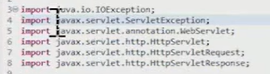

# Web Back WebMVC 종합 실습


### Workspace가 바뀌면 서버는 어째 될까??? ---> 서버가 안잡힌다!!!

### 시험에 가면 워크스페이스를 바꾸라는 말이 나온다. 같이 바꿔보자


### 새로운 워크스페이스를 잡으면 이클립스가 다시 실행된다.


### 워크스페이스 바꾸면 뭐해야함??? ---> 설정 바꿔야지 encoding이 utf-8인지 확인해야하지 이거를 자동으로 해주는게 있다??? 개꿀팁!!!!

### eclipse에 보면 eclipse.ini파일에서 맨 마지막에 `-Dfile.encoding=utf-8` 을 적어주자!!!


### 다시 돌아와서 새로 프로젝트를 만들면 우리는 항상 그냥 finish 눌렀다. but 그러나  지금은 Target runtime이 안잡혀있다. 그러니까 New Runtime을 눌러서 tomcat을 설정해주어야한다.


### 이 서블릿을 만드는 순간 에러가 났을것이다 왜???



### 이 친구들 못얻어온다고 하지만 지금은 되는 이유가 실행시키면 우리가 Servers에서  context.xml, server.xml, web.xml 이런것들을 그대로 카피해왔기 때문에 하지만 이렇게 안했으면 에러가 난다. 이거 꼭 기억하자


# 새롭게 워크스페이스를 한다면

### 1. encoding 설정했는지

### 2. 서버 설정 했는지

### 요거 두개는 꼭 기억해주기!!!!!!!!!!!!!!!!!!!!!!1


내컴퓨터에있는 소스들을 서버에 배포해야한다.

톰캣이 있는곳이 배포하는곳? 

내컴퓨터에 이클립스에서 소스만드는거

톰캣안에 conf 안에보면 context.xml, server.xml, web.xml이 있다. 이런애들을 내 이클립스에 가져와서 실행시키는거라고 생각하자


# guestbook_mvc2 실습

### 1. guestbook_mvc2이라는 dynamic web project를 만들고 import 해주기


### 하기전에 따른이야기로 새버림 workspace에서 뭐를 뺀다는데 그게 뭔말인지 모르겠음 어쨋든 workspace에서 guestbook_mvc2 파일에 들어가면


### 이렇게 .classpath랑 .project가 있다. 이걸 열어보면 


### 여기서는 JRE에 대한 설정이zulu로 되어있다 그리고 tomcat에 대한 설정이 있다. 근데 집에서 만들어온게 줄루가 아니고 톰캣도 이름을 다른거로 설정했다면 안깔려있으니까


### 여기에 들어가면 요렇게 (unbind)라고 오류가 날것이다.

### 

### 그러므로 다 빼고 우리가 만지는 src, res, WebContent만 가져온다. (질문이 이거말고 왜 저런거는 안가져오냐 이런거였는듯) 

### 즉 다른거는 이클립스가 자동으로 설정해주는건데 오히려 가져오면 에러가 난다!!!


### 2. 다시 돌아와서 


# 클라이언트가 요청하면 DB는 언제만들죠??

### 지금꺼는 요청하면 DB를 연결한다


### 이친구를 실행하면 먼저

```java
Class.forName("com.mysql.cj.jdbc.Driver"); // 드라이버 로딩하고
Connection conn = DriverManager.getConnection() //DataBase 연결한다.
```

### 여기에 만약 syso로 print해보면 드라이버 성공 하고 약간의 공백 뒤에 DB연결 성공이라고 나온다. 우리 눈으로 보일정도로 차이가 있다면 어마무시한거다.

### 만약 우리가 글쓰고 목록가져오고 수정한다면 3번 DB에 연결한다.  이때 우리는 처음에 DB 연결하고 글쓰고 목록가져오고 수정하고 CLOSE했나??? NO!!!!!!

### 연결 글쓰고 닫고 연결 가져오고 닫고 연결 수정하고 닫고 이렇게 해야한다. 왜냐? 간단하게 이야기하면 우리가 사용하는 RDBMS가 무료가 아니다 그중 클라이언트가 접속한 수만큼 돈을 내야하는 뭐 그런게 있다 그래서 약간 한정하는 그런게 있는데 50명 들어오면 터진다고 가정하자 근데 사람이 연결하고 안나가 이러면 이 사이트는 죽는다 그러므로 필요할때마다 연결하고 끊고 이런게 필요하다.

### 그래서 계속 연결하고 끊고를 반복하다보니까 시간이 걸린다,,, 사람이 많아지면 많아질수록 시간이 더 걸리겠죠? 그럼 해결책은? 필요할때 연결을 하니까 미리 연결하자!!!!! 미리 연결하고 필요할때 빌려주고 그리고 회수해오자!!!!! 즉 재사용하면 시간이 줄어든다 이러한 개념이 pool이다. 

### 이러한 pool이라는 개념을 사용하려면 JNDI(자바 네이밍 디렉토리 인터페이스) 즉 자바의 객체를 이름과 디렉토리의 개념으로 관리할 수 있는 방법이다.

### 예를 들어서 우리가 어떤 파일을 찾으려면 경로와 이름을 알아야한다.  요런 파일 구조가 있다고 생각해보자


### 우리는 지금 D안에 a에 있다 여기서 C로 가는 방법은 뭐 D로 올라가서 가는 방법과 a에서 바로 C로 가는 방법도 있다.

### 우리가 C밑에 공부 밑에 싸피 밑에 정리.TXT로 가듯이 자바에서도

### java: comp/env 밑에 뭐 이런식으로 접근할수 있다 이것이 JNDI


### 진짜 다시 돌아가서 src안에 com.ssafy.util안에 DBUtil.java를 보자

```java
package com.ssafy.util;

import java.sql.Connection;
import java.sql.DriverManager;
import java.sql.SQLException;

import javax.naming.Context;
import javax.naming.InitialContext;
import javax.naming.NamingException;
import javax.sql.DataSource;
public class DBUtil {
/*

	private final String driverName = "com.mysql.cj.jdbc.Driver";
	private final String url = "jdbc:mysql://127.0.0.1:3306/ssafyweb?serverTimezone=UTC";
	private final String user = "ssafy";
	private final String pass = "ssafy";

	private static DBUtil instance = new DBUtil();

	private DBUtil() {
		try {
			Class.forName(driverName);
		} catch (ClassNotFoundException e) {
			e.printStackTrace();
		}
	}

	public static DBUtil getInstance() {
		return instance;
	}

	public Connection getConnection() throws SQLException {
		return DriverManager.getConnection(url, user, pass);
	}

	public void close(AutoCloseable... closeables) {
		for (AutoCloseable c : closeables) {
			if (c != null) {
				try {
					c.close();
				} catch (Exception e) {
					e.printStackTrace();
				}
			}
		}
	}
*/
	private static DBUtil instance = new DBUtil();
	
	private DBUtil() {}
	
	public static DBUtil getInstance() {
		return instance;
	}
	
	public Connection getConnection() throws SQLException {
		try {
			Context context = new InitialContext();        //요거는 메모리를 접근할 수 있게끔 context 객체를 얻어옴 그러면 밑에 경로를 적어줘야지
			Context rootContext = (Context) context.lookup("java:comp/env"); // java:comp/env라는 루트를 찾아라 라고 하고 얘는 자바의 객체를 다 저장하고 찾을 수 있어서 오브젝트를 리턴한다 그러므로 Context로 형병환
			DataSource dataSource = (DataSource) rootContext.lookup("jdbc/ssafy");
			return dataSource.getConnection();
		} catch (NamingException e) {
			// TODO: handle exception
			e.printStackTrace();
		}
	}

	public void close(AutoCloseable... closeables) {
		for (AutoCloseable c : closeables) {
			if (c != null) {
				try {
					c.close();
				} catch (Exception e) {
					e.printStackTrace();
				}
			}
		}
	}
}

```


# 수정 삭제 버튼만들기

```java
...
<script type="text/javascript">
    $(document).ready(function () {
        $("#mvRegisterBtn").click(function () {
            location.href = "${root}/article?act=mvregister";
        });
        
        function deleteArticle(no) {
        	if(confirm("정말로 삭제??")) {
        		location.href = "${root}/article?act=delete&articleno=${article.articleNo}"; // 이렇게 만들어 주자 근데 어라?? 이러면 article.articleNo를 알 수 없는데??? 어째할까 밑에 인자값으로 넘겨주자
        		location.href = "${root}/article?act=delete&articleno=" + no;  // 최종
        	}
        }
    });
</script>
...
<tr>
    <td colspan="2" class="table-danger">
        <strong>${article.articleNo}. ${article.subject}</strong>
        <c:if teset="${userInfo.userId eq article.userId}">   // 요거는 글쓴사람이랑 로그인한 사람이 같다면
        <div>
        	<a href="${root}/article?act=mvmodify">수정</a> //이렇게만 보내면 안된다.
        	<a href="${root}/article?act=mvmodify&articleno=${article.articleNo}">수정</a>
        	<a href="${root}/article?act=delete&articleno=${article.articleNo}">삭제</a>  // 근데 이래하면 바로 삭제가된다. 그럼 어째?
        	<a href="deleteArticle();">삭제</a>   // 함수로 만들어줬으니 script에 함수를 만들어주자
        	<a href="deleteArticle(${article.articleNo});">삭제</a>    // 인자값으로 넘겨준거
        </div>
        </c:if>
    </td>
</tr>
```


### 근데 위에서 `location.href = "${root}/article?act=delete&articleno=" + no;` 사용할때 백틱(`) 사용하면 안되나??? 

```JAVA
location.href = `${root}/article?act=delete&articleno=${no}`;
// 요래 하면 안되나?
// 안된다. 앞에 저 ${root} 이친구는 EL이다 (Expression language) 뭐 그래서 안된다.
```


### 

### 
