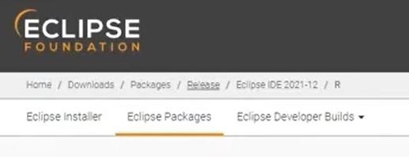

## java 2

---

(IT 상식)

도입: **3g**와 **2g**의 차이는? (1g는 아날로그. 목소리는 가지만, 문자는 불가)

무선통신 3세대와 2세대. **세대를 가르는 기준**은? 단순히 속도가 빠르다고 해서 다음 세대라고 지칭할 수는 없을 것

**2세대: 문자 가능**

**3세대: 영통 가능** (몰랐는데 나중에 아는척하기 좋을듯)

+

4세대: AII IP -> 3세대까지는 중간 교환국을 거쳐 데이터를 전송. 그러나 4세대부터는 데이터를 직접 전송

3세대는 전화 걸자마자 종료 누르면 취소 가능했음. 근데 4세대는 낙장불입

+

5세대: 3d 상태의 통신이 가능한 수준

을 바랬으나, 아직 상용화될 수준의 기술은 아닌듯

---

**컴퓨터의 자료 표현**

- **비트**
  - 0 or 1. 1 칸의 데이터를 표현할 수 있는 단위
  - **1 비트당 2가지**의 정보를 담을 수 있음. 

- **바이트**

  - **8비트 ==  1바이트**

- 2진수

  - **2의보수**

    - 이진수로 표현한 데이터를 뒤집음 (ex: 101 -> 010)

    - 거기에 1 더함 (ex: 010에 1 더해서 011)
    - 101의 2의보수는? 011
    - 둘이 더하면? 101 + 011 -> 1000 -> 000 -> 0
    - **즉 2의 보수는 해당 숫자에 -를 붙인 값이 된다**
    - ex) -9를 표현하고 싶으면?
      - 9는 00001001로 표현 가능
      - 뒤집으면? 11110110
      - 1 더하면? 11110111
      - 걔가 -9임

**요약: 컴퓨터가 자료를 표현할 때는?**

- 정수: 2의 보수를 활용, 부호를 표현
- 문자: 아스키코드 활용
- 실수: 부동소수점 표현 활용. 부호 / 지수 / 가수 부분으로 나누어 표현 

---

**개발환경 구축**

개발환경 구축은 각자 컴퓨터 사정에 맞게 설정하도록 합시다

1. **zulu**

   - azul.com 들어가
   - Download now
   - 버전 선택(LTS로 선택, 싸피 비전공 과정에서는 8버전 이용)
   - 그 외는 컴퓨터 환경에 맞게 선택
   - 8u192b01 선택 후 msi 다운로드
   - 대충 뜨는거 알았다, 다음, next ㄱ

   

2. **이클립스**
   - 통합개발환경
   - 이클립스 검색 후 사이트 들어가서
   - download packages 누르고
   - 
   - 화면 상단 release 클릭
   - 2018 09 선택 (싸피 공식인데 꼭 따를 필요는 없을것같음)
   - R Packages 선택
   - 환경에 맞는거 선택 후 설치 (아마 다들 윈도우 64 아닐까) (맥은 모르겠음)
   - 이클립스는 개기일식이라는 뜻
   - 초반버전은 행성 이름들 따서 이름붙임
   - 쓸 게 없어서 이거까지 씀

---

# JAVA 2강 fin.

