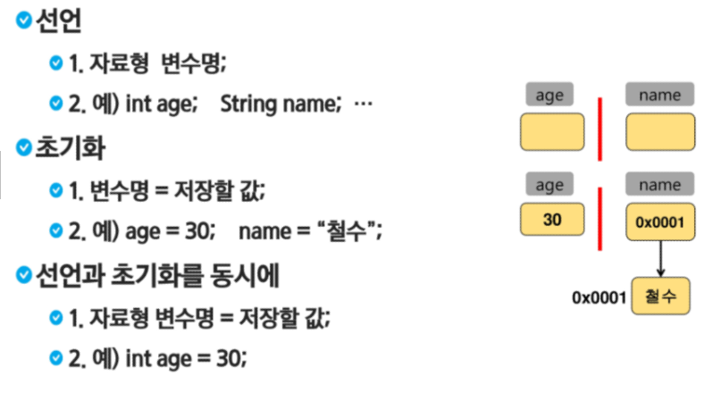
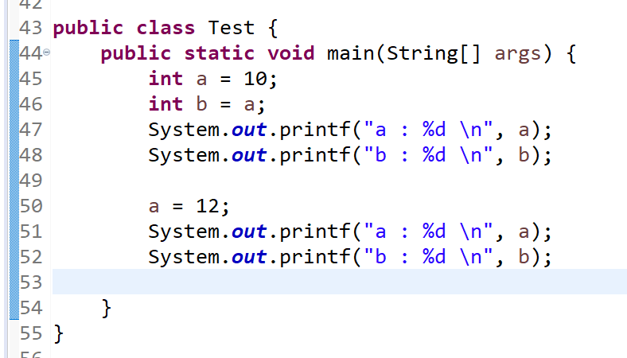
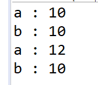
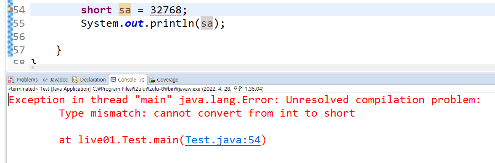
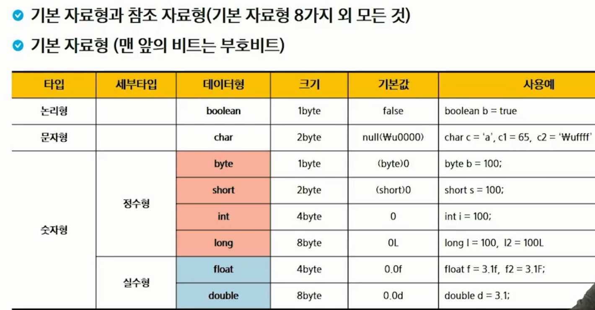
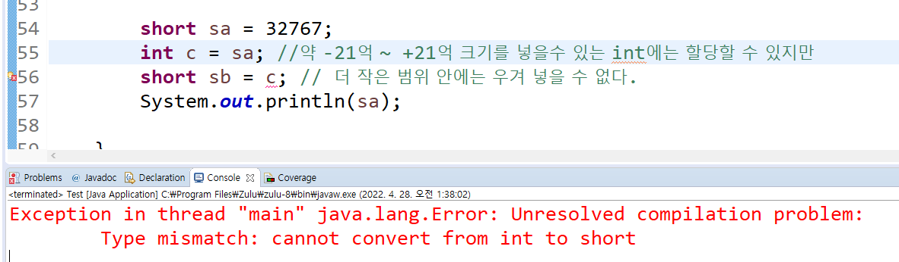
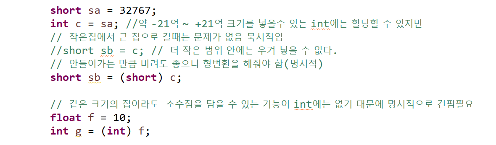
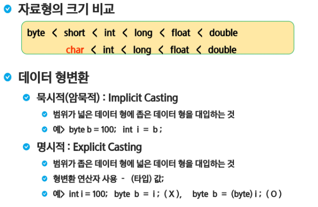

## 자바 1주차

> ### 변수




> ### 코드 예시



```java
public class Test { 
	public static void main(String[] args) {
		int a = 10;
		int b = a;
		System.out.printf("a : %d \n", a);
		System.out.printf("b : %d \n", b);
		
		a = 12;
		System.out.printf("a : %d \n", a);
		System.out.printf("b : %d \n", b);
	
	}
}
```


> ### 출력예시



- a의 값만 바꼈기 때문에 b의 값은 그대로 인것을 확인


-----------

> ### 자료형

- 자신의 공간 안에 실제 값을 넣는 것이 기본자료형, 기초자료형
  - 예시) short는 2byte라는 크기안에 -32768~32767 까지의 값을 넣을수 있다
    - 
- 문자열은 'Hong', 'Hong gil dong' 처럼 크기를 정해놓기 어렵기 때문에 참조 자료형으로 구분




- 더 큰 크기의 자료형에 작은 크기의 자료형을 할당 할 수 없다
  - 예시
    - 


- 명시적인 형변환
  - 예시
    - 

```java
short sa = 32767;
int c = sa; //약 -21억 ~ +21억 크기를 넣을수 있는 int에는 할당할 수 있지만
// 작은집에서 큰 집으로 갈때는 문제가 없음 묵시적임
//short sb = c; // 더 작은 범위 안에는 우겨 넣을 수 없다.
// 안들어가는 만큼 버려도 좋으니 형변환을 해줘야 함(명시적)
short sb = (short) c;

// 같은 크기의 집이라도  소수점을 담을 수 있는 기능이 int에는 없기 대문에 명시적으로 컨펌필요
float f = 10;
int g = (int) f;

System.out.println(sa);
```


> ### 형변환




> ### 실습

사람의 정보를 변수에 담아 출력하기

```java
package live01;

public class test3 {
	public static void main(String[] args) {
		// 사람의 정보를 변수에 담아 출력하기
		String name = "Hong";
		int age = 27; //String age = "27"; 출력만 하는데는 문제가 없음, 연산에서는 계산 불가
		int height = 179;
		int weight = 70;
		
		System.out.printf("이름은 %s이고, 나이는 %d 입니다. \n", name, age);
		System.out.printf("키는 %3d 이고, 몸무게는 %3d 입니다. \n", height, weight);
	}
}

```

