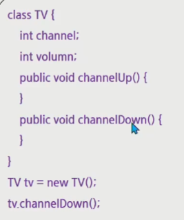
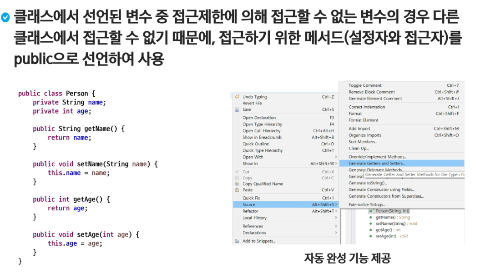

# 자바 문법2

### 1. 1차원, 2차원 배열

- 클라우드: 인프라를 빌려쓰는 것
- 드랍박스를 통해 공유할 예정
- 배열: 같은 타입의 변수의 모임

- String은 기초 자료형이 아니다(크기가 정해져 있지않음)
- int -> 정수하나 담을 수 있음
- int[] -> int 배열의 주소를 담을 수 있음(int랑 다른 타입임)
- new int[78]; -> int 78개 만큼의 공간을 만들어냄
- 
- 

- 장점:  1. 간편하게 많은 같은 타입의 변수를 생성할 수 있다.
  2. 연속된 공간을 할당 받을 수 있다.
  3. 반복문과의 시너지
- 배열이란
  - 같은 종류의 데이터를 저장하기 위한 자료구조
  - 크기가 고정되어 있다.(한번 생성된 배열은 크기를 바꿀 수 없다.)
  - 배열을 객체로 취급
  - 배열의 요소를 참조하려면 배열이름과 색인이라고 하는 
    int 유형의 정수값을 조합하여 사용한다.
  - 

```java
public class test01 {
    public static void main(String[] args) {
        Scanner sc = new Scanner (System.in);
        System.out.println("몇번을 보고 싶어요?");
        int num = sc.nextInt();
        int[] score = new int[78];
        score[0] = 10;
        score[1] = 12;

        System.out.println(score[num]);

        int score0 = 10;
        int score1 = 12;
    }
}
```

```java
public class test02 {
    public static void main(String[] args) {
        int[] score = new int[5];
        score[0] = 10;
        score[1] = 12;
        score[2] = 17;
        score[3] = 20;
        score[4] = 1;

        for (int i = 0; i < 5; i++) {
            System.out.println(score[i]);
        }

        // score에 들어있는 데이터 중 가장 큰 데이터를 찾자.
        // 젤 큰 녀석을 찾고
        // 그 녀석과 0번칸의 위치를 교환
        int max = score[0];
        int maxIdx = 0;
        for (int i = 0; i < score.length; i++) {
            if (max < score[i]) {
                max = score[i];
                maxIdx = i;
            }
        }
        System.out.println(max);
        System.out.println(maxIdx);

        int tmp = score[0];
        score[0] = score[maxIdx];
        score[maxIdx] = tmp;
        System.out.println(score[0]);
    }
}
```

```java
public class test03 {
    public static void main(String[] args) {
        int a = 10;
        int b = 20;

        // doSomething
        int tmp = a;
        a= b;
        b= tmp;

        System.out.printf("%d %d", a, b);
    }
}
```

```java
import java.util.Arrays;

public class test04 {
    public static void main(String[] args) {
        int[] score = new int[5];
        score[0] = 10;
        score[1] = 12;
        score[2] = 17;
        score[3] = 20;
        score[4] = 1;

        // for-each
        // score에 값을 n에 복사해서 쓰는거임.
        for (int n : score) {
            System.out.println(n);
        }

        int a = 10;
        int b = a;
        a = 12;
        System.out.println(b);

        System.out.println(Arrays.toString(score)); // 예쁘게 나옴
        // output : [10, 12, 17, 20, 1]
    }
}
```

- 
- 스트링 배열타입(String[]) - 스트링이 여러개 담긴 위치를 담은 배열의 위치를 참조할 수 있는
  공간을 만듬
- ex) String name = 'hong'; -> 문자열 하나의 위치를 저장할 수 있는 공간
- String nameList = new String[3]; -> 문자열 하나의 위치를 저장할 수 있는 공간이 여러개
  모여있는 아이를 참조할 수 있는 공간
- int a = 10; / 정수를 하나 저장할 수 있는 공간
- int[] arr = new int[10];  / **int[10]** -> 정수 10개가 모여 있는 공간
  **int[]** -> 정수가 10개 모여 있는 **공간의 위치**를 저장할 수 있는 공간
  `int[][]` -> int[]가 또 여러개 있는거

- 
- 
- `prime = new int[3][];` --> 참조까지만 하고 있고, 2차원 뎁스에 있는녀석들은
  아직 만들지 않았음

#### 1-2. 배열의 자동 초기화

- 배열이 생성되면 자동적으로 배열요소는 기본값으로 초기화된다.

- int: 0
- boolean : false
- char : `\u0000'
- 참조형 : null...,
- 멤버변수와 로컬변수 모두 배열이 생성이 되면 자동 초기화된다.
- 
- 
- 
- 초기화
  - {} 를 활용하는 방식: 배열 선언 시 에만 설정가능
  - 1차원 배열: 배열유형 [] 배열명 = {값, ..값};
  - ex) int [] prime = {1, 2, 3};
  - 2차원 배열: 배열유형 `[][]` 배열명 = {{ 값1, 값2}, {값3, 값4}};
  - ex) int `[][]` twoArr = {{1, 2}, {3, 4}, {5, 6}};
  - new 배열타입[] {값, ...,}
  - int [] prime = new int[] {1, 2};

#### 1-3. 배열 관련 제공 API

- 

#### 1-4. 배열의 메모리 생성 과정

- 

#### 1-5. for-each

- 가독성이 개선된 반복문으로, 배열 및 collections에서 사용

- index 대신 직접 요소(elements)에 접근하는 변수를 제공

- naturally read only (copied value)

- 

- ```java
  int min = Integer.MAX_VALUE;
  int max = Integer.MIN_VALUE;
  ```

#### 1-6. 2차원 배열 탐색

- 

### 2. 클래스

- 묶음도장
- 관련있는 변수와 함수를 묶어서 만든 사용자정의 <자료형>
- 모든 객체들의 생산처
- 클래스 = 객체를 생성하는 틀
- 프로그래밍이 쓰이는 목적을 생각하여 어떤 객체를 만들어야 하는지 결정한다.
- 각 객체들이 어떤 특정(속성과 동작)을 가지고 있을지 결정한다.
- 객체들 사이에서 메시지를 주고 받도록 만들어 준다.
- 클래스: 관련있는 변수와 함수를 묶어 만든 사용자 정의 자료형
- 객체: 하나의 역할을 수행하는 '메소드와 변수(데이터)'의 묶음
- 객체지향 프로그래밍 : 프로그램을 단순히 데이터와 처리 방법으로 나누는
  것이 아니라, 프로그램을 수많은 '객체(object)'라는 기본 단위로 나누고
  이들의 상호작용으로 서술하는 방식

#### 2-1. 객체의 구성

- 속성 (Attribute) - 멤버 변수
- 동작 (Behavior) - 메소드
- 

#### 2-2. 추상화와 클래스

- 필요한 객체를 설계해서 프로그램이 인식하게 하는 방법
  - 클래스를 설계한다.
  - 클래스로부터 객체를 생성한다.
  - 생성된 객체는 클래스에 정의한 속성과 동작을 가지고 동작한다.
  - 

#### 2-3. 클래스 선언

- 

#### 2-4. 메소드

- 수업에서 건너뜀

- ```java
  // 메소드 오버로딩: 이름이 같고 매개변수가 다른 메소드를 여러개 정의하는 것
     void print() {
          System.out.println("사람의 이름은 " + name + "입니다.");
          System.out.println(("나이는" + age + "이구요, 키는" + height + "입니다."));
      }
      void print(int n){
          System.out.println("매개변수 정수 n");
      }
      void print(double n) {
          System.out.println("매개변수 실수 n");
      }
  ```

- ```java
  p1.print(10);
  p1.print(10.1);
  p1.print();
  ```

- 


#### 2-5. 생성자

- 클래스 명과 이름이 동일

- 반환타입이 없다.

- 

- ```java
  // 생성자란 객체가 생성될때 최초 한번 수행되는 함수
  // 생성자라는 함수의 이름은 클래스명
  // 생성자는 반환 유형이 없다. void가 아니고 아얘 문법적으로 반환유형이 없다.
  // 생성자를 하나도 만들지 않으면, 몸통이 비어있는 기본생성자를 컴파일러가 자동으로 생성해준다.
  public class Person {
      String name;
      int age;
      int height;
  
  //    생성자도 함수니까,.. 필요하다면 매개변수를 받을 수 있음
      Person(String n, int a, int h){
          System.out.println("나 불렀니?");
          name = n;
          age = a;
          height = h;
      }
      void print() {
          System.out.println("사람의 이름은 " + name + "입니다.");
          System.out.println(("나이는" + age + "이구요, 키는" + height + "입니다."));
      }
  }
  ```

- ```java
  Person p1 = new Person("Hong", 23, 179);
  Person p2 = new Person("Kim", 30, 185);
  ```

- ```java
  //    생성자도 함수니까.. 오버로딩이 가능
      Person() {
          System.out.println("매개변수가 없어요");
      }
  ```

- ```java
  Person p3 = new Person();
  ```

- 

- 디폴트 생성자

  - 클래스 내에 생성자가 하나도 정의되어 있지 않을 경우 JVM이 자동으로 제공하는 생성자
  - 형태: 매개변수가 없는 형태, 클래스 명() {}
  - 

- 오버로딩을 지원한다

  - 클래스 내에 매소드 이름이 같고 매개변수의 타입 또는 개수가 다른 것
  - 

- 객체를 생성할 때 속성의 초기화를 담당하게 한다.

- 

- this의 활용: static 영역에서는 사용이 불가능 하다.

- 

- 

#### 2-6. static 특징

- 로딩시점
  - static: 클래스 로딩 시
  - non-static: 객체 생성 시
- 메모리상의 차이
  - static: 클래스당 하나의 메모리 공간만 할당
  - non-static: 인스턴스 당 메모리가 별도로 할당
- 실행 시 메모리 영역
- 
- 문법적 특징
  - static: 클래스 이름으로 접근
  - nonStatic: 객체 생성 후 접근
  - 
- static 영역에서는 non-static 영역을 직접 접근이 불가능
- 
- non-static 영역에서는 static 영역에 대한 접근이 가능
- 

#### 2-7. 접근 제한자(access modifier)

- **패키지(package)**
  - PC의 많은 파일을 관리하기 위해서 폴더를 이용한다.
  - 프로그램의 많은 클래스를 관리하기 위해서 패키지를 이용한다.
  - 패키지는 클래스와 관련 있는 인터페이스들을 모아두기 위한 이름 공간
  - 패키지의 구분은 .(dot) 연산자를 이용한다.
  - 패키지의 이름은 시중에 나와 있는 패키지들과 구분되게 지어야 한다.
  - 일반적으로 소속이나 회사의 도메인을 사용함
  - `com.ssafy.project_이름.module_이름`
- 임포트(import)
  - 
- **캡슐화(Encapsulation)**
- 

```java
class Car {
    String color;
    private int speed; // 속도는 최소 0이고, 최대 250을 넘을 수 없다.

    void speedUP() {
        if (speed + 10 < 250)
            speed += 10;
    }
    //private인 speed에 밖에서 못오니까 대신 갖다주는 친구 getter
    public int getSpeed() {
        return speed;
    }
    // pirvate인 speed에 밖에서 못오니까 대신 넣어주는 친구 setter
    public void setSpeed(int speed){
        // 나는 변수가 아니라 함수다. 동작을 수행할 수 있지.
        if (speed >0 && speed <250)
            this.speed = speed;
    }
}

public class CarTest{
    public static void main(String[] args) {
        Car c = new Car();
        c.speedUP();
//        c.speed = 300; // private멤버는 외부접근이 불가능
        c.setSpeed(100);
        System.out.println("자동차의 속도는 ?" + c.getSpeed());  // ㅠㅠ읽지도 못한다.
        // speed의 값을 78로 만들어 준다.
    }
}
```

- 접근제어와 getter, setter
  - setter를 통해 값을 검증
  - getter만 작성하면 읽기 전용
  - setter만 작성하면 쓰기전용
  - 접근권한 세분화

- **접근제한자**
  - 클래스, 멤버 변수, 멤버 메서드 등의 선언부에서 접근 허용 범위를 지정하는 역할의 키워드
  - 접근 제한자의 종류는 public, protected, (default), private가 있다.
  - 그 외 제한자
    - static: 클래스 레벨의 요소 설정
    - final: 요소를 더 이상 수정할 수 없게 함
    - abstract: 추상 메서드 및 추상 클래스 작성
  - public: 모든 위치에서 접근이 가능
  - protected: 같은 패키지에서 접근이 가능, 다른 패키지 접근 불가능
    단, 다른 패키지의 클래스와 상속관계가 있을 경우 접근 가능
  - default: 같은 패키지에서만 접근이 허용
    접근제한자가 선언이 안되어있을 경우 기본 적용
  - private: 자신 클래스에서만 접근이 허용
  - 클래스(외부) 사용가능: public, default
  - 내부클래스, 멤버변수, 메소드 사용가능: 4가지 모두 가능
- **접근자(getter)/ 설정자(setter)**
- 
- 

### 3. 함수

```tex
아침에 일어난다
출퇴(param)
{
param를 타고 출근한다.
소와같이 일을 한다.
param를 타고 퇴근한다.

return 퇴근시간
}
게임을 한다.
잠을 잔다.

아침에 일어난다.
자동차를 타고 출근한다.
소와같이 일을 한다.
자동차를 타고 퇴근한다.
잠을 잔다.

아침에 일어난다.
운동을한다.
자동차를 타고 출근한다.
소와같이 일을 한다.
자동차를 타고 퇴근한다.
잠을 잔다.

아침에 일어난다.
운동을한다.
출퇴(자동차)
게임을 한다.
잠을 잔다.

--> 비슷한 게 계속 반복됨, 출퇴()같이 만들면 줄일 수 있다.
--> 재사용을 목적으로..

자전거를 타고 출근한다.
소와같이 일을 한다.
자동차를 타고 퇴근한다.
--> 자전거 하나 때문에 3줄을 써야하냐? --> 매개변수를 만들자

아침에 일어난다.
퇴근시간 = 출퇴(자전거)
퇴근시간이 되서 집에 간다.
```

- void 함수 : return값이 없는  함수

```java
public class FunctionTest {
    public static void main(String[] args) {
        System.out.println("Hello World");
        System.out.println("Welcome to SSAFY");
        int a = work("자동차");
        System.out.println("다 수행되면 이쪽일 하던거 해야지");
        int b = work("자전거");
    }

    static int work(String name) {
        System.out.println(name + "를 타고 출근한다.");
        System.out.println("소와 같이 일을 한다.");
        System.out.println(name + "를 타고 퇴근한다.");
        return 3;
    }
}
```

