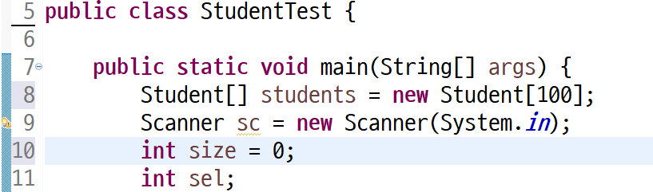
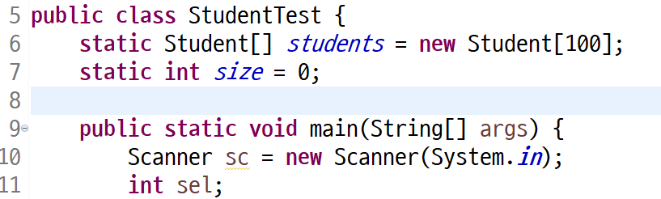
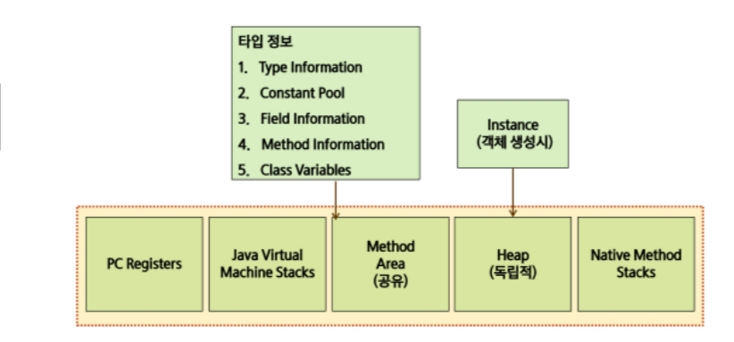
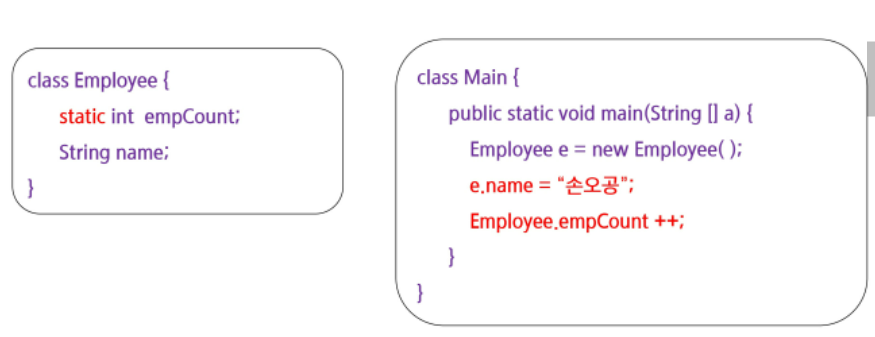
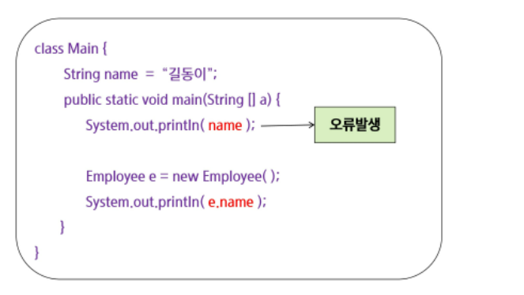
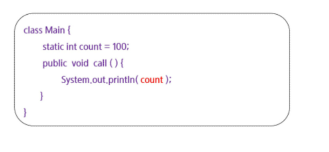

### 클래스를 사용하는 이유

| 이름   | 전화번호       | 소속 | 이메일                 |
| ------ | -------------- | ---- | ---------------------- |
| 배준식 | 010-1234-1234  | 싸피 | qownstlr0394@naver.com |
| 김싸피 | 010-1203-12301 | 싸피 | dhfpdh@naver.com       |

- 이러한 데이터가 있으면 행에 들어있는 데이터를 독립적인 하나 하나의 변수로 관리 하는게 아니라 전체를 하나의 데이터로 정의하고 싶어서 클래스를 사용한다.
- 여러가지 정보를 하나의 정보로 관리하고 싶다면 클래스를 사용해라


### 변수 선언 

```java
package 학생관리v0;

public class Student {
	String name;
	int age;
	String major;
}
```

- 변수를 선언했다고해서 데이터를 담을 수 있는 공간이 생기는 것은 아니다.
- class Student로 데이터를 만들어 내면(new 연산자로) 그 만들어진 객체안에 name, age, major 공간이 생긴다.
- 타입이 정의된거지 공간이 생기는거는 아니다


```java
package 학생관리v0;

import java.util.Scanner;

public class StudentTest {
    // static은 객체를 생성하지 않아도 존재하는 변수나 함수
    
	public static void main(String[] args) {
        // Scanner 클래스 : 읽은 바이트를 문자, 정수, 실수, 불린, 문자열 등 다양한 타입으로 변환하여 리턴하는 클래스
      
		Scanner sc = new Scanner(System.in);
		Student[] students = new Student[100];
		int size = 0;
		int sel;
		do {
			System.out.println("번호로 입력하세요.");
			System.out.println("1. 학생추가 ");
			System.out.println("2. 학생조회(이름) ");
			System.out.println("3. 전공변경 ");
			System.out.println("0. 종료 ");
			sel = sc.nextInt();
			if ( sel == 1 ) {
				System.out.println("학생을 추가합니다.");
				System.out.println("이름 : ");
				String name = sc.next();
                // next는 Scanner의 method이다
                // next(): String, 다음 토큰을 문자열로 return
				System.out.println("나이 : ");
				int age = sc.nextInt();
				System.out.println("전공 : ");
				String major = sc.next();
				Student s = new Student();
				s.name = name;
				s.age = age;
				s.major = major;
				students[size++] = s;
			}
			else if ( sel == 2 ) {
				System.out.println("학생을 조회합니다");
				System.out.println("이름 : ");
				String name = sc.next();
                // 이름에 해당하는 위치를 찾자
                // 어디까지??? size까지				
				int idx = -1;
				for(int i = 0; i < size; i++) {
					if ( name.equals(students[i].name)) {
						idx = i;
						break;
					}	
				}
				// 만약 idx가 -1 이면 학생이 없는거다
				if ( idx == -1) {
					System.out.println("학생이 존재하지 않는다");
				}
				else {
					System.out.println("조회한 학생의 정보는 ");
					System.out.println("이름 : "+ students[idx].name);
					System.out.println("나이 : "+ students[idx].age);
					System.out.println("전공 : "+ students[idx].major);
				}
			}
			else if ( sel == 3 ) {
				System.out.println("전공을 변경합니다.");
				System.out.println("이름 : ");
				String name = sc.next();
				System.out.println("전공 : ");
				String major = sc.next();
                // 전공을 변경하려면 또 찾아야하네??
                // 이걸 또 써야해??? 에반데
                // 함수로 만들자
			}
		} while(sel != 0);
		
	}
    static int getStudent(String name) {
		int idx = -1;
		for(int i = 0; i < size; i++) {
			if ( name.equals(students[i].name)) {
				idx = i;
				break;
			}	
		}
		return idx;
	}
}
```

```java
// 지역변수였던 size와 students에 접근이 안된다.
	// size와 student[]를 밖으로 빼서 static으로 접근시키자.
	static int getStudent(String name) {
		int idx = -1;
		for(int i = 0; i < size; i++) {
			if ( name.equals(students[i].name)) {
				idx = i;
				break;
			}	
		}
		return idx;
	}
```





### 

### 완성된 코드

```java
package 학생관리v0;

import java.util.Scanner;

public class StudentTest {
	static Student[] students = new Student[100];
	static int size = 0;
	
	public static void main(String[] args) {
		Scanner sc = new Scanner(System.in);
		int sel;
		do {
			System.out.println("번호로 입력하세요.");
			System.out.println("1. 학생추가 ");
			System.out.println("2. 학생조회(이름) ");
			System.out.println("3. 전공변경 ");
			System.out.println("0. 종료 ");
			sel = sc.nextInt();
			if ( sel == 1 ) {
				System.out.println("학생을 추가합니다.");
				System.out.println("이름 : ");
				String name = sc.next();
				System.out.println("나이 : ");
				int age = sc.nextInt();
				System.out.println("전공 : ");
				String major = sc.next();
				Student s = new Student();
				s.name = name;
				s.age = age;
				s.major = major;
				students[size++] = s;
			}
			else if ( sel == 2 ) {
				System.out.println("학생을 조회합니다");
				System.out.println("이름 : ");
				String name = sc.next();
                // 이름에 해당하는 위치를 찾자
                // 어디까지??? size까지				
				int idx = getStudent(name);
				// 만약 idx가 -1 이면 학생이 없는거다
				if ( idx == -1) {
					System.out.println("학생이 존재하지 않는다");
				}
				else {
					System.out.println("조회한 학생의 정보는 ");
					System.out.println("이름 : "+ students[idx].name);
					System.out.println("나이 : "+ students[idx].age);
					System.out.println("전공 : "+ students[idx].major);
				}
			}
			else if ( sel == 3 ) {
				System.out.println("전공을 변경합니다.");
				System.out.println("이름 : ");
				String name = sc.next();
				System.out.println("전공 : ");
				String major = sc.next();
				changeMajor(name,major);
			}
		} while(sel != 0);
	}
	static void changeMajor(String name, String major) {
		int idx = getStudent(name);
		if( idx == -1 ) {
			// 학생없음
		}
		else {
			students[idx].major = major;
		}
	}
	// 지역변수였던 size와 students에 접근이 안된다.
	// size와 student[]를 밖으로 빼서 static으로 접근시키자.
	static int getStudent(String name) {
		int idx = -1;
		for(int i = 0; i < size; i++) {
			if ( name.equals(students[i].name)) {
				idx = i;
				break;
			}	
		}
		return idx;
	}
}

```


### 기능적 부분 클래스

```java
package 학생관리v1;

public class StudentManger {
	Student[] students = new Student[100];
	int size = 0;

	void addStudent(Student s) {
		students[size++] = s;
	}
	
//	int findStudent(String name) {
//		int idx = -1;
//		for(int i = 0; i < size; i++) {
//			if( name.equals(students[i].name)) {
//				idx = i;
//				break;
//			}
//		}
//		return idx;
//	}
	// void는 return 값이 없는 함수
	void changeMajor(String name, String major) {
//		int idx = findStudent(name);
		Student s = getStudent(name);
//		if (idx == -1) {
		if (s == null) {
			//학생이 없어서 전공변경을 못한 경우에 대한 처리
		}
		else
//			students[idx].major = major;
			s.major = major;
	}
	// 학생의 정보 자체를 주어야한다
	
	Student getStudent(String name) {
//		int idx = findStudent(name);
		int idx = -1;
		for(int i = 0; i < size; i++) {
			if( name.equals(students[i].name)) {
				idx = i;
				break;
			}
		}
		if ( idx == -1 )
			return null;
		else
			return students[idx];
	}
}

```


### 기능부분 클래스를 적용한 코드

```java
package 학생관리v1;

import java.util.Scanner;

public class StudentTest {
	public static void main(String[] args) {
		Scanner sc = new Scanner(System.in);
		StudentManger sm = new StudentManger();
		int sel;
		do {
			System.out.println("번호로 입력하세요.");
			System.out.println("1. 학생추가 ");
			System.out.println("2. 학생조회(이름) ");
			System.out.println("3. 전공변경 ");
			System.out.println("0. 종료 ");
			sel = sc.nextInt();
			if ( sel == 1 ) {
				System.out.println("학생을 추가합니다.");
				System.out.println("이름 : ");
				String name = sc.next();
				System.out.println("나이 : ");
				int age = sc.nextInt();
				System.out.println("전공 : ");
				String major = sc.next();
				Student s = new Student();
				s.name = name;
				s.age = age;
				s.major = major;
				sm.addStudent(s);
			}
			else if ( sel == 2 ) {
				System.out.println("학생을 조회합니다");
				System.out.println("이름 : ");
				String name = sc.next();
				Student s = sm.getStudent(name);
				if ( s == null) {
					System.out.println("학생이 존재하지 않는다");
				}
				else {
					System.out.println("조회한 학생의 정보는 ");
					System.out.println("이름 : "+ s.name);
					System.out.println("나이 : "+ s.age);
					System.out.println("전공 : "+ s.major);
				}
			}
			else if ( sel == 3 ) {
				System.out.println("전공을 변경합니다.");
				System.out.println("이름 : ");
				String name = sc.next();
				System.out.println("전공 : ");
				String major = sc.next();
				sm.changeMajor(name, major);
			}
		} while(sel != 0);
	}
}

```


### Scanner

- 읽은 바이트를 문자, 정수, 실수, 불린, 문자열 등 다양한 타입으로 변환하여 리턴하는 클래스


### Scanner() Method

- next(): String, 다음 토큰을 문자열로 return
- nextLine(): String, '\n'을 포함하는 한 line을 읽고 '\n'을 버린 나머지만 return
- nexyByte(): byte, 다음 토큰을 byte 타입으로 return
- nextShort(): short, 다음 토큰을 short 타입으로 return
- nextInt(): int, 다음 토큰을 int 타입으로 return
- nextLong(): long, 다음 토큰을 float 타입으로 return
- nextDouble(): double, 다음 토큰을 double 타입으로 return
- close(): void, Scanner의 사용 종료
- hasNext(): boolean, 현재 입력된 토큰이 있으면 true, 아니면 새로운 입력이 들어올 때까지 무한정 기다리면서 새로운 입력이 들어오면 그 때 true return, ctrl+z 키가 입력되면 입력 끝으로 false return


## 클래스와 객체 복습

- 클래스
  - 관련있는 변수와 함수를 묶어 만든 사용자 정의 자료형
- 객체
  - 하나의 역활을 수행하는 '메소드와 변수(데이터)의 묶음'
- 객체지향 프로그래밍
  - 프로그램을 단순히 데이터와 처리 방법으로 나누는것이 아니라, 프로그램을 수많은 '객체(object)'라는 기본 단위로 나누고 이들의 상호작용으로 서술하는 방식


### static 특징

- 로딩 시점
  - static: 클래스 로딩 시
  - non-static: 객체 생성시
- 메모리상의 차이
  - static: 클래스당 하나의 메모리 공간만 할당
  - non-static: 인스턴스 당 메모리가 별도로 할당


- 실행 시 메모리 영역



크기가 정해진 공간 : Java Virtual Machine Stacks

크기가 정해지지 않은 공간 : Heap


- 문법적 특징
  - static: 클래스 이름으로 접근
  - nonStatic: 객체 생성 후 접근



- static 영역에서는 non-static 영역을 직접 접근이 불가능




- non static 영역에서는 static 영역에 대한 접근이 가능

