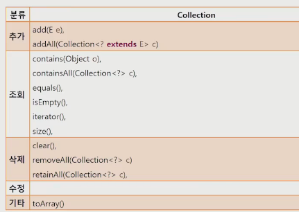
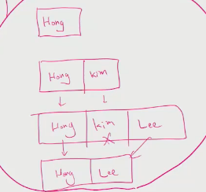
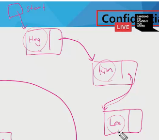
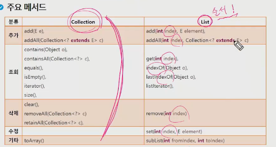
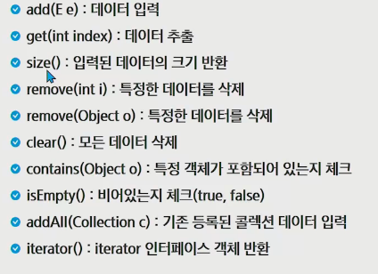
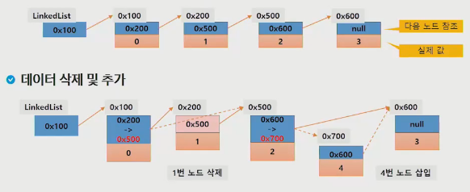
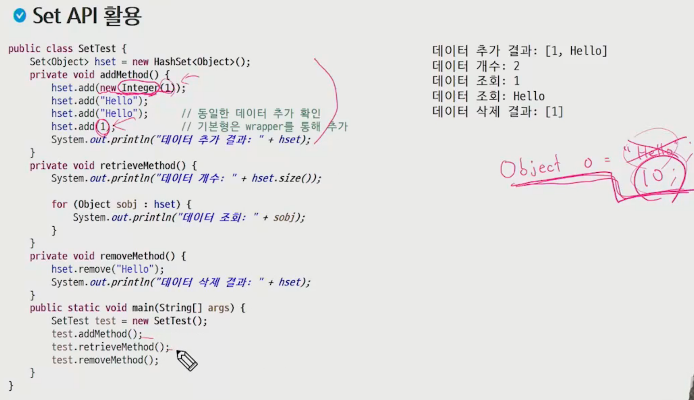
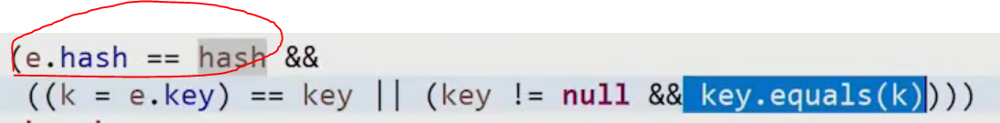
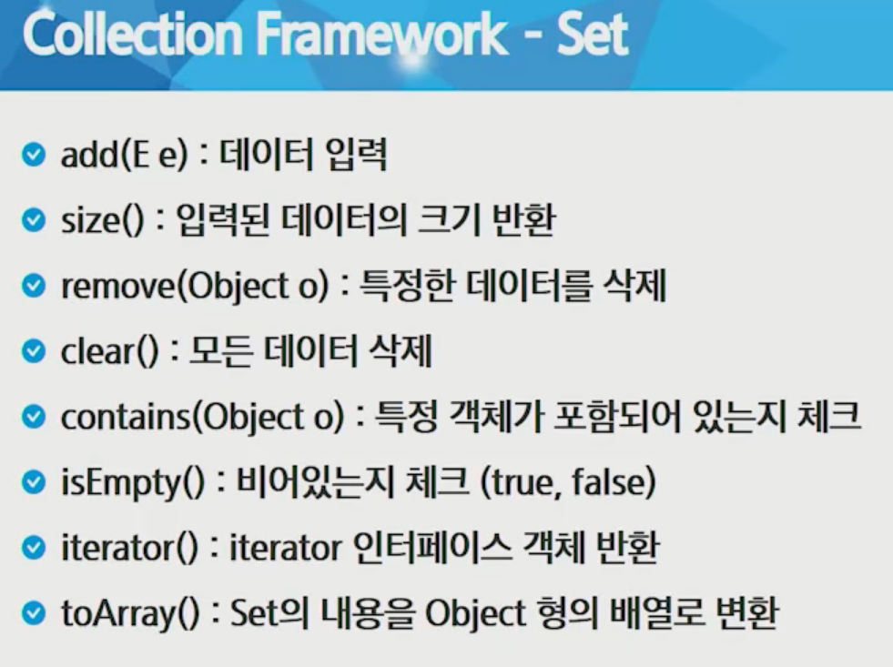
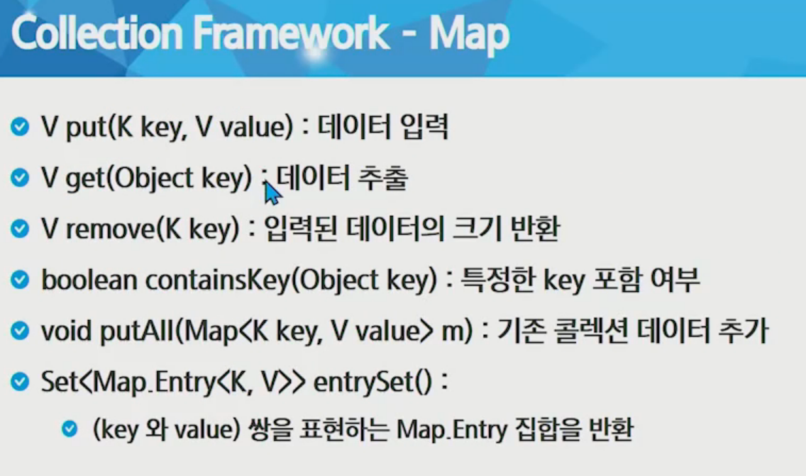

# 4. Collection Framework

- 자료구조를 편하게 쓸 수 있도록 만든 덩어리
- 되게 편함

### 4-1. collection Framework

- 객체들을 한곳에 모아놓고 편리하게 사용할 수 있는 환경을 제공
- 정적 자료구조 (Static structure)
  - 고정된 크기의 자료구조
  - 배열이 대표적인 정적 자료구조
  - 선언 시 크기를 명시하면 바꿀 수 없음
- 동적 자료구조 (Dynamic structure)
  - 요소의 개수에 따라 자료구조의 크기가 동적으로 증가하거나 감소
  - 리스트, 스택, 큐 등
- 자료구조들의 종류는 결국은 어떤 구조에서 얼마나 빨리 원하는 데이터를 찾는가에 따라 결정된다.
  - 순서를 유지할 것인가?
  - 중복을 허용할 것인가?
  - 다른 자료구조들에 비해서 어떤 단점과 장점을 가지고 있는가?
- 
- 어떤 특성을 가지는 지 인지, 어떻게 쓰는지 인지하기

#### 4-2. java .util

- 다수의 데이터를 쉽게 처리하는 방법 제공
- collection framework 핵심 interface
  - list - 순서가 있는 데이터의 집합, 순서가 있으므로 데이터의 중복을 허락(ArrayList, LinkedList)
  - Set - 순서를 유지하지 않는 집합, 순서가 없어서 데이터 구별 x -> 중복 허락하지 않음(HashSet, TreeSet), (값 자체가 key임)
  - Map - key와 value의 쌍으로 데이터를 관리하는 집합, 순서는 없고 key의 중복 불가, value는 중복가능(hashMap, TreeMap), 키로 구분(키는 객체일 수 있다.)(파이썬에서 dict)

#### 4-3. collection interface

- 
- 인터페이스도 상속이 가능하다.

#### 4-4. Collection Framework - List

- 특징: 순서가 있고, 중복을 허용 (배열과 유사하지만 얘는 가변길이가 된다.)
- 구현 클래스
  - ArrayList
  - 결과가 될 길이만큼의 리스트를 새로 만들고 복사 붙이기한다.
  - 큰집이 필요하면 큰집짓고 이사, 작은집필요하면 작은집으로 이사
  - 추가, 삭제 => 불리, 탐색 => 유리
  - 
  - LinkedList
  - 다음놈을 가리키는 포인터만 쓱쓱 바꿔줌
  - 
  - 추가 삭제 => 유리, 탐색 => 불리
- 내부적으로 배열을 이용해 데이터를 관리
- 배열과 다르게 크기가 유동적으로 변함 (동적 자료구조)
- 크기가 실제로 1.5배씩 증가(부족할 때)
- 배열을 다루는 것과 유사하게 사용할 수 있음
- 순서가 있어 조회가 순서와 관련됨
- 
- 배열과 ArrayList
  - 배열의 장점
    - 가장 기본적인 형태의 자료 구조, 간단하며 사용이 쉬움
    - 접근 속도가 빠름
  - 배열의 단점
    - 크기를 변경할 수 없어 추가 데이터를 위해 새로운 배열을 만들고 복사 해야함
    - 비 순차적 데이터의 추가, 삭제에 많은 시간이 걸림
  - 배열을 사용하는 ArrayList도 태생적으로 배열의 장/단점을 그대로 가져감
- ArrayList 메서드
- 
- LinkedList
  - 각 요소를 node로 정의하고 node는 다음 요소의 참조 값과 데이터로 구성됨
  - 각 요소가 다름 요소의 링크 정보를 가지며 연속적으로 구성될 필요가 없음
  - 
  - 

#### 4-5. Set

- 특징 - 순서가 없고, 중복을 허용하지 않음
- 장점 - 빠른 속도, 효율적인 중복 데이터 제거 수단
- 단점 : 단순  집합의 개념으로 정렬하려면 별도의 처리가 필요
- 구현 클래스
  - HashSet
  - TreeSet
- 
- 중복된 값이 하나만 나온다.
- Hash
  - mapping 함수 (input이 있으면 output(크기가 일정)으로 매핑)
  - 같은 데이터가 들어가면 같은 값이 나온다
  - 다른게 들어가면 다른 게 나온다(너무 많아지면 같은 게 나올 수도 있지만 최대한 안나오게 한다. (sha 512 =  2 ^ 512))
  - 같다 다르다를 판단하기 전에 hash로 한 번 거른다.
  - 해시는 다 검사하는게아니라 샘플을 뽑아서 검사하니까 equal보다 빠르다. 샘플링이 좋을 경우 성능이 더 좋다.
  - 
  - 

#### 4-6. Map

- 특징: Key(키)와 value(값)를 하나의 Entry로 묶어서 데이터 관리, 순서는 없으며, 키에 대한 중복은 없음
- 장점: 빠른 속도
- 구현 클래스: HashMap, TreeMap
- 

#### 4-7. 정렬

- 요소를 특정 기준에 대한 내림차순 또는 오름차순을 배치하는 것

- 순서를 가지는 Collection들만 정렬 가능

  - list 계열
  - Set에서는 SortedSet의 자식 객체
  - Map에서는 SortedMap의 자식 객체(Key 기준)

- Collections의 sort()를 이용한 정렬

  - sort(List<T> list)
  - 객체가 Comparable을 구현하고 있는 경우 내장 알고리즘을 통해 정렬

- Comparable interface

- ```java
  public interface Comparable<T> {
  	public int comparTo(T o);
  }
  // T와 o를 비교해서 T가 먼저면 -1, T가 뒤에면 +1, 같으면 0 반환
  ```

- 그 비교하는 기준을 내가 만들어야함