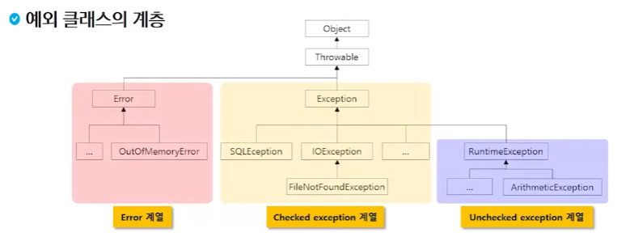

# 쥐잡듯JAVA - 3주차 김효근

## 예외처리

> 에러와 예외
>
> - 어떤 원인에 의해 오동작 하거나 비정상적으로 종료되는 경우
> - 심각도에 따라 분류가 나뉜다
>
> Error -> 시스템 잘못
>
> - 일단 발생하면 복구할 수 없는 상황
> - 프로그램의 비정상적 종료를 막을 수 없음
>
> Exception -> 내 잘못
>
> - 수습될 수 있는 비교적 상태가 약한 것들
> - 프로그램 코드에 의해 수습될 수 있는 상황



### Error

- 대처 코드를 적용시킬수 없는 상황

### Checked Exception

- 예외에 대한 대처 코드가 없으면 컴파일이 진행되지 않음

### Unchecked Exception

- RuntimeException의 하위 클래스
- 예외에 대한 대처 코드가 없더라도 컴파일은 진행됨


### 예외처리

- 직접 처리

  - try
  - catch
  - finally

  ```java
  public static void main(String[] args) {
      Scanner sc = new Scanner(System.in);
      int a = sc.nextInt();
      int b = sc.nextInt();
      int result = 0;
      try {
          //실행할 코드
          result = a / b;
      }
      catch(Exception e) {
          //예외가 발생했을때 처리할 코드
          Ststem.out.println("예외발생")
      }
  }
  ```

  try ~ catch 문에서의 흐름

  1. try 블록에서 예외 발생
  2. JVM이 해당 Exception 클래스의 객체 생성 후 던짐(throw) : throw new XXException()
  3. 던져진 exceptio을 처리할 수 있는 catch 블록에서 받은 후 처리
  4. 적절한 catch블록이 없는 예외처리는 실패

- 간접처리
  - throws
- 사용자 정의 예외처리
  - throws

__예외클래스의 계층을 살펴보면, Exception을 catch에 조건으로 사용해주면 모든 예외를 처리해줄 수 있다.__

#### 다중 exception handling

```java
try {
    //exception이 발생할 만한 코드
} catch (XXException e) {
} catch (XXException e) {
} catch (Exception e) {
}
```

- try 블록에서 여러 종류의 예외가 발생할 경우
- 하나의 try 블록에 여러개의 catch 블록 추가 가능
- 다중 catch 문장 작성 순서 유의 사항
  - JVM이 던진 예외는 catch 문장을 찾을 때는 다형성이 적용됨
  - 상위 타입의 예외가 먼저 선언되는 경우 뒤에 등장하는 catch 블록은 동작할 기회가 없음