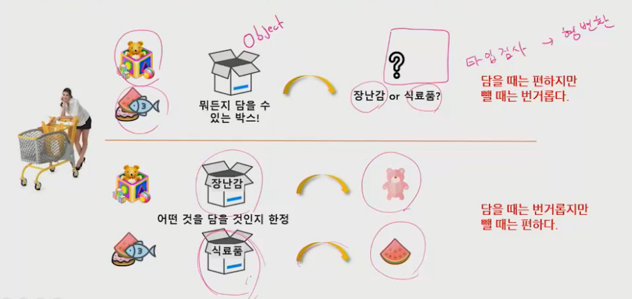
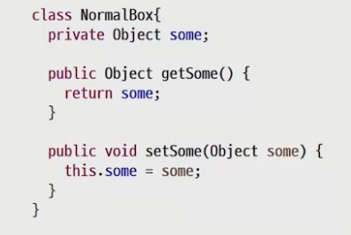
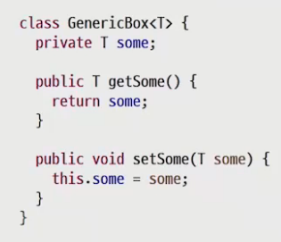
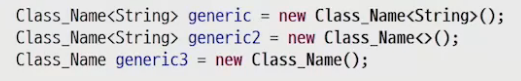

# Generic

- 제네릭 이후로 이전과 다르다...(딥해짐) -> 하지만 이게 되네,, 가 됨(근데 자주 안씀ㅇㅇ)
- 

## generic이란?

- 데이터 형식에 의존하지 않고, 하나의 값이 여러 다른 데이터 타입들을 가질 수 있도록 함

  

- 일반적인 클래스는 정해진 데이터타입(Object)으로 꺼내고 형 변환 해야 함

  

  

- 제네릭은 객체를 만들 때 타입(T)을 결정 가능

- generic => String 타입

## 타입 파라미터의 제한

- 뒤에거 자식만 들어오게 제한 가능(구체적 기능 활용 가능)
- ... => 가변 길이 배열 (파이썬의 *args 같은 듯?)
- 제네릭 함수도 있지만 있는거만 알고 있어라