# 1. 스프링맛보기

- mvc 패턴
  - 모델 1 - JSP페이지에서 모든 요청을 처리하고 로직을 구현해 만들어내는 구조
    - 서블릿(HTML코드와 로직을 수행하는 자바 코드가 함께 존재)
    - JSP = HTML <- JAVA
    - 직관적, 진입장벽이 낮다. 유지 보수 재활용 어렵다.
  - 모델 2 - 이거를 씀
    - 요청 처리는 서블렛, 응답은 JSP에서 처리하는 구조
    - 요청 처리, 로직 구현, 화면출력을 따로 처리하는 구조
    - 유지보수, 코드 수정 쉽다.
    - 진입장벽 높다.
    - 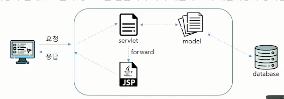
- 프론트 - 클라이언트, Browser(HTML, CSS, JS), 서버로 request(GET/POST)
- 백엔드 - 서블릿(url mapping, 함수 호출() -> 서비스(비즈니스 로직) -> DAO(data access object)
  -> 서비스 -> 서블릿, 여기서 매개체가(DTO(data transfer Object))) 
  => 이 결과를 이용해서 JSP로 토스(1. redirect(어디든 보낼 수 있다.), 2. forward(우리 프로젝트 안에서만 갈 수 있다.))
- JSP(HTML, java(<%! %> <% %>)) => EL(${  }), JSTL
- 서블릿(컨트롤러), DAO(model), JSP(View)
- 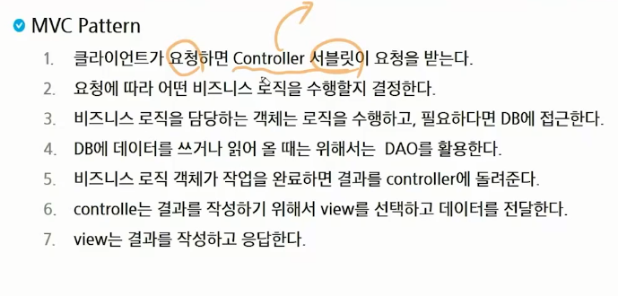
- 100 - mvc
- 102~111: my sql
- Java App <=  MyBatis  => DB(mySQL)
- My batis - sql을 쉽게 쓸 수 있는 프레임워크(XML방식쓸거임)
- 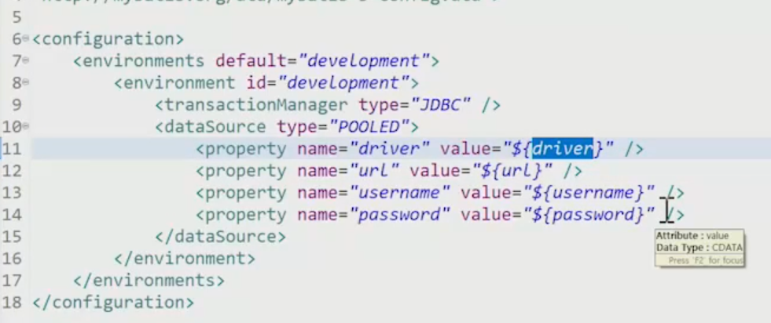
- 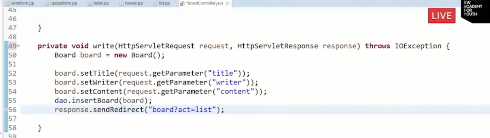
- 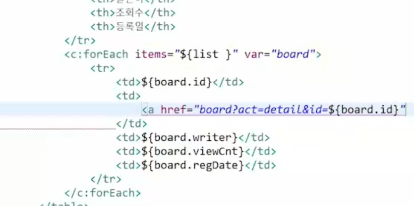

- 스프링 프레임워크
  - 1주(기초 학습)
  - 알고리즘 후 2주(실제로 사용되는 형태를 실습)
  - 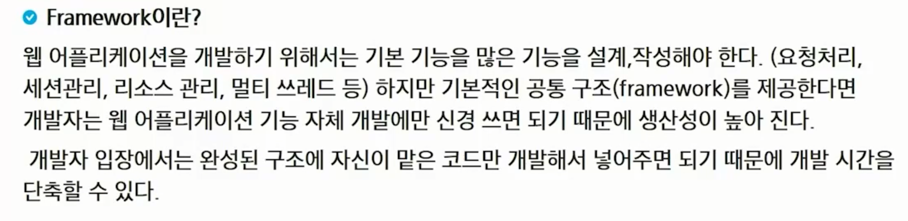
  - 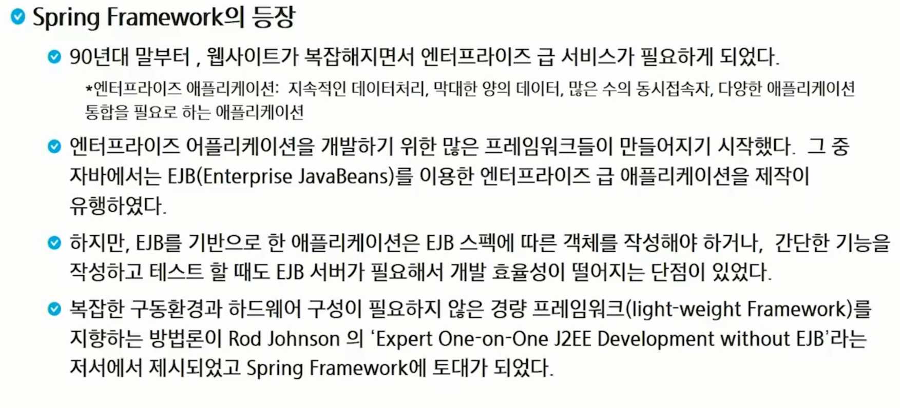
  - 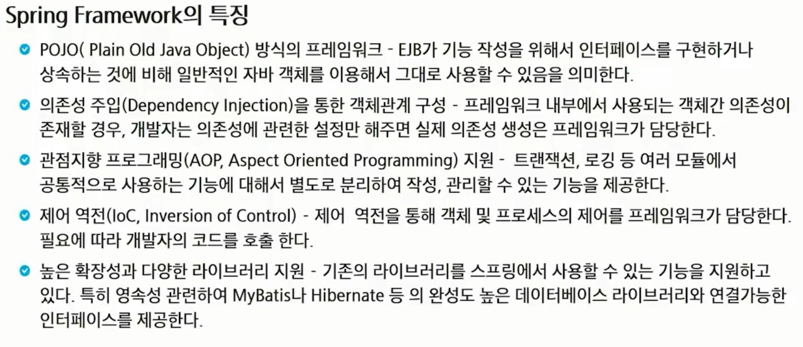
  - 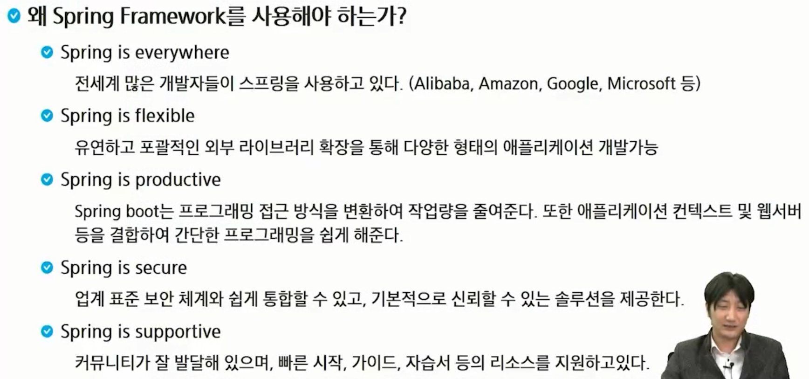
  - 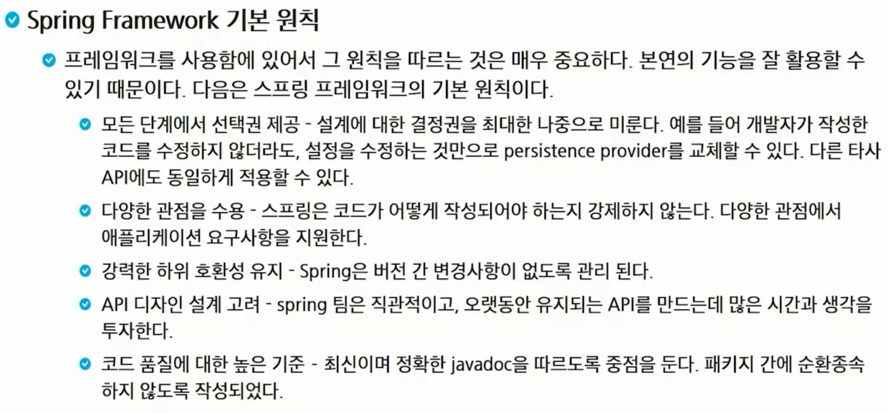
  - 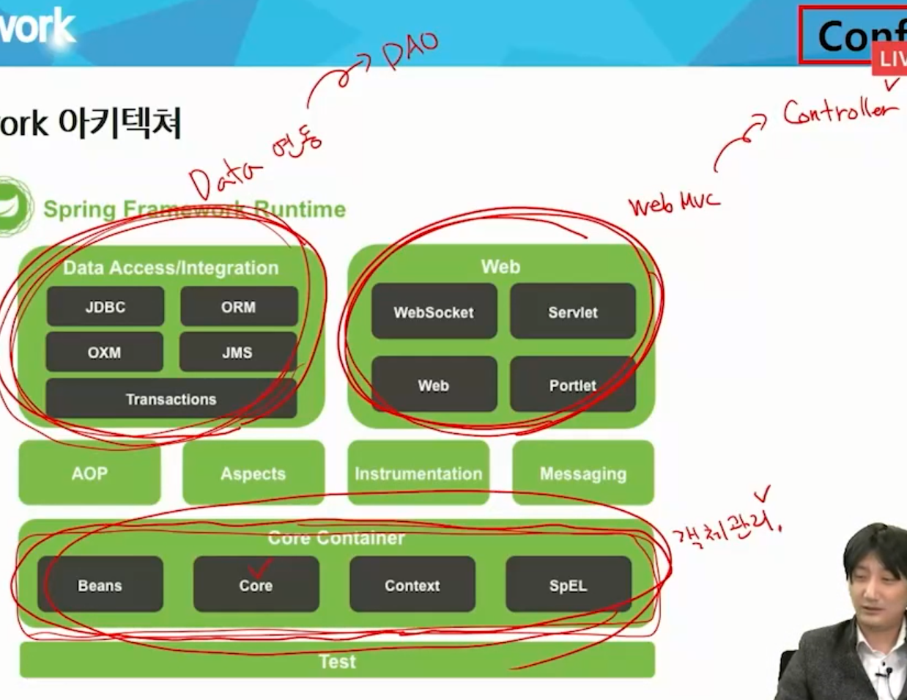
  - 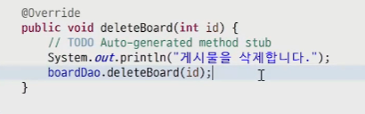
  - 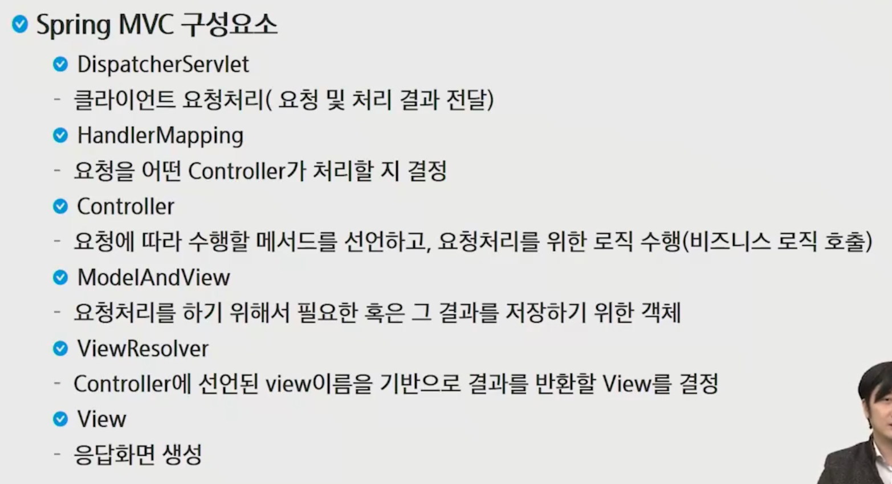

- 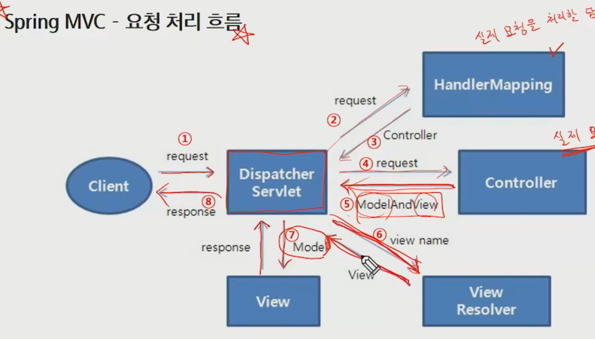
- 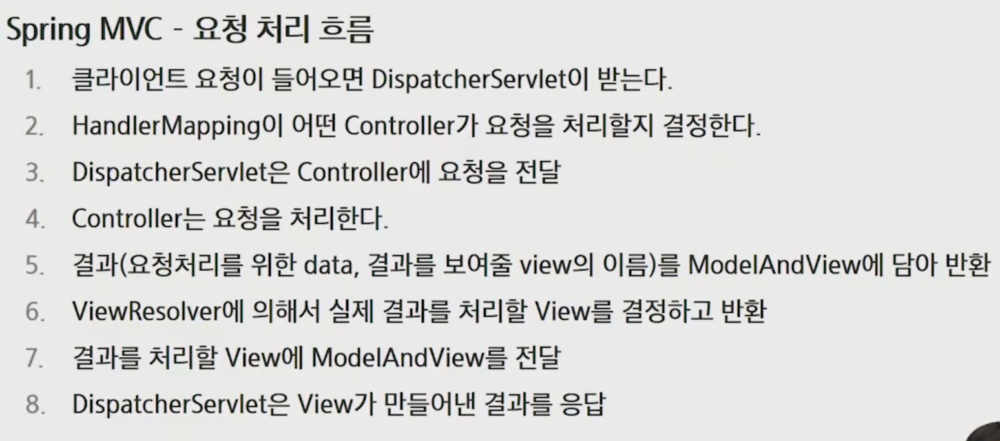

- 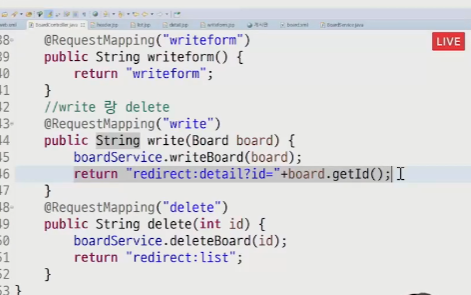