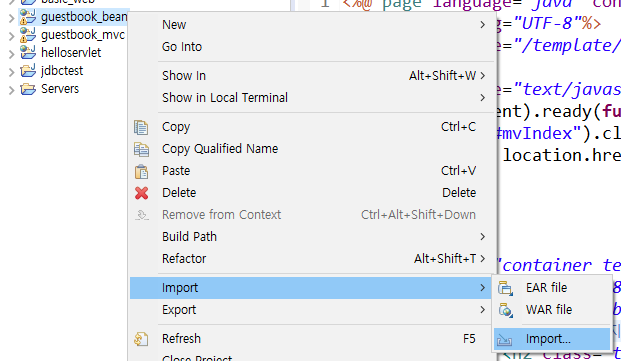
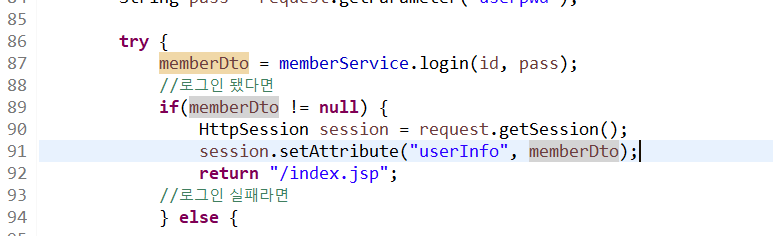

# Model 2 (MVC 구조) & Session


---

### Model2 구조


#### - mvc 패턴


-> Dao 가 Database Access Object를 의미하는 듯


#### - Model2 구조의 장단점


## 실습1 - 0324 guestbook_beans 방명록 글쓰기(불완전 mvc)


#### 다이나믹 웹 프로젝트 생성 후 import 하기

다이나믹 웹 프로젝트 생성 -> import -> file system

### * 참고) 배포파일 import 하기

1. 다이나믹 웹 프로젝트 생성


2. project 파일 위에서 우클릭 -> import

   

   

   

3. File System

   

   

4. Browse에서 파일찾고 -> import 할 파일 선택가능(주로 res, src, WebContent)

   


### * 참고) MySQL 연결

1. DBUtil.java 들어가기


2. 줄친 부분 MySQL에서 설정한 user랑 pass로 바꾸기(예시에서는 내가 MySQL 잘못 설치해서 ssafy가 안되서 root로 해서 실습했는데, MySQL 설치가이드 잘 보고 설치하신분은 ssafy로 하시면됨)

   


참고) user에 써야하는 이름은 아래 줄친 부분이고, 비번은 생성 시 입력한 비번(자바반에서는 ssafy로 통일했다고함)


----------


### JSP 지시자 - Include Directive


#### 1. 파일 위치 -> index.jsp


#### include directive를 활용


- 장고 base.html과 유사함

  

#### 2. 파일 위치 -> header.jsp


- header.jsp는 장고의 base.html과 유사한 기능을 수행하고 있음, 수많은 jsp에서 공통적으로 쓰여야 하는 요소(ex. bootstrap cdn)가 입력되있음


<hr>
### Include Directive vs JSP tag

1. Include Directive - root 변수 중복 에러 발생

   

   

2. jsp 태그로 바꾸면 에러가 발생 x

   


- **왜?**

  |                     1. Include Directive                     |                  2. JSP tag                  |
  | :----------------------------------------------------------: | :------------------------------------------: |
  | 파일이기 때문에 두개의 파일이 합쳐져서 실행이됨<br /> -> 여러 곳에서 사용되는 공통적인 변수를 include 해줄 때 사용(ex. 세션, 쿠키) | 페이지이기 때문에 결과화면인 html만 가지고옴 |


<hr>

### header.jsp의 root변수의 역할은 무엇일까?

#### 1. 파일위치 -> header.jsp


- 실행결과 -> **/geustbook_bean**(context의 path) 가 console에 출력됨


#### 2. 파일위치 server.xml


- 내가만든 프로젝트가 tomcat에 올라갈때 context라고 표현됨 
- context에서 path 명이 실행결과와 일치하는 것을 확인


- 따라서 getContextPath() 함수는 여기서 path를 얻어오는 것임 (장고 url이랑 비슷한듯)

- /guestbook_bean 이라는 path를 /gb로 수정한다고 가정했을 때 root라는 변수에 담겨있기 때문에 일일이 하나씩 수정해줄 필요가 없어짐 -> 즉 **root** 변수를 활용해서 **공통적으로** 많이 사용되는 변수의 수정을 용이하게 함 


<hr>


### 글쓰기


#### 1. 파일위치 -> wirte.jsp


- jsp는 보여주는 역할(view)만 하고 로직처리는 하지 않음

-  article을 submit할때 개발자만 볼수 있는 값인 hidden을 사용해서 act라는 값으로 "register" value를 보내고 있음

- jsp <-> servlet이 통신하면서 로직은 controller에서 수행됨

  


#### 2. 파일위치 - com.ssafy.geustbook.controller


- 해당 부분에서 로직이 수행됨 

- 이 단계는 현재 **jsp 에서 로직을 수행하는 java를 분리한 단계까지 온 것임**(불완전 mvc)

<hr>
### 글목록
### 글목록


#### 1. 파일위치 - index.jsp


- 글 목록을 볼려면 db가 필요함 -> jsp로 바로 이동하는 것이 아닌 servlet을 거쳐야하므로 쿼리문으로 act=list 라는 조건을 달아주고 있음


#### 2. 파일위치 - com.ssafy.guestbook.controller


- act가 list일 때 listArticle 호출


> listArticle


- listArticle()로 **ctrl+클릭해서** 이동해보면 db에서 받아와서 **list 라는 변수에 담고있음**(노란펜)
- servelet에서 **list에 담은 것**을 list.jsp로 보냄 (초록펜) -> 요청이 들어올 때마다 필요하므로 **request**라는 바구니에 list에 담은 것을 **setAttribute로** 넣어줌


> 다시 상단으로 올라와서 request라는 바구니에 담긴 데이터를 유지하면서 보내는 법에 주목
>
> Redirect vs forward


#### 3. 파일위치 - list.jsp


- setAttribute로 담은 글을 getAttribute로 뽑아서 화면에 뿌려주기
- controller의 java파일에서 db를 처리하고 jsp에서는 화면에 뿌리기위한 코드 외에는 사라짐
- 하지만 아직까지 servelet(controller.java) 안에 jdbc나 business logic이 남아있음 -> 이걸 완전히 분리해야 진정한 mvc구조가 됨


#### * 1. guestbook_bean의 servlet(controller)  vs  2. mvc구조인 guestbook_mvc의 servelet차이 메모

-> 지금은 차이를 모르겠는데, 예를 들어 servelet에 남아있는 jdbc나 비즈니스 로직이 뭔지? 뭐가 완전 분리 됐는지? 나중에 보면 알 수 도 있을것 같아서 기록


> 1. guestbook_bean의 servlet(controller)
>
>    ```java
>    package com.ssafy.guestbook.controller;
>                
>    import java.io.IOException;
>    import java.sql.*;
>    import java.util.ArrayList;
>    import java.util.List;
>                
>    import javax.servlet.RequestDispatcher;
>    import javax.servlet.ServletException;
>    import javax.servlet.annotation.WebServlet;
>    import javax.servlet.http.HttpServlet;
>    import javax.servlet.http.HttpServletRequest;
>    import javax.servlet.http.HttpServletResponse;
>                
>    import com.ssafy.guestbook.model.GuestBookDto;
>    import com.ssafy.util.DBUtil;
>                
>    @WebServlet("/article")
>    public class GuestBookController extends HttpServlet {
>    	private static final long serialVersionUID = 1L;
>    	            
>    	private DBUtil dbUtil;
>    	            
>    	public void init() {
>    		dbUtil = DBUtil.getInstance();
>    	}
>                
>    	protected void doGet(HttpServletRequest request, HttpServletResponse response) throws ServletException, IOException {
>    		String act = request.getParameter("act");
>    		String path = "index.jsp";
>    		//act가 register라면
>    		if("register".equals(act)) {
>    			path = registerArticle(request, response);
>    			response.sendRedirect(request.getContextPath() + path); //sendRedirect는 기존의 request 바구니를 초기화하고 넘어감, 글쓰기는 단순 페이지 이동 => Redirect활용
>    		} else if("list".equals(act)) { //act가 list 라면
>    			path = listArticle(request, response);
>    			RequestDispatcher dispatcher = request.getRequestDispatcher(path); 
>    			dispatcher.forward(request, response); //forward를 사용해야 request와 response가 새로고침되지 않고 그대로 전달됨
>    		} else if("".equals(act)) {
>    			            
>    		} else if("".equals(act)) {
>    			            
>    		} else if("".equals(act)) {
>    			            
>    		}
>    	}
>    	            
>    	protected void doPost(HttpServletRequest request, HttpServletResponse response) throws ServletException, IOException {
>    		request.setCharacterEncoding("utf-8");
>    		doGet(request, response);
>    	}
>    	            
>    	private String listArticle(HttpServletRequest request, HttpServletResponse response) {
>    		List<GuestBookDto> list = new ArrayList<GuestBookDto>();
>    		            
>    		Connection conn = null;
>    		PreparedStatement pstmt = null;
>    		ResultSet rs = null;
>    		try {
>    			conn = dbUtil.getConnection();
>    			String sql = "select articleno, userid, subject, content, regtime \n";
>    			sql += "from guestbook \n";
>    			sql += "order by articleno desc";
>    			pstmt = conn.prepareStatement(sql);
>    			rs = pstmt.executeQuery();
>    			while(rs.next()) {
>    				GuestBookDto guestBookDto = new GuestBookDto();
>    				guestBookDto.setArticleNo(rs.getInt("articleno"));
>    				guestBookDto.setUserId(rs.getString("userid"));
>    				guestBookDto.setSubject(rs.getString("subject"));
>    				guestBookDto.setContent(rs.getString("content"));
>    				guestBookDto.setRegTime(rs.getString("regtime"));
>    				            
>    				list.add(guestBookDto);
>    			}
>    		} catch (SQLException e) {
>    			e.printStackTrace();
>    		} finally {
>    			dbUtil.close(rs, pstmt, conn);
>    		}
>    		            
>    		request.setAttribute("articles", list); //글목록담은 list가지고 가야함
>    		            
>    		return "/guestbook/list.jsp";//글목록 list에서 갈때는 
>    	}
>                
>    	private String registerArticle(HttpServletRequest request, HttpServletResponse response) {
>    		String userid = request.getParameter("userid");
>    		String subject = request.getParameter("subject");
>    		String content = request.getParameter("content");
>                
>    		Connection conn = null;
>    		PreparedStatement pstmt = null;
>    		int cnt = 0;
>    		try {
>    			conn = dbUtil.getConnection();
>    			String sql = "insert into guestbook (userid, subject, content) \n";
>    			sql += "values (?, ?, ?)";
>    			pstmt = conn.prepareStatement(sql);
>    			pstmt.setString(1, userid);
>    			pstmt.setString(2, subject);
>    			pstmt.setString(3, content);
>    			cnt = pstmt.executeUpdate();
>    		} catch (SQLException e) {
>    			e.printStackTrace();
>    		} finally {
>    			dbUtil.close(pstmt, conn);
>    		}
>    		return cnt != 0 ? "/guestbook/writesuccess.jsp" : "/guestbook/writefail.jsp";
>    	}
>    }
>    ```
>
>    

---


> 2. mvc구조인 guestbook_mvc의 servelet
>
> ```java
> package com.ssafy.guestbook.controller;
> 
> import java.io.IOException;
> import java.sql.Connection;
> import java.sql.PreparedStatement;
> import java.sql.ResultSet;
> import java.sql.SQLException;
> import java.util.ArrayList;
> import java.util.List;
> 
> import javax.servlet.ServletException;
> import javax.servlet.annotation.WebServlet;
> import javax.servlet.http.*;
> 
> import com.ssafy.guestbook.model.GuestBookDto;
> import com.ssafy.guestbook.model.MemberDto;
> import com.ssafy.guestbook.model.service.GuestBookService;
> import com.ssafy.guestbook.model.service.GuestBookServiceImpl;
> import com.ssafy.util.DBUtil;
> 
> @WebServlet("/article")
> public class GuestBookServlet extends HttpServlet {
> 	private static final long serialVersionUID = 1L;
> 	
> 	private DBUtil dbUtil = DBUtil.getInstance();
> 	
> 	private GuestBookService guestBookService = GuestBookServiceImpl.getGuestBookService();
> 
> 	protected void doPost(HttpServletRequest request, HttpServletResponse response)
> 			throws ServletException, IOException {
> 		request.setCharacterEncoding("utf-8");
> 		doGet(request, response);
> 	}
> 
> 	protected void doGet(HttpServletRequest request, HttpServletResponse response)
> 			throws ServletException, IOException {
> 		String act = request.getParameter("act");
> 		String path = "/index.jsp";
> 		if("mvregister".equals(act)) {
> 			response.sendRedirect(request.getContextPath() + "/guestbook/write.jsp");
> 		} else if ("register".equals(act)) {
> 			path = registerArticle(request, response);
> //			response.sendRedirect(request.getContextPath() + path);
> 			request.getRequestDispatcher(path).forward(request, response);
> 		} else if ("list".equals(act)) {
> 			path = listArticle(request, response);
> 			request.getRequestDispatcher(path).forward(request, response);
> 		}
> 	}
> 
> 	private String registerArticle(HttpServletRequest request, HttpServletResponse response) {
> 		String userid = request.getParameter("userid");
> 		String subject = request.getParameter("subject");
> 		String content = request.getParameter("content");
> 
> 		Connection conn = null;
> 		PreparedStatement pstmt = null;
> 		int cnt = 0;
> 		try {
> 			conn = dbUtil.getConnection();
> 			StringBuilder registerArticle = new StringBuilder();
> 			registerArticle.append("insert into guestbook (userid, subject, content, regtime) \n");
> 			registerArticle.append("values (?, ?, ?, now())");
> 			pstmt = conn.prepareStatement(registerArticle.toString());
> 			pstmt.setString(1, userid);
> 			pstmt.setString(2, subject);
> 			pstmt.setString(3, content);
> 			cnt = pstmt.executeUpdate();
> 		} catch (SQLException e) {
> 			e.printStackTrace();
> 		} finally {
> 			dbUtil.close(pstmt, conn);
> 		}
> 		return cnt != 0 ? "/guestbook/writesuccess.jsp" : "/guestbook/writefail.jsp";
> 	}
> 
> 	private String listArticle(HttpServletRequest request, HttpServletResponse response) {
> 		List<GuestBookDto> list = new ArrayList<GuestBookDto>();
> 		Connection conn = null;
> 		PreparedStatement pstmt = null;
> 		ResultSet rs = null;
> 		try {
> 			conn = dbUtil.getConnection();
> 			StringBuilder listArticle = new StringBuilder();
> 			listArticle.append("select articleno, userid, subject, content, regtime \n");
> 			listArticle.append("from guestbook \n");
> 			listArticle.append("order by articleno desc \n");
> 			pstmt = conn.prepareStatement(listArticle.toString());
> 			rs = pstmt.executeQuery();
> 			while (rs.next()) {
> 				GuestBookDto guestBookDto = new GuestBookDto();
> 				guestBookDto.setArticleNo(rs.getInt("articleno"));
> 				guestBookDto.setUserId(rs.getString("userid"));
> 				guestBookDto.setSubject(rs.getString("subject"));
> 				guestBookDto.setContent(rs.getString("content"));
> 				guestBookDto.setRegTime(rs.getString("regtime"));
> 				
> 				list.add(guestBookDto);
> 			}
> 		} catch (SQLException e) {
> 			e.printStackTrace();
> 		} finally {
> 			dbUtil.close(rs, pstmt, conn);
> 		}
> 		
> 		request.setAttribute("articles", list);
> 		
> 		return "/guestbook/list.jsp";
> 	}
> }
> ```
>
> 

#### * 여기서잠깐! 짚고 넘어가는 용어정리

- jdbc

  - **JDBC**(Java Database Connectivity)는 자바에서 데이터베이스에 접속할 수 있도록 하는 자바 API이다. **JDBC**는 데이터베이스에서 자료를 쿼리하거나 업데이트하는 방법을 제공한다.

    ```java
     String url = "jdbc:oracle:thin:@localhost:1521:orcl";
    ```

- Dto & Dao 

  | DAO(Data Access Object)                                      | DTO(Data Transfer Object)                                    |
  | ------------------------------------------------------------ | ------------------------------------------------------------ |
  | 1) DAO는 DB의 data에 접근하기 위한 객체로 직접 DB에 접근하여 데이터를 삽입, 삭제, 조회 등 조작할 수 있는 기능을 수행한다.<br />2) DataBase 접근을 하기 위한 로직과 비지니스 로직을 분리하기 위해 사용한다.<br /><br />3) DAO의 경우는 DB와 연결할 Connection 까지 설정되어 있는 경우가 많다. | 1) DTO는 계층간(Controller, View, Business Layer) 데이터 교환을 위한 자바 빈즈(Java Beans)를 의미한다.<br />2) DTO는 로직을 가지지 않는 데이터 객체이고 getter/setter메소드만 가진 클래스를 의미한다.<br /><br />3) DTO(Data Transfer Object)는 데이터 전송(이동) 객체라는 의미를 가지고 있고 주로 비동기 처리 시 사용 |

- business logic

  - **비즈니스 로직(Business Logic)**은 **유저의 요청에 따른 결과물을 만들어내기 위한 일련의 작업들**을 의미한다. 회원가입을 예로들면, 아이디 중복 체크를 할 때 유저에게는 단순하게 중복여부를 출력만 하지만, 내부적으로는 DB에 접근하여 유저가 입력한 아이디가 존재하는지 확인하는 절차가 진행된다. 다시 정리하자면, 사용자가 어떤 요청을 했을 때, 그 **요청을 처리하기 위해 내부적으로 진행되는 절차**를 비즈니스 로직이라고 한다.


<hr>


## 실습2 - 0324 guestbook_mvc 방명록 글쓰기(mvc)

### 전체 구조

#### 1. 파일위치 - index.jsp


> 잘못된 방식에서 배우기


- user 폴더 안에 join.jsp와 login.jsp 가 만들어져있다고해서 이렇게 하면 될까? -> 동작은 하지만 회원가입이 100군데 있다고 가정하면 모든 jsp를 돌면서 다 수정해야함
- 따라서 client 요청이 들어오면 단순 페이지 이동이라도 **controller를** 거쳐서 가도록함(컨트롤러는 일종의 신호등 역할)


#### 2. 파일위치 - login.jsp


- **controller로** 거치도록 act가 달려있는 것을 볼 수 있음(참고로 act는 하나의 parameter로 꼭 act일 필요는 없음)


#### 3. 파일위치 - MemberServlet.java(controller)


- 기능별로 방명록이랑 회원관리 구분해서 만들어 놓은 것도 확인하기(하나의 java파일이 요청이 많아짐에 따라 복잡해질 때는 분리해줘야함)


- /user로 이동하라고 표시되어 있음


> index.jsp로 돌아와서 잘못된 부분 수정하기

따라서 제대로 로직을 수행할려면 controller를 거치도록 아래와 같이 설정해야함


- controller를 거쳐가도록 수정

- 회원가입이 100군데 있어도 해당 부분은 수정할 필요가 없고, controller를 거쳐서 로직이 수행되기 때문에 join.jsp를 register.jsp로 수정만 해주면 됨

  - 예시) 파일위치 - MemberServlet.java(controller) - 주석 확인

    

    

----


### SERVICE 기본구조

> 교수님 필기
>
> 
>
> 
>
> - controller는 경우에 따라서 data를 받아서 Dao에 일을 시키거나
>
> - Service(Business 로직, 간단한 연산, DB가 필요 없는 경우)에 일을 시킬 수 있음
>
> - 또한 DB를 거쳐서 수행해야 하는 service 로직이 있을 수 있음
>
>   


-> 교수님 필기에서 볼 수 있듯이 관계가 복잡하므로 원활한 유지보수를 위해 항상 service를 거쳐가도록 설정함


#### 파일위치 - MemberServlet.java


---


### SERVICE 활용

#### 1. 파일위치 -  MemberService.java 


- **인터페이스** 임


- **memberDto** 를 리턴함 


#### 2. 파일위치 - MemberServiceimpl


- 꼭 구현해야 하는 method들이 override되고 있음
- db를 써야하는 3개의 동작(id 중복검사, 회원등록, 로그인)이 들어가있음 -> **memberDao** 


#### 3. 파일위치 - MemberDao


- **인터페이스** 임


- service는 dao와 유사하다
- 따라서 service로직에서 사용하고자 하는 비즈니스 로직을 딱히 쓸 필요가 없는 간단한 프로젝트 라면 dao와 controller만으로도 구현 할 수는 있음


#### *참고) 데이터흐름

1. jsp에서 act = mvregister (controller라는 신호등으로 보냄)

2. controller

3. sendRedirect -> join.jsp

4. join.jsp(크롬에서 회원가입 직접 수행해보기)

   **여기까지** **진행**

5. idcheck(아이디 중복검사)

6. controller -> memberservlet.java에 있는 idcheck 호출(act:idcheck)

8. int cnt =  idCheck() 호출


<hr>
### 이어서 아이디 중복체크

#### 1. 파일위치 - join.jsp


- **ajax** 요청

- act가 idcheck인 controller로 이동

  

#### 2. 파일위치 - MemberServlet.java(controller)


- act가 idcheck일 때 controller에서 int cnt =  idCheck() 호출
- idCheck()는 MemberServiceimpl.java 호출


#### 3. 파일위치 - MemberServiceimpl.java


- 딱히 하는 것 없이 memberDao호출

#### 4. 파일위치 - MemberDaoimpl.java 


- select를 돌려서 where에 해당하는 count를 얻어오라고 함(0또는 1이 가능한 이유 id=pk라서 겹치는 아이디가 있으면 한개 없으면 영개 둘 중 하나임)


#### 아이디 중복 검사 완료 활용해보자


> 1. 다시 MemberServlet으로 돌아가서 봤을 때 0또는 1 이 return 되는 cnt의 의미가 무엇인지 알 수 있음
>
> 
>
> 
>
> - cnt를 response에 담아줌
>
> 
>
> 
>
> 
>
> 2. 다시 join.jsp로 이동했을 때
>
> 
>
> - ajax 요청인 response에 0또는 1값이 들어가서 id 중복검사가 가능해짐


-----


### session

#### - 기본개념


#### - 동작 순서 및 특징


#### -HttpSession의 주요기능


### session 실습

#### 1. 파일위치 - MemberServlet.java



- 사용자 정보 session에 담기


#### 2. 파일위치 - index.jsp


- session 에서 사용자 정보 꺼내기
- 사용자 정보가 null 이면 회원가입, 로그인 보여주기 아니라면 글쓰기 글목록 보여주기


### *참고) 해당 md를 실습할 때 참고하면 좋을 다른 범위의 교재 자료


#### 오류 처리 exception


#### jsp 용어


