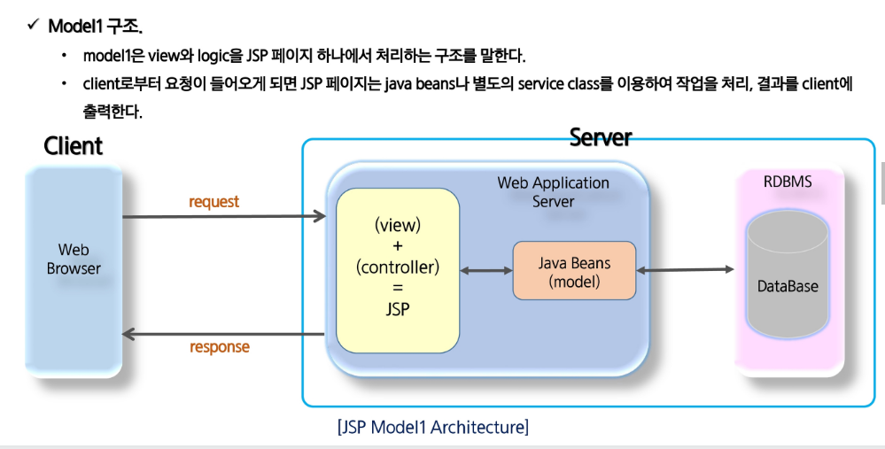
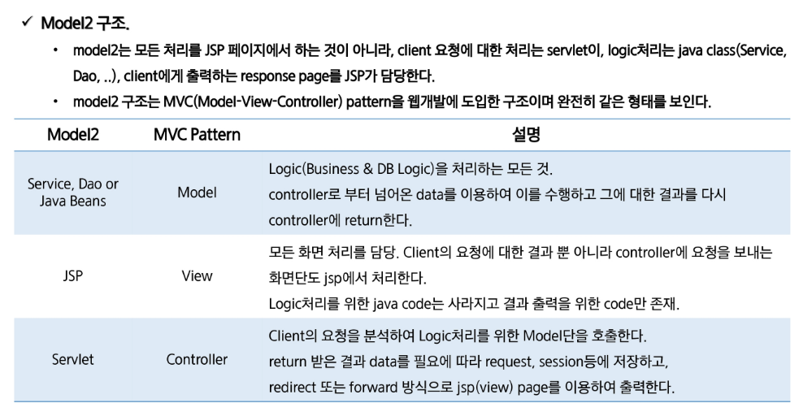

#### 1. model_1

- model_1 - jsp가 logic처리와 view에 대한 처리를 모두 함
- model_2 - mvc, jsp가 view에 대한 처리만 함

controller - 자바 -> 웹에관련된 자바(servelet), 일반자바(jdbc)

모델 1 장점 - 직관적, 하나의 파일이 - 화면을 구성할 수 있다

개발비용 감소, 시간 감속, jsp코드 자체가 복잡, 확장성 나쁨

#### 2. model_2(MVC pattern)

- model-view-controller
- 
- 클라이언트에서 data 요청 -> 1. data get(request.getparameter, servelet(controller)) -> 2. logic(jdbc, java, model) -> 3.response page(html + java -> jsp / view라고함)
- 장점 - 로직, 뷰가 분리되어 코드가 복잡하지는 않다, 분업이 용이, 유지보수가 쉽다, 확장성 뛰어남 

- 단점 - 구조가 복잡해 초기 진입이 어렵다. 개발 시간의 증가로 개발 비용 증가

#### 3. 쿠키_1