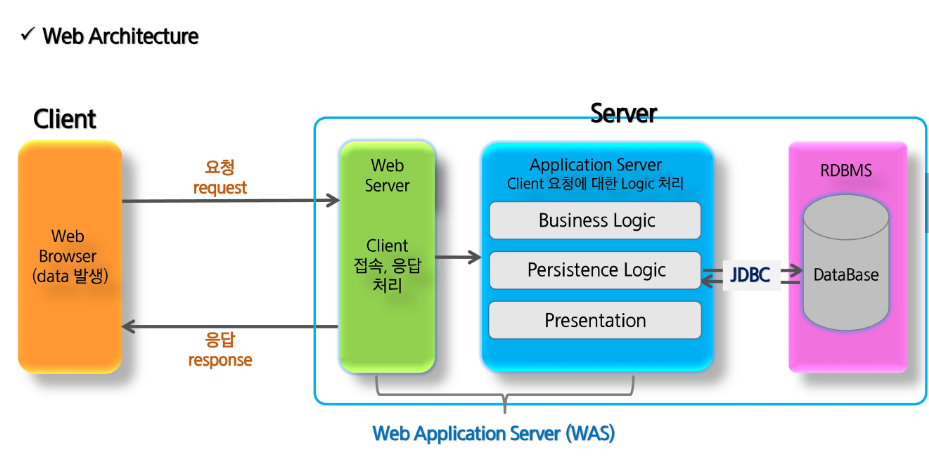
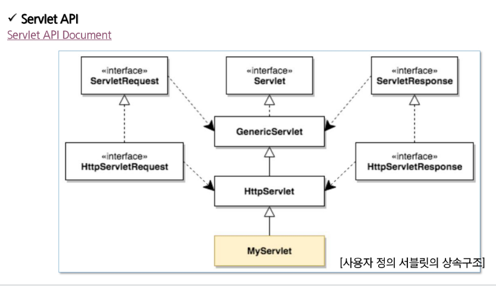
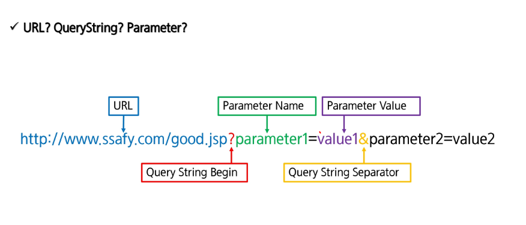

# 1. Web_architecture

- 3월 22일 자바 전공 강의
- web-backend

#### 1.1. web architecture

- 브라우저가 해석할수있는 언어 (markup language - html, xml(데이터의 표현, 데이터 전달용 문서), CSS, JS)

- parameter를 가지고 요청함(request)
- client가 서버에 접속(**using http**)
- web server(http server, 클라이언트의 접속을 도와줌, 접속, 응답 처리)
- Application server(program language사용가능(**java사용**), client 요청에 대한 logic 처리)
  - 1. data get
    2. logic - business logic(db와 관련없는 모든 로직), db logic(dao)
    3. 응답(html)
  - java + web => Servlet, JSP
- 요즘은 web server와 application server가 합쳐서 많이 쓰임 -> Web Application Server(WAS, ex- web logic, web Sphere, JEUS, **Tomcat**)
- RDBMS(Oracle, MySQL, MsSQL, mariaDB)

#### 1.2 servelet

#### 1-4. servlet parameter

- 파라미터를 어떻게 처리할것인가..
- 
