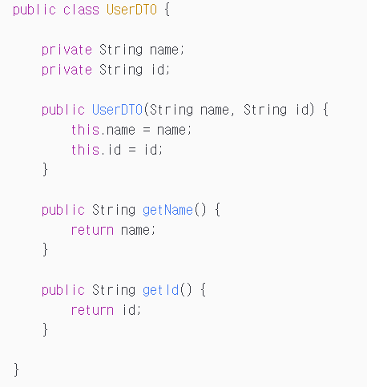
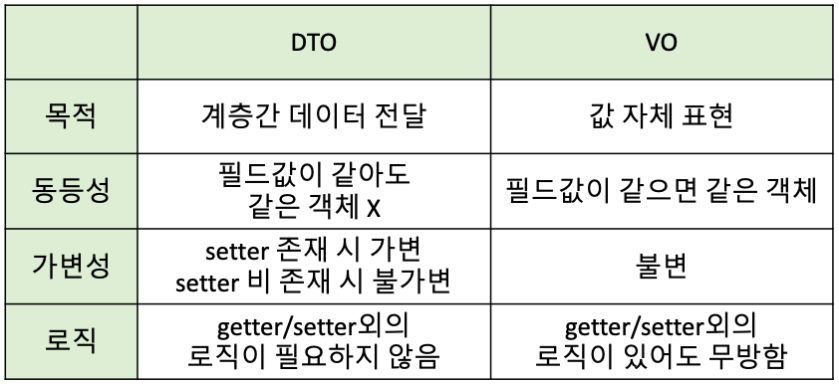
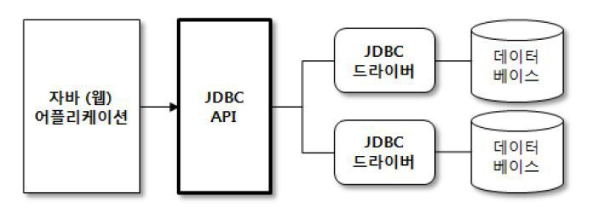
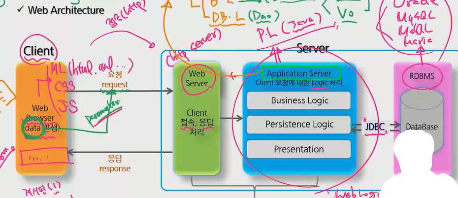
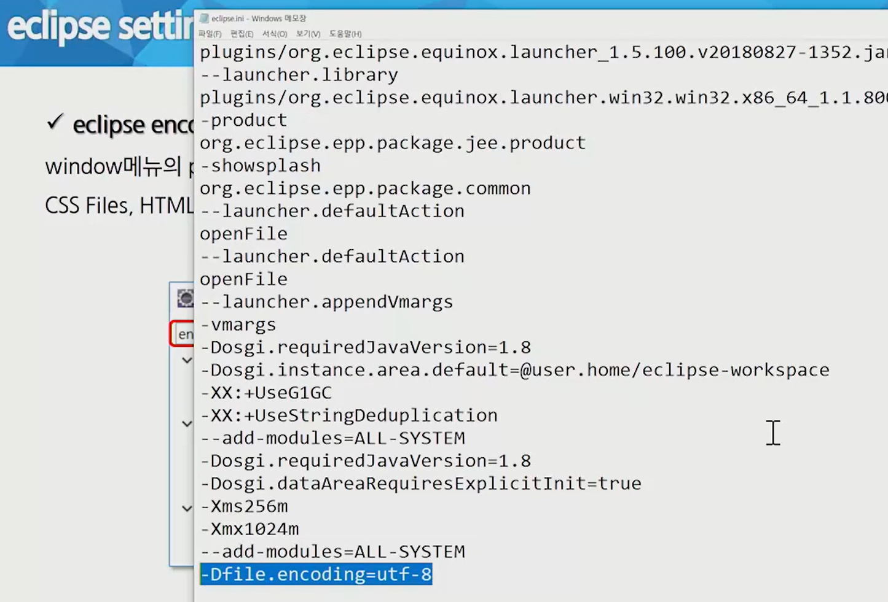
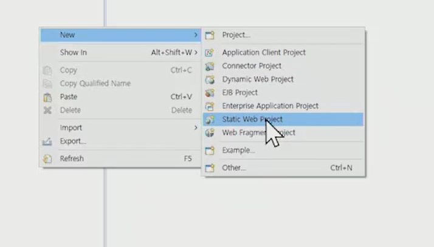
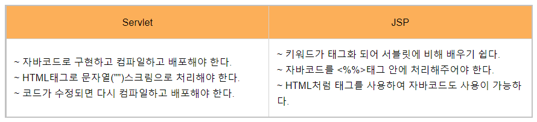
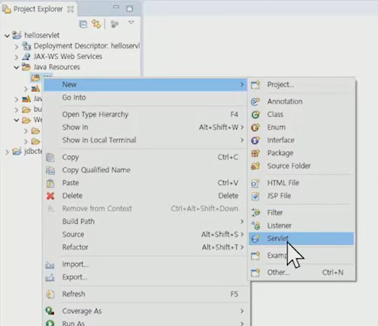
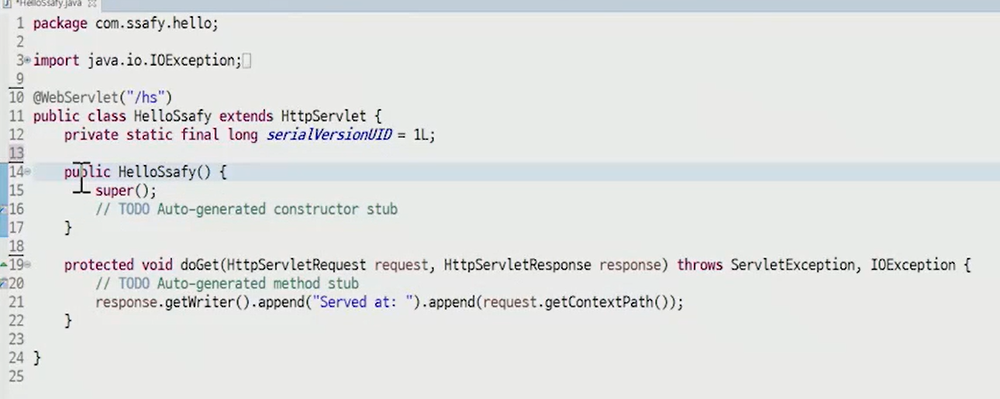

## web architecture

---

웹의 구조 확인

1. **클라이언트**와 **서버**
   
   - 실제로 웹사이트를 보기위해 필요로 했던 건? **브라우저**
   - 브라우저가 해석 가능한건 **마크업 랭귀지**
   - web browser는? data를 발생시키는 장소
   - Form을 이용하여 데이터를 발생시킬 수도 있는 것이고, 링크(blablabla?pg=1)를 이용하여 발생시킬 수도 있는 것
   
   

**클라이언트가 데이터를 발생시키면?**

데이터를 가지고 **요청**보냄. (꼭 그런건 아니지만, 일반적으로 서버에 일을 시킨다는 것은 데이터를 가져가는 것)

이 때 이 데이터를 **파라미터**라고 함

**요청**을 보내면? 데이터를 가지고 서버에 전송

- 클라이언트가 서버에 접속 (http 프로토콜 사용) - **web server**를 이용(일반적으로 **http server**)
- 이 **web server**는 **client의 접속과 응답**을 처리함
- 그러나 http server는 프로그래밍 언어를 돌릴 수 있는 힘이 없음
- 그래서 필요한게 바로 **application server** (client 요청에 대한 logic을 처리함)
- 요즘의 서버는 **web server와 aplication server**를 합친 형태임 (web application server라고 표현)
- 결론: was는 프로그래밍 언어를 사용할 수 있다!
- 추가: 앞서 말한 application server가 처리하는 **logic**에 대해 ->

  - **business logic** -> 
  - 컴퓨터 프로그램에서 데이터를 생성, 표시, 저장, 변경하는 부분
    
  - 얘를 처리하기 위해 Service라는 클래스를 이용
  - **db logic** -> 
    - business logic 이외
    - 얘를 처리하기 위해 **Dao**라는 클래스를 이용

---

## DTO, DAO, VO

**DTO**: data transfer object, **데이터를 담아 계층 간으로 전달하는 객체**

- 로직을 갖고있지 않는 순수한 데이터 객체, 메서드로는 getter와 setter를 가진다
- 전달시 setter 이용, 받을때 setter 사용
- setter의 경우 변조 가능성이 있기 때문에 생성자를 이용해 값을 넣어주게 되면 전달 과정에서 변조가 불가능해진다
- 

**DAO**: data access object, **db를 사용해 데이터를 조화하거나 조작하는 기능을 전담하도록 만든 오브젝트**

**VO**: value object, **값 그 자체를 나타내는 객체**

- **로직을 포함할 수 있음**
- 특정 값을 표현하기 때문에, 불변성의 보장을 위해 생성자를 이용하여야 한다
- 다음은 생성자를 이용한 불변 객체를 표현
- 

참고 문서: https://maenco.tistory.com/entry/Java-DTO%EC%99%80-VO%EC%9D%98-%EC%B0%A8%EC%9D%B4

**DTO와 VO의 차이 정리**

---

**JDBC**

- 자바에서 DB 프로그래밍을 하기 위해 사용하는 API
- 

**web architecture 도식화**

---

**데이터 처리 단계**

- data get
- logic 처리
- 응답 처리 (결과적으로 html.  클라이언트가 해석 가능한 무언가)

---

## 이클립스 세팅(참고용)

인코딩 설정

perspective 설정 **java EE**로 바꾸기 -> 우클릭시 메뉴가 

이렇게 바뀔 것

---

## Servlet

java + web이라고 생각하면 됨

자바를 이용하여 웹 페이지를 동적으로 생성하는 서버측 프로그램을 의미함

**JSP와 Servlet의 비교**

1. servlet
   - 자바 코드 안에 html 태그가 삽입. 확장자는 .java
   - 웹어플리케이션에 대한 자바 언어의 호환성을 높이기 위해 만든 API이며, 이 규약에 맞는 라이브러리나 클래스들을 상속 및 구현하여 만든 클래스들을 서블릿이라 함
2. JSP
   - html 내부에 java 코드를 삽입하는 형식. 서블릿의 단점을 보완하고자 만든 서블릿 기반의 스크립트 기술.

---

**Tomcat**

웹 서버와 연동하여 실행 가능한 자바 환경을 제공함

JSP와 Servlet이 실행되는 환경을 제공하는 것이라 생각하면 됨

---

**Servlet 생성**

생성 예시

ctrl + f11로 실행

tomcat v9.0 server에서 실행

실행시 windows-web browser-사용할 브라우저 선택 하면 브라우저에서 이용 가능(이클립스 내부 브라우저가 아닌)
