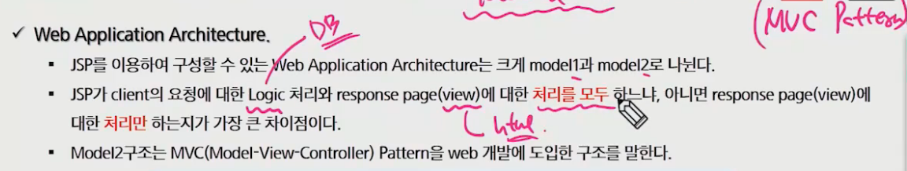
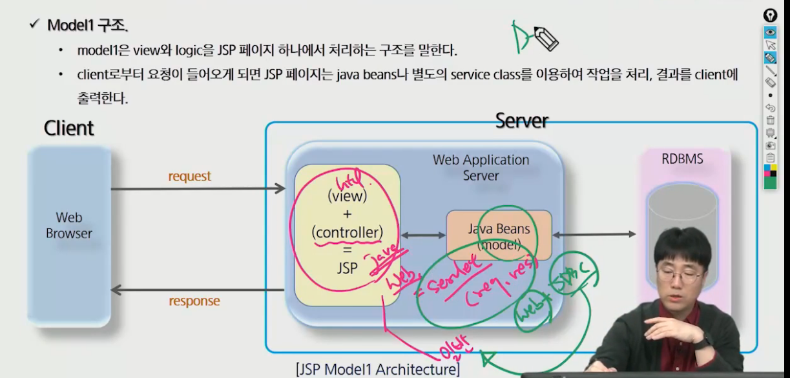
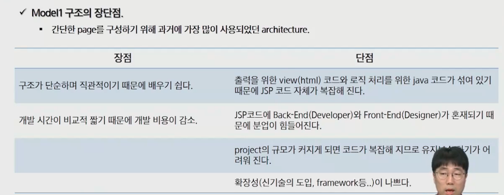
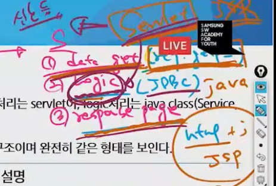
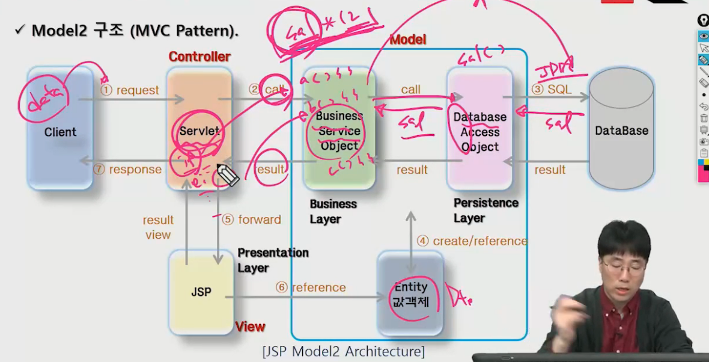
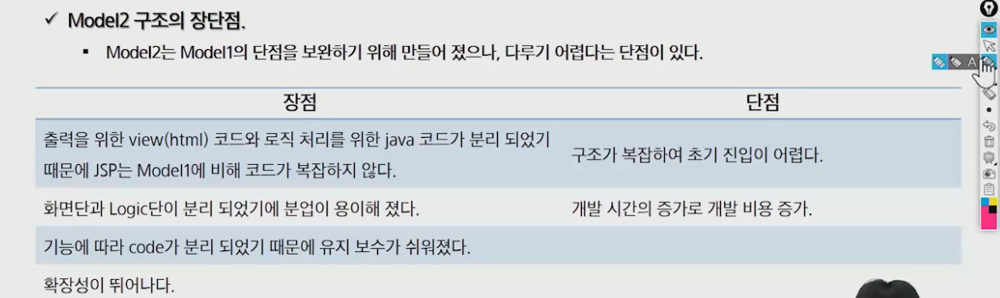
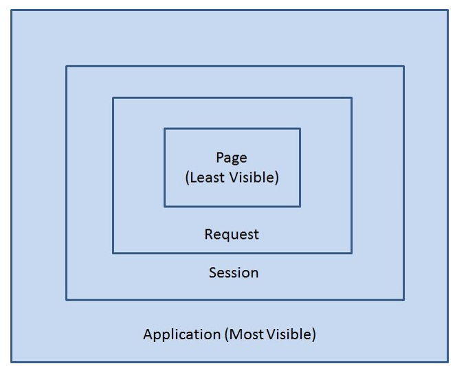

# MODEL

- 웹 프로그램에 있어서 가장 중요한 부분(MVC)
- 웹을 개발하는 방식 : model1 vs model2

## model1

- 
- 
- 웹용 자바(servlet), 일반 자바(JDBC)를 합친게 Java Beans 
- html과 DB를 하나의 어플리케이션으로 처리한 것이 model1 (하나의 파일 = 화면)
- 

## model2

- MVC 패턴(Model - View - Controller) 사용
- 

1. data get (Controller)
   - 클라이언트의 요청을 분석하여 모델을 호출(커맨드 센터)
   - 리턴받은 데이터를 필요에 따라 바구니에 저장(페이지, 리퀘스트, 세션, 어플리케이션)
   - redirect or forward 방식으로 jsp page 출력
2. jsp page (View)
   - 모든 화면 처리를 담당
   - 로직 처리를 하지 않고 받은 데이터(바구니)를 사용하여 출력
3. logic (Model)
   - JSP로 보내기 전 데이터를 처리하는 로직(BL : 더하기 빼기, DBL : 데이터베이스 로직)을 처리
   - 컨트롤러로부터 넘어온 데이터를 이용하여 수행하고 결과를 다시 컨트롤러에 보냄

- 
-  DTO : 로직을 가지지 않는 순수한 데이터 객체
- 

- 복잡해져서 스프링, 장고같은 프레임워크가 나오게 됨

## 참고

바구니(페이지, 리퀘스트, 세션, 어플리케이션)의 사용 범위가 정해져 있음

1. Page Scope
   - jsp 페이지 내에서 지역변수처럼 사용된다.
   - 해당 jsp or servlet이 실행되는 동안에만 정보를 유지할 때 사용
2. Request Scope
   - http 요청을 서버가 받아서 웹브라우저에 응답할 때까지 변수값을 유지
   - forward시 값을 유지할 때 사용
3. Session Scope
   - 프로젝트 밑 모든 폴더에서 사용 가능 (세션=true 인 곳만 사용가능)
   - 로그인 여부처럼 사용자별 유지가 되어야 할 정보에서 사용
   - 시간이 설정되어 있음(세션 타임 아웃) (톰캣은 기본적으로 30분)
4. Application Scope
   - 웹 어플리케이션이 시작되고 종료될 때까지 변수를 저장
   - 모든 클라이언트가 공통으로 사용되어야 할 값이 있을 때 사용 (클라이언트가 바뀌어도 누적)
