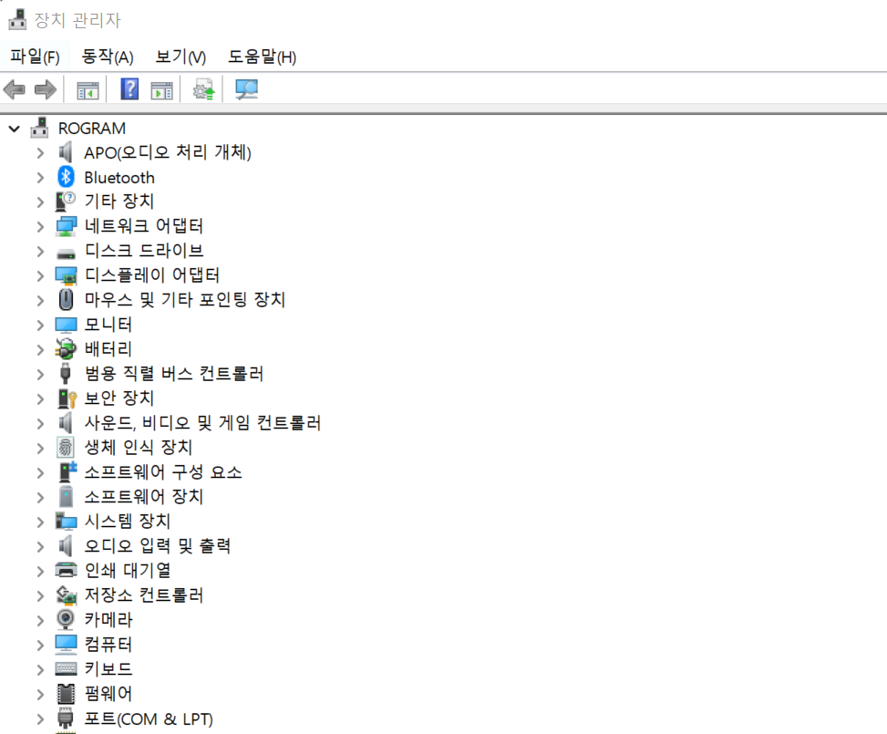
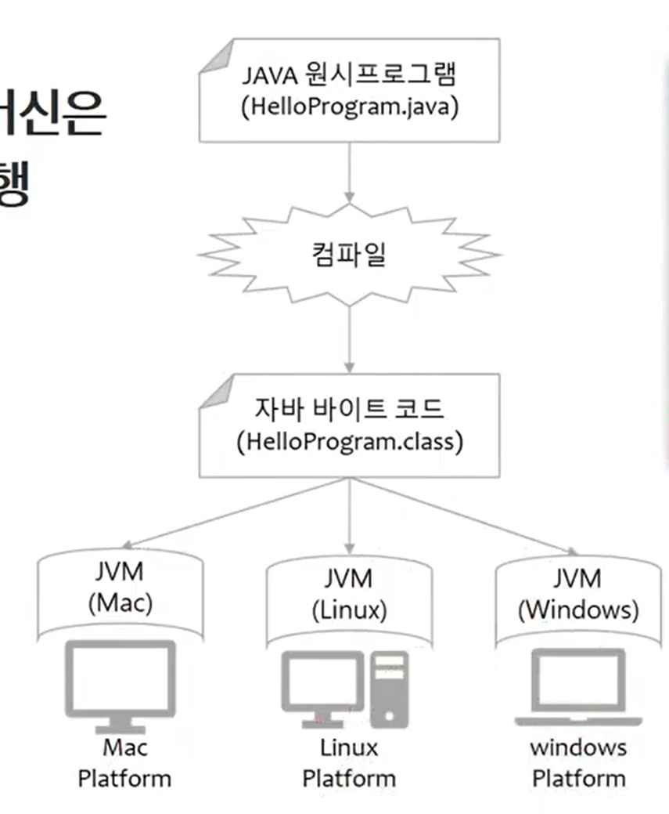
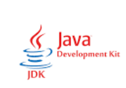

### 데이터와 정보

##### 데이터 

- 현실 그대로 존재하는 값 자체

##### 정보 

- 의미가 있는 데이터

010 3452 4353 : 한국인 에게는 정보, 말레이 사람에게는 데이터

우리눈에는 핸드폰 번호라고 인식이 된다

한국인이 보기에는 이건 정보다. 배열, 010으로 시작한다는 점 등에서 그렇게 느껴짐 

김혜라의 핸드폰 번호 라는 가치가 있다면 활용이 가능하다. 

ex) 강원랜드 근처에서 치킨을 시켜먹은 핸드폰 번호 -> 도박 사이트 광고 문자를 많이 받음

그러나 말레이시아 사람에게는 ??일 수 있다.

---

### 운영체제와 프로그램이란?

#### 운영체제(operation system, OS)

시스템 하드웨어를 관리할 뿐 아니라 응용 소프트웨어를 실행하기 위하여 하드웨어 추상화 플랫폼과 공통 시스템 서비스를 제공하는 시스템 소프트웨어

#### 프로그램(program)

컴퓨터에서 실행될 때 특정작업(specific task)을 수행하는 일련의 명령어들의 모음(집합)

#### 프로그래밍

컴퓨터가 수행해야하는 작업 지침서를 만드는 일

---

#### 오큘러스를 play할 수 있는 이유 

오큘러스는 하드웨어다. 장치관리자의 추상화 플랫폼 중 오큘러스에 맞는 것이 없다. 그럼에도 사용할 수 있는 이유는 driver를 설치했기 때문이다. 

운영체제는 driver를 이용해서 하드웨어를 관리한다.

반대로, 마우스를 꽂으면 바로 사용할 수 있는 이유는 운영체제가 제공하는 추상화 플랫폼에 해당하기 때문이다.

마찬가지로, 프로그램도 os의 규격에 맞게 생성해야 동작할 것이다. (window와 mac의 프로그램이 다른 이유)

---

#### 스마트폰과 피처폰

- OS의 유무로 구분한다
- 피처폰에는 펌웨어가 있다 -> 사용자가 기능을 추가, 삭제 등이 불가능하며 확장이 불가능하다.
- 스마트폰에는 OS가 있다 -> 사용자가 직접 수정 가능

---

### JVM(Java Virtual Machine)이란

- 자바 바이트코드를 실행할 수 있는 주체
- 자바 바이트코드는 플랫폼에 독립적이며 모든 자바 가상 머신은 자바 가상 머신 규격에 정의된 대로 자바 바이트 코드를 실행 
- 컴파일은 java 문법을 기계어로 변환해주는 과정
- 자바에서 컴파일을 하는 프로그램을 JDK(java development kit)이라고 부름
  - JDK는 java를 기계어로 완벽히 변환해주지는 않고, 바이트 코드 까지만 변환해줌

- JDK가 바이트 코드 까지만 변환해 놓은 것을 JVM이 기계어로 마저 변환해줌

- Mac, Window,Linux의 환경에 맞는 JVM이 각각 존재
- JVM은 바이트 코드를 실행하는 역할을 수행한다

#### 자바 바이트코드는 플랫폼에 독립적이며 모든 자바 가상 머신은 자바 가상 머신 규격에 정의된 대로 자바 바이트 코드를 실행한다

- 바이트코드는 플랫폼과 상관없이, JDK에 의해서 변환된 바이트 코드 값으로 존재
- JVM은 OS별로 다르게 정의된 규격에 맞게 코드를 실행

